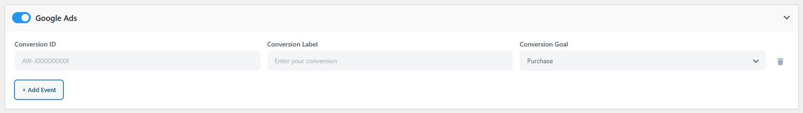
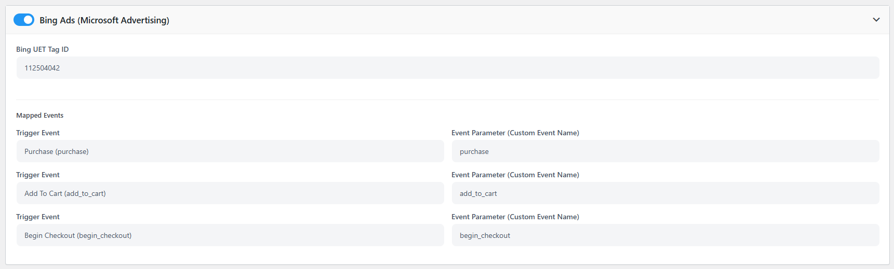
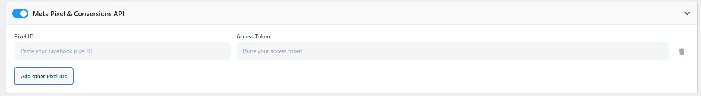
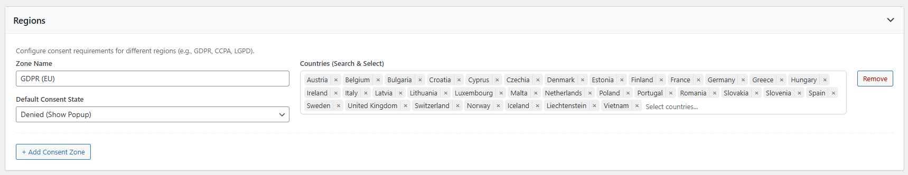
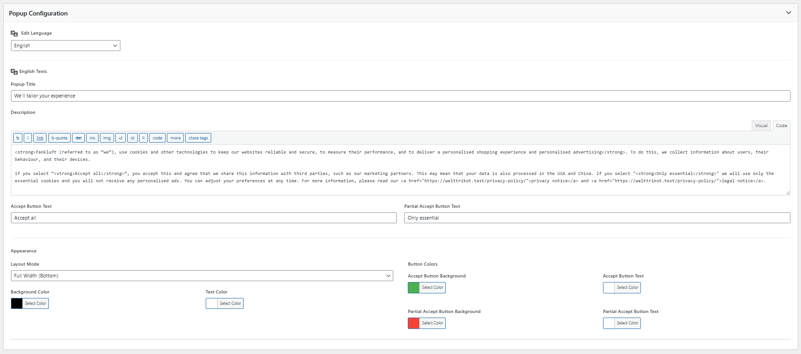

# Hướng dẫn Sử dụng Plugin Ads Pixel Manager

> [!IMPORTANT]
> **Ads Pixel Manager** là giải pháp tối ưu giúp cài đặt, quản lý và theo dõi các mã chuyển đổi (Conversion Tracking Pixels) của các nền tảng quảng cáo lớn (Google, Facebook, Bing) một cách đồng bộ, hỗ trợ cả cơ chế lưu dữ liệu qua API (Conversions API - CAPI) và tuân thủ các quy định bảo mật Cookie (Consent Mode v2 / GDPR).

---

## Lưu ý Quan trọng Trước khi Cấu hình
- **Xóa Cache**: Mỗi khi thay đổi bất kỳ cấu hình nào trong plugin, bắt buộc phải thực hiện xóa bộ nhớ đệm (Clear Cache) trên hệ thống (Ví dụ: **WP Rocket**) để các thay đổi mã script bám ngoài frontend ngay lập tức.
- **Tiện ích kiểm tra (Debug Extensions)**: Cài đặt sẵn các extension trên Chrome để phục vụ kiểm thử dữ liệu gửi đi:
  * Google Ads: **Google Tag Assistant**
  * Bing Ads: **UET Tag Helper**
  * Facebook: **Meta Pixel Helper**

---

## 1. Cấu hình Theo dõi Chuyển đổi (Conversion Tracking)

### 1.1. Google Ads Conversion Tracking (Hỗ trợ Multi-Tracking)
Chức năng này giúp đẩy dữ liệu hành vi người dùng lên Google Ads. Hệ thống hỗ trợ **Multi-Tracking** cho phép thêm nhiều tài khoản/luồng theo dõi song song theo từng dòng.

<div align="center">
    
</div>

- **Cấu hình**:
  1. Truy cập **Settings -> Ads Pixel Manager -> Google Ads**.
  2. Tại bảng cấu hình, bạn có thể thêm nhiều dòng theo dõi. Với **mỗi dòng**, cần nhập đầy đủ 3 thông tin:
     * **Conversion ID**: Mã định danh tài khoản Google Ads.
     * **Conversion Label**: Nhãn chuyển đổi tương ứng được lấy từ Google Ads.
     * **Conversion Goal (Mục tiêu chuyển đổi)**: Lựa chọn hành vi cần theo dõi (Ví dụ: `Add to Cart` - Thêm vào giỏ hàng, `Begin Checkout` - Bắt đầu thanh toán, `Purchase` - Mua hàng thành công).
  3. Nhấn lưu thiết lập.
- **Kiểm tra**: Sử dụng Chrome extension **Tag Assistant** và thực hiện hành động mẫu trên web để xem các thẻ Google Ads có kích hoạt (Fire) và truyền đúng Conversion ID & Label hay không.

---

### 1.2. Bing Ads Conversion Tracking
- **Cấu hình**:
  1. Truy cập **Settings -> Ads Pixel Manager -> Bing Ads**.
  2. Nhập mã **UET Tag ID** duy nhất (Hệ thống hỗ trợ cấu hình tối đa **1 UET Tag ID**).
  3. Đối với Bing Ads, hệ thống **tự động kích hoạt mặc định 3 sự kiện chính**:
     * `Add to Cart` (Thêm vào giỏ hàng)
     * `Begin Checkout` (Bắt đầu thanh toán)
     * `Purchase` (Mua hàng thành công)
     * (Không cần thiết lập các sự kiện thủ công vì các sự kiện mặc định luôn hoạt động đồng thời).
  4. Tạo sẵn các **Event Goals Conversion** tương ứng trong trang quản lý chiến dịch của Bing Ads trùng khớp với các sự kiện mặc định này.

<div align="center">
    
</div>

- **Kiểm tra**: Sử dụng tiện ích **UET Tag Helper** trên trình duyệt để kiểm tra trạng thái hoạt động của thẻ.

---

### 1.3. Facebook Pixel & Conversions API (Meta Ads - Hỗ trợ Multi-Tracking)
Hỗ trợ phương thức theo dõi kép qua trình duyệt (Pixel) và qua máy chủ (Conversions API) giúp tối ưu độ chính xác của dữ liệu. Hệ thống hỗ trợ **Multi-Tracking** cho phép khai báo nhiều tài khoản Facebook Ads để theo dõi chéo.

<div align="center">
    
</div>

- **Cấu hình**:
  1. Tại bảng cấu hình Facebook, thêm nhiều dòng theo dõi tương ứng với các tài khoản quảng cáo khác nhau. Với **mỗi dòng**, điền đầy đủ:
     * **Pixel ID**: ID Pixel của tài khoản Facebook Ads.
     * **Access Token**: Token truy cập dành cho Conversions API (CAPI).
  2. **Cơ chế tự động**: Với mỗi dòng Pixel ID và Access Token được khai báo, hệ thống sẽ **tự động kích hoạt theo dõi đồng thời cả 3 sự kiện chính**: `Add to Cart` (Thêm giỏ hàng), `Begin Checkout` (Bắt đầu thanh toán), và `Purchase` (Mua hàng thành công).
- **Kiểm tra & Xác minh**: 
  * **Trình duyệt**: Sử dụng extension **Meta Pixel Helper** để kiểm tra hoạt động của Facebook Pixel trực tiếp ngoài frontend.
  * **Máy chủ (CAPI)**: Để kiểm tra kết quả đẩy dữ liệu qua máy chủ Conversions API (CAPI), hãy truy cập vào menu quản trị: **WooCommerce -> Status -> Logs** -> chọn tìm file log có dạng `pys-meta-capi-[thời-gian-thao-tác]`.
  * **Kiểm tra chéo (Cross-verification)**: Bạn có thể thực hiện kiểm tra chéo bằng cách đối chiếu thông số ID ghi nhận trong file log máy chủ này với các Event ID bắt được trên tiện ích Meta Pixel Helper để xác thực dữ liệu được đồng bộ thành công và tránh ghi nhận trùng lặp sự kiện (Deduplication).

---

## 2. Quản lý Chế độ Đồng ý (Region Consent Mode)
Tính năng hỗ trợ tuân thủ luật bảo mật thông tin người dùng (GDPR của EU, Anh và Thụy Sỹ) bằng cách chỉ kích hoạt các pixel theo dõi khi có sự đồng ý của khách hàng.

<div align="center">
    
</div>

* **Cơ chế tự phát hiện quốc gia**: Hệ thống tự động sử dụng công nghệ tra cứu cơ sở dữ liệu IP (GeoIP) để phát hiện quốc gia hiện tại của khách truy cập.
* **Tự động kích hoạt GDPR**: Mặc định, nếu website chưa được cấu hình bất kỳ khu vực nào, hệ thống sẽ tự động khởi tạo vùng bảo mật GDPR áp dụng cho khu vực EU (Liên minh Châu Âu), Anh (UK) và Thụy Sỹ (CH).
* **Cấu hình chế độ đồng ý theo khu vực (Region Consent)**: Có 2 chế độ xử lý chính:
  * `Denied (Show Popup)`: Trạng thái mặc định là từ chối. Hệ thống sẽ hiển thị một popup yêu cầu khách hàng bấm lựa chọn đồng ý thì mới kích hoạt tracking.
  * `Grant (Auto Accept)`: Tự động giả định khách hàng đồng ý và tự động chấp nhận quyền tracking cho các khu vực không bị kiểm soát nghiêm ngặt.

---

## 3. Tùy chỉnh Giao diện Popup Đồng ý (Popup Configuration)
Hỗ trợ tinh chỉnh thẩm mỹ popup xin quyền tracking hiển thị ngoài frontend:

<div align="center">
    
</div>

* **Vị trí**: Mặc định hiển thị cố định ở phía dưới cùng (`bottom`) của trang.
* **Chế độ hiển thị (Display Mode)**: Hỗ trợ 2 kiểu giao diện:
  * `Full Width`: Banner kéo dài toàn màn hình ngang dưới chân trang.
  * `Modal`: Khung hộp thư thoại nổi nhỏ gọn đặt ở giữa dưới chân trang.
* **Cá nhân hóa thiết kế**: Hỗ trợ thay đổi màu nền, màu chữ, màu sắc các nút bấm một cách trực quan trong phần cài đặt.
* **Đa ngôn ngữ**: Hỗ trợ hiển thị ngôn ngữ phù hợp theo từng quốc gia (Mặc định tích hợp sẵn Tiếng Anh và Tiếng Đức). Admin có thể sử dụng thẻ HTML tại ô mô tả để tự thiết kế bố cục nội dung chi tiết.
* **Thứ tự ưu tiên hiển thị ngôn ngữ**: `Site Language` (Ngôn ngữ hiện tại của trang) -> `Default Language` (Ngôn ngữ mặc định của plugin nếu trang không khớp) -> `Customer Option` (Lựa chọn thủ công của khách).

---

## 4. Cấu hình Consent Mode Thủ Công Cho Cửa Hàng Shopbase (Shopbase Store Integration)

> [!NOTE]
> Đối với cửa hàng hoạt động trên nền tảng Shopbase, hệ thống mặc định sẽ luôn luôn hiển thị popup và không sử dụng cơ chế tự động phát hiện quốc gia qua IP.
> Để tích hợp Consent Mode hoạt động chuẩn xác với Google Tag Manager (GTM) trên Shopbase, bạn cần chèn thủ công 2 đoạn mã sau vào cấu hình của cửa hàng:

### 4.1. Bước 1: Thêm Đoạn Mã Khởi Tạo vào Header (Trước GTM Script)
Chèn đoạn mã này vào phần Header của Shopbase, **bắt buộc nằm trước** đoạn mã nhúng script của Google Tag Manager để thiết lập trạng thái Consent mặc định là Từ chối (`denied`):

```html
<script>
    window.dataLayer = window.dataLayer || [];
    function gtag(){dataLayer.push(arguments);}
    gtag('consent','default',{
        ad_storage:'denied',
        ad_user_data:'denied',
        ad_personalization:'denied',
        analytics_storage:'denied',
        wait_for_update:500
    });
</script>
```

---

### 4.2. Bước 2: Thêm Đoạn Mã CSS Tùy Biến Thẩm Mỹ Popup (Mobile Responsive)
Chèn đoạn mã CSS sau vào cấu hình giao diện của Shopbase để popup hiển thị sang trọng, mượt mà và tự động co giãn tương thích trên điện thoại:

```css
<style>
#pys-popup {
  position: fixed;
  bottom: 5px;
  left: 50%;
  transform: translate(-50%, 40px);
  opacity: 0;

  width: calc(100% - 40px);
  max-width: 1216px;

  background: #000;
  color: #fff;
  padding: 20px 24px;
  border-radius: 10px;
  box-shadow: 0 -2px 20px rgba(0,0,0,.4);
  z-index: 999999;

  display: flex;
  flex-direction: column;
  gap: 16px;
  font-family: system-ui, sans-serif;

  animation: pysSlideUp .35s ease forwards;
}

/* ================= ANIMATION ================= */
@keyframes pysSlideUp {
  from {
    transform: translate(-50%, 60px);
    opacity: 0;
    filter: blur(4px);
  }
  to {
    transform: translate(-50%, 0);
    opacity: 1;
    filter: blur(0);
  }
}

.pys-hide {
  animation: pysSlideDown .25s ease forwards;
}

@keyframes pysSlideDown {
  to {
    transform: translate(-50%, 60px);
    opacity: 0;
  }
}

/* ================= HEADER ================= */
.pys-header{
  display:flex;
  align-items:center;
  width: 100%;
}

.pys-title{
  font-weight:600;
  font-size:24px;
}

/* ================= LANGUAGE SWITCH ================= */
.pys-lang{
  margin-left: auto;
  position: relative;
  display: flex;
  align-items: center;
}

/* SELECT */
.pys-lang select{
  position: absolute;
  right: 0;
  top: 28px;

  appearance: none;
  -webkit-appearance: none;
  -moz-appearance: none;

  background: #000;
  color: #fff;
  border: 1px solid #fff;
  padding: 8px 36px 8px 12px;
  border-radius: 6px;
  cursor: pointer;
  font-size: 14px;

  display: none;
}

.pys-lang.show select{
  display: block;
}

.pys-lang::after{
  content: "";
  position: absolute;
  right: 14px;
  top: 40px;

  width: 8px;
  height: 8px;

  border-right: 2px solid #fff;
  border-bottom: 2px solid #fff;

  transform: rotate(45deg);
  pointer-events: none;

  opacity: 0;
}

.pys-lang.show::after{
  opacity: 1;
}

/* Globe icon */
.pys-icon {
  cursor: pointer;
}

/* ================= TEXT ================= */
.pys-text {
  font-size: 14px;
  line-height: 1.5;
}

/* ================= BUTTONS ================= */
.pys-actions {
  display: flex;
  justify-content: flex-end;
  gap: 12px;
}

.pys-btn {
  padding: 10px 100px;
  cursor: pointer;
  font-size: 14px;
  border-radius: 6px;
  border: none;
}

.pys-accept {
  background: #fff;
  color: #000;
}

.pys-decline {
  background: transparent;
  color: #fff;
}

/* ================= MOBILE ================= */
@media (max-width:768px){
  .pys-actions {
    flex-direction: column;
    align-items: center;
    width: 100%;
    border-top: 1px solid #444;
    padding-top: 12px;
  }

  .pys-btn {
    width: 100%;
  }

  .pys-title{
    font-size:20px;
  }
}
</style>
```

---

### 4.3. Bước 3: Thêm Đoạn Mã Javascript Điều khiển và Quản lý Cookie vào Body
Chèn đoạn mã Javascript này vào phần Body cuối trang của Shopbase. Đoạn mã này có chức năng khởi tạo popup, xử lý sự kiện nút bấm, lưu tùy chọn của khách vào Cookie `pys_consent_choice` (Có hiệu lực **60 ngày**) và kích hoạt cập nhật trạng thái `gtag('consent', 'update', ...)` lên Google:

```html
<script>
(function(){
    const DEFAULT_LANG = 'en';
    const COOKIE='pys_consent_choice';
    const LANG_COOKIE='pys_lang';
    const LANG = {
        en: {
            title: "We’ll tailor your experience",
            text: `<b>Shop (referred to as “we”), use cookies and other technologies to keep our websites reliable and secure, to measure their performance, and to deliver a personalised shopping experience and personalised advertising</b>.<br>
            To do this, we collect information about users, their behaviour, and their devices.<br><br>
            If you select "<b>Accept all</b>", you accept this and agree that we share this information with third parties, such as our marketing partners.
            This may mean that your data is also processed in the USA.
            If you select "<b>Only essential</b>" we will use only the essential cookies and you will not receive any personalised ads.
            You can adjust your preferences at any time.`,
            accept: "Accept all",
            decline: "Only essential"
        },

        de: {
            title: "Wir passen Ihr Erlebnis an",
            text: `<b>Shop (nachfolgend „wir“) verwendet Cookies und ähnliche Technologien, um unsere Website zuverlässig und sicher zu betreiben, die Leistung zu messen und personalisierte Werbung bereitzustellen.</b><br>
            Dabei sammeln wir Informationen über Nutzer, ihr Verhalten und ihre Geräte.<br><br>
            Wenn Sie "<b>Alle akzeptieren</b>" wählen, stimmen Sie der Weitergabe an Partner zu.
            Ihre Daten können auch in den USA verarbeitet werden.
            Wenn Sie "<b>Nur notwendige</b>" wählen, verwenden wir nur essenzielle Cookies.`,
            accept: "Alle akzeptieren",
            decline: "Nur notwendige"
        }
    };
    function setCookie(n,v,d){
        let date=new Date();
        date.setTime(date.getTime()+d*864e5);
        document.cookie=
        n+"="+v+
        "; expires="+date.toUTCString()+
        "; path=/; SameSite=Lax; Secure";
    }

    function getCookie(n){
        return document.cookie.split('; ').find(r=>r.startsWith(n+'='))?.split('=')[1];
    }

    function updateConsent(granted){
        const s=granted?'granted':'denied';
        gtag('consent','update',{
            ad_storage:s,
            ad_user_data:s,
            ad_personalization:s,
            analytics_storage:s
        });
        closePopup();
    }
    
    function applyLang(lang){
        const t=LANG[lang];
        if(!t) return;

        document.querySelector('.pys-title').innerHTML=t.title;
        document.querySelector('.pys-text').innerHTML=t.text;
        document.getElementById('pys-accept').innerHTML=t.accept;
        document.getElementById('pys-decline').innerHTML=t.decline;
    }

    function renderPopup(){
        document.body.insertAdjacentHTML('beforeend',`
            <div id="pys-popup">
                <!-- header -->
                <div class="pys-header">
                    <!-- title -->
                    <div class="pys-title"></div>

                    <div class="pys-lang">
                    <!-- icon -->
                        <span class="pys-icon">
                            <svg viewBox="0 0 24 24" width="18" height="18">
                                <path fill="#fff"
                                    d="M11.99 2C6.47 2 2 6.48 2 12s4.47 10 9.99 10C17.52 22 22 17.52 22 12S17.52 2 11.99 2zm6.93 6h-2.95a15.65 15.65 0 00-1.38-3.56A8.03 8.03 0 0118.92 8zM12 4.04c.83 1.2 1.48 2.53 1.91 3.96h-3.82c.43-1.43 1.08-2.76 1.91-3.96zM4.26 14C4.1 13.36 4 12.69 4 12s.1-1.36.26-2h3.38c-.08.66-.14 1.32-.14 2 0 .68.06 1.34.14 2H4.26zm.82 2h2.95c.32 1.25.78 2.45 1.38 3.56A7.987 7.987 0 015.08 16zm2.95-8H5.08a7.987 7.987 0 014.33-3.56A15.65 15.65 0 008.03 8zM12 19.96c-.83-1.2-1.48-2.53-1.91-3.96h3.82c-.43 1.43-1.08 2.76-1.91 3.96zM14.34 14H9.66c-.09-.66-.16-1.32-.16-2 0-.68.07-1.35.16-2h4.68c.09.65.16 1.32.16 2 0 .68-.07 1.34-.16 2zm.25 5.56c.6-1.11 1.06-2.31 1.38-3.56h2.95a8.03 8.03 0 01-4.33 3.56zM16.36 14c.08-.66.14-1.32.14-2 0-.68-.06-1.34-.14-2h3.38c.16.64.26 1.31.26 2s-.1 1.36-.26 2h-3.38z"/>
                            </svg>
                        </span>

                        <!-- language switch -->
                        <select id="pys-language">
                            <option value="en">English</option>
                            <option value="de">Deutsch</option>
                        </select>
                    </div>
                </div>

                <!-- text -->
                <div class="pys-text"></div>

                <!-- buttons -->
                <div class="pys-actions">
                    <button class="pys-btn pys-decline" id="pys-decline"></button>
                    <button class="pys-btn pys-accept" id="pys-accept"></button>
                </div>
            </div>
        `);

        document.getElementById('pys-accept').onclick=()=>{
            setCookie(COOKIE,'accepted',60);
            updateConsent(true);
        };

        document.getElementById('pys-decline').onclick=()=>{
            setCookie(COOKIE,'accepted',60);
            updateConsent(true);
        };

        const langWrap = document.querySelector('.pys-lang');
        const icon = langWrap?.querySelector('.pys-icon');
        const select=document.getElementById('pys-language');
        const savedLang = getCookie(LANG_COOKIE) || DEFAULT_LANG;
        select.value=savedLang;
        applyLang(savedLang);
        select.onchange=()=>{
            applyLang(select.value);
            setCookie(LANG_COOKIE,select.value,60);
        };
        icon.onclick = (e)=>{
            e.stopPropagation();
            langWrap.classList.toggle('show');
        };

        langWrap.addEventListener('click', e=>{
            e.stopPropagation();
        });

        document.addEventListener('click',()=>{
            langWrap?.classList.remove('show');
        });
    }

    function closePopup(){
        const el=document.getElementById('pys-popup');
        if(!el) return;

        el.classList.add('pys-hide');
        setTimeout(()=>el.remove(),400);
    }

    const choice=getCookie(COOKIE);
    if(choice){
        updateConsent(choice==='accepted');
    }else{
        document.addEventListener('DOMContentLoaded',renderPopup);
    }
})();
</script>
```

> [!WARNING]
> **Cấu hình Consent trong Tag Manager**: Thiết lập này chỉ xử lý việc cập nhật Consent Default cho hệ thống Google Tag Manager. Các thẻ (Tags) con được thiết lập bên trong GTM bắt buộc phải được cấu hình ràng buộc kích hoạt theo điều kiện Consent tương ứng theo đúng tài liệu chính thức của Google [Google Consent Mode Documentation](https://support.google.com/google-ads/answer/10718549?hl=en).
