# Hướng dẫn Sử dụng & Cấu hình Plugin EC Advanced Coupon

Tài liệu này hướng dẫn cách cấu hình và quản lý mã giảm giá nâng cao sử dụng plugin **EC Advanced Coupon** trên hệ thống WooCommerce. Hướng dẫn tập trung vào thao tác quản trị và thiết lập nội dung.

---

## 1. Các Tính năng Chính

* **Hiển thị danh sách coupon công khai**: Tự động hiển thị các mã giảm giá có sẵn ngay trên trang Giỏ hàng, trang Thanh toán hoặc trang chi tiết sản phẩm để kích thích khách hàng mua sắm.
* **Thiết lập đối tượng áp dụng chi tiết**: Giới hạn mã giảm giá theo Phân loại sản phẩm (Danh mục, Thẻ, Bộ sưu tập) hoặc theo các Sản phẩm cụ thể.
* **Thiết lập điều kiện tối thiểu**: Yêu cầu khách hàng đạt giá trị đơn hàng hoặc số lượng sản phẩm tối thiểu để sử dụng mã.
* **Hiển thị gợi ý mua thêm (gần đủ điều kiện)**: Khi giỏ hàng gần đạt ngưỡng tối thiểu (ví dụ đạt 50% giá trị yêu cầu), hệ thống sẽ hiển thị mã giảm giá kèm thông báo gợi ý mua thêm để được hưởng ưu đãi.

---

## 2. Hướng dẫn Thiết lập Mã Giảm giá (Coupon)

> [!IMPORTANT]
> **Lưu ý quan trọng**: Tất cả thiết lập giới hạn theo Categories, Tags, Collection, EC Product Type hoặc sản phẩm cụ thể bắt buộc phải cấu hình tại tab **EC Coupon Rules**. **Không** thực hiện thiết lập các phần này trong tab **Usage restriction (Hạn chế sử dụng)** mặc định của WooCommerce để tránh xảy ra xung đột kiểm tra điều kiện và lỗi hiển thị danh sách coupon.

Khi tạo mới hoặc chỉnh sửa một mã giảm giá tại mục **Marketing > Coupons**, tab **EC Coupon Rules** xuất hiện trong khung cấu hình coupon:

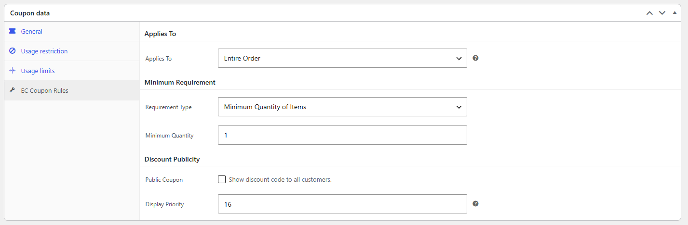
*Hình minh họa: Tổng quan tab cấu hình EC Coupon Rules*

### 2.1. Đối tượng Áp dụng (Applies To)

* **Applies To**: Chọn phạm vi sản phẩm được phép áp dụng mã giảm giá này:
  * *Entire Order*: Áp dụng cho toàn bộ đơn hàng (không giới hạn sản phẩm cụ thể).
  * *Specific Taxonomy*: Áp dụng cho các nhóm phân loại sản phẩm. Khi chọn mục này, cần cấu hình thêm:

    * *Taxonomy Type (Loại phân loại)*: Chọn áp dụng theo Danh mục sản phẩm (Product Category), Thẻ sản phẩm (Product Tag), Loại sản phẩm (Product Type), hoặc Bộ sưu tập (Collection).
    * *Taxonomy Terms*: Tìm kiếm và chọn các danh mục hoặc thẻ cụ thể.

    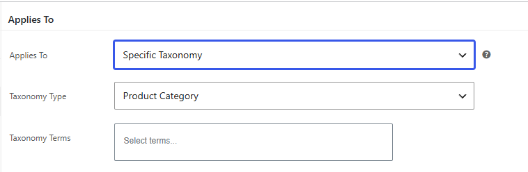
    *Hình minh họa: Giới hạn mã giảm giá áp dụng theo Phân loại sản phẩm*
  * *Specific Products*: Áp dụng cho các sản phẩm cụ thể. Khi chọn mục này, ô **Specific Products** sẽ hiện ra để tìm và chọn các sản phẩm hoặc biến thể được áp dụng.

    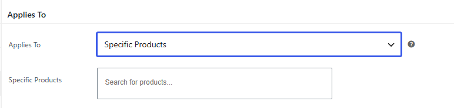
    *Hình minh họa: Giới hạn mã giảm giá áp dụng cho Sản phẩm cụ thể*

### 2.2. Điều kiện Tối thiểu (Minimum Requirement)

Thiết lập điều kiện tối thiểu của giỏ hàng để mã giảm giá bắt đầu có hiệu lực:

* **Requirement Type**: Chọn loại yêu cầu tối thiểu:
  * *None*: Không yêu cầu điều kiện.
  * *Minimum Purchase Amount*: Yêu cầu số tiền mua hàng tối thiểu. Nhập số tiền vào ô **Minimum Amount** (ví dụ: nhập 50 để yêu cầu đơn hàng từ 50$ trở lên).

    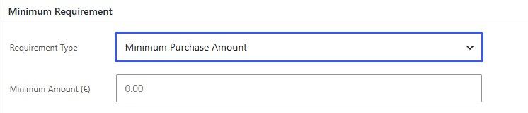
    *Hình minh họa: Yêu cầu số tiền đơn hàng tối thiểu*
  * *Minimum Quantity of Items*: Yêu cầu số lượng sản phẩm tối thiểu trong giỏ hàng. Nhập số lượng sản phẩm vào ô **Minimum Quantity** (ví dụ: nhập 3 để yêu cầu giỏ hàng có từ 3 sản phẩm trở lên).

    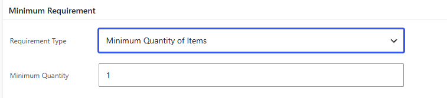
    *Hình minh họa: Yêu cầu số lượng sản phẩm tối thiểu*

### 2.3. Cài đặt Công khai (Discount Publicity)

* **Public Coupon**: Đánh dấu chọn mục này nếu muốn mã giảm giá hiển thị trực quan cho mọi khách hàng thấy trên website. Nếu không chọn, khách hàng chỉ có thể sử dụng bằng cách tự nhập thủ công mã giảm giá.
* **Display Priority**: Thứ tự ưu tiên hiển thị (từ 1 đến 999). Mã giảm giá có số thứ tự nhỏ hơn sẽ xếp ở vị trí đầu tiên.

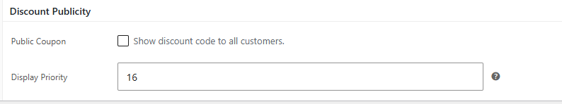
*Hình minh họa: Cài đặt công khai mã và thứ tự hiển thị*

---

## 3. Cấu hình Hiển thị và Giao diện Chung

Để điều chỉnh cách hiển thị của các mã giảm giá công khai trên toàn trang web, truy cập vào menu **WooCommerce > EC Coupon Display**:

### 3.1. Các Thành phần Hiển thị (Display Elements)

Đánh dấu chọn các phần tử muốn hiển thị trên thẻ mã giảm giá:

* *Show Coupon Code*: Hiển thị dòng mã giảm giá.
* *Show Description*: Hiển thị mô tả chi tiết của coupon.
* *Show Discount Value/Label*: Hiển thị nhãn giảm giá (ví dụ: "10% OFF" hoặc "$5 OFF").
* *Show Expiry Date*: Hiển thị ngày hết hạn của coupon.
* *Show Apply Button*: Hiển thị nút "Áp dụng" nhanh để khách hàng nhấp và tự động điền mã vào đơn hàng.

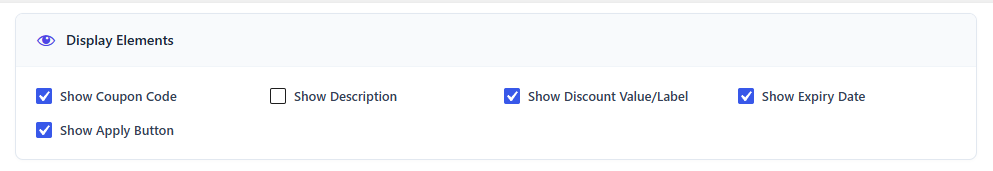
*Hình minh họa: Chọn các phần tử hiển thị của thẻ coupon*

### 3.2. Màu sắc Giao diện (Appearance)

Có thể tùy chỉnh màu sắc của thẻ coupon để đồng bộ với thiết kế thương hiệu:

* *Apply Button Background*: Màu nền của nút Áp dụng.
* *Apply Button Text*: Màu chữ của nút Áp dụng.
* *Discount Title Color*: Màu sắc của chữ giá trị giảm giá (ví dụ: chữ "5% OFF").
* *Coupon Code Color*: Màu sắc của dòng mã giảm giá.

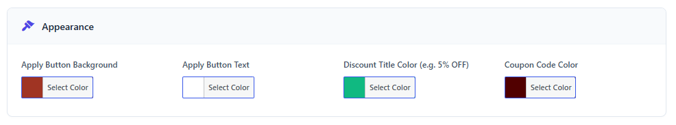
*Hình minh họa: Cấu hình mã màu Hex cho thẻ coupon*

### 3.3. Chế độ Hiển thị (Display Mode)

* *Valid Only*: Chỉ hiển thị những mã giảm giá mà khách hàng đã đủ điều kiện sử dụng ở thời điểm hiện tại.
* *Valid + Almost Eligible*: Hiển thị cả những mã chưa đủ điều kiện nhưng giỏ hàng của khách đã đạt một ngưỡng phần trăm nhất định.
* *Near-Valid Threshold (%)*: Ngưỡng phần trăm tối thiểu của giá trị đơn hàng hoặc số lượng sản phẩm cần đạt được (ví dụ: nhập 50%). Nếu giỏ hàng đạt trên 50% yêu cầu của mã, mã đó sẽ hiển thị kèm thông báo gợi ý (ví dụ: "Mua thêm $20 để mở khóa mã này").

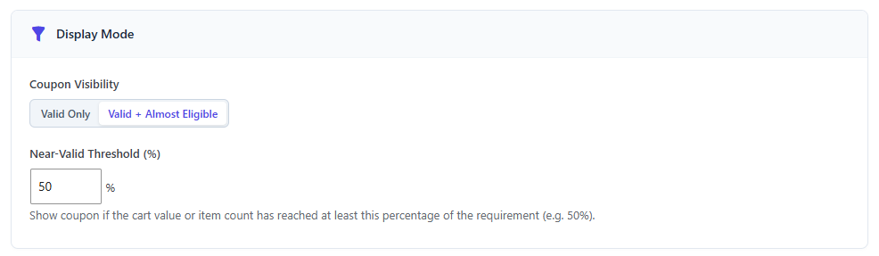
*Hình minh họa: Thiết lập hiển thị mã gần đủ điều kiện và ngưỡng phần trăm*

### 3.4. Vị trí Tự động Hiển thị (Display Locations)

Thiết lập vị trí tự động chèn danh sách coupon trên trang web mà không cần dùng shortcode:

* **Tại trang Giỏ hàng (Cart Page)**: Bật tính năng chèn tự động, chọn vị trí muốn hiển thị (ví dụ: Dưới danh sách sản phẩm, Trước phần vận chuyển, hoặc Dưới cùng trang), chọn kiểu bố cục (dạng danh sách, dạng lưới, hoặc dạng cột bên), và giới hạn số lượng coupon hiển thị tối đa.
* **Tại trang Thanh toán (Checkout Page)**: Bật tính năng chèn tự động, chọn vị trí hiển thị (ví dụ: Trên cùng trang, Trước phần vận chuyển, hoặc Trước tổng tiền), chọn kiểu bố cục và giới hạn số lượng hiển thị.

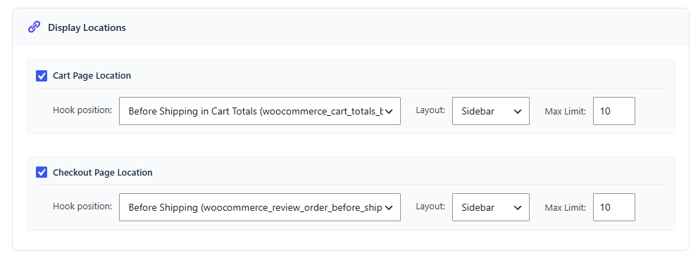
*Hình minh họa: Bật tự động hiển thị trên Cart và Checkout*

### 3.5. Trình xem thử trực tiếp (Live Preview) & Sao chép Shortcode

Phần bên phải của trang cấu hình cung cấp giao diện trực quan hiển thị trước thiết kế thẻ coupon dựa trên các tùy chọn màu sắc và thành phần đã thiết lập. Đồng thời, đây cũng là nơi sao chép shortcode nhanh.

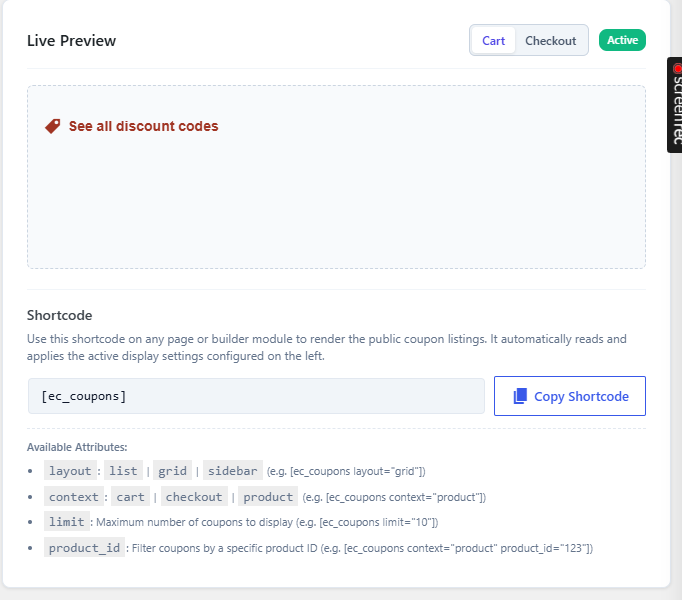
*Hình minh họa: Live Preview và khu vực sao chép shortcode*

---

## 4. Hướng dẫn Sử dụng Shortcode

Nếu không sử dụng tính năng chèn tự động, có thể nhúng danh sách coupon công khai vào bất kỳ bài viết, trang đích (Landing Page) hoặc trình dựng trang (Page Builder) bằng shortcode sau:

### Shortcode cơ bản:

`[ec_coupons]`

### Các tham số tùy biến đi kèm (trong shortcode):

* **Thay đổi bố cục hiển thị**: Sử dụng tham số `layout` để chuyển đổi giữa các kiểu giao diện:
  * Dạng danh sách: `[ec_coupons layout="list"]`
  * Dạng lưới: `[ec_coupons layout="grid"]`
  * Dạng cột bên: `[ec_coupons layout="sidebar"]`
* **Thay đổi ngữ cảnh hiển thị**: Sử dụng thuộc tính `context` để lọc mã theo ngữ cảnh:
  * Lọc mã áp dụng cho giỏ hàng: `[ec_coupons context="cart"]`
  * Lọc mã áp dụng cho trang thanh toán: `[ec_coupons context="checkout"]`
  * Lọc mã áp dụng riêng cho một sản phẩm cụ thể: `[ec_coupons context="product"]` (khi nhúng ở trang chi tiết sản phẩm, hệ thống tự động lọc các mã áp dụng được cho sản phẩm đó).
* **Giới hạn số lượng mã hiển thị**: Sử dụng thuộc tính `limit` (ví dụ hiển thị tối đa 3 mã):
  * `[ec_coupons limit="3"]`
* **Lọc thủ công theo ID sản phẩm**: Sử dụng thuộc tính `product_id` (ví dụ lọc các mã áp dụng được cho sản phẩm có ID là 123):
  * `[ec_coupons context="product" product_id="123"]`
