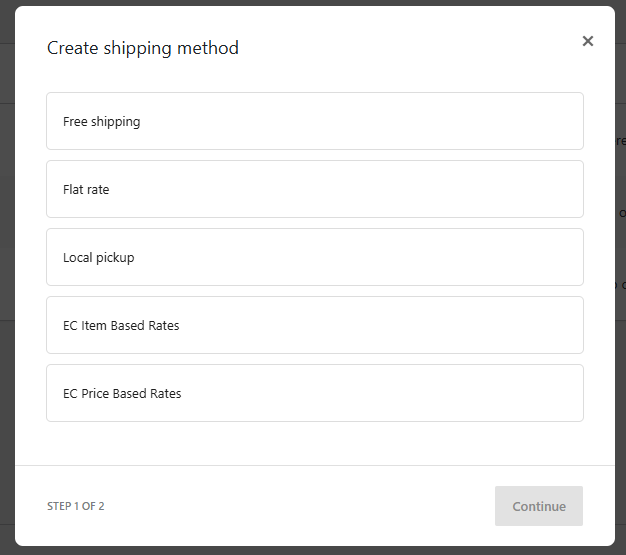
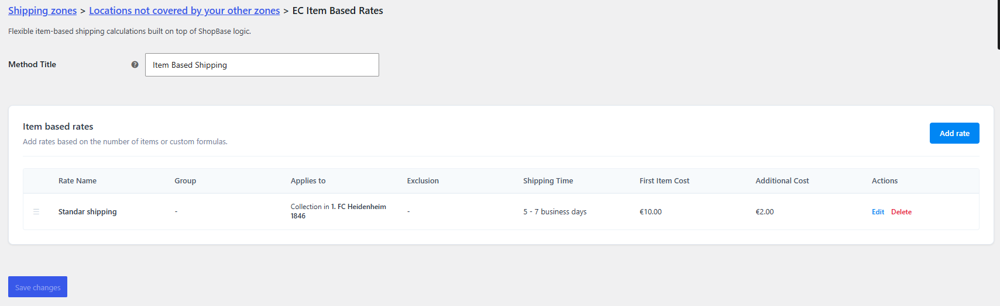
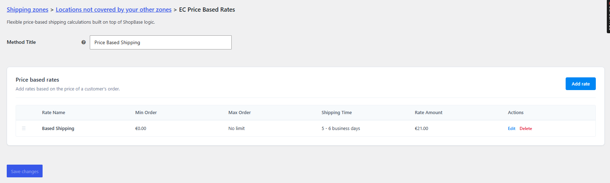
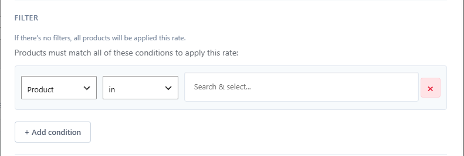
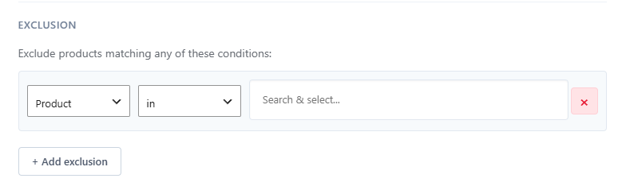
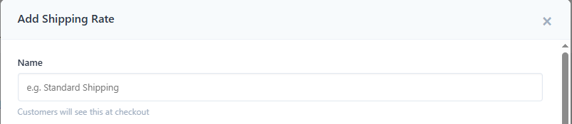
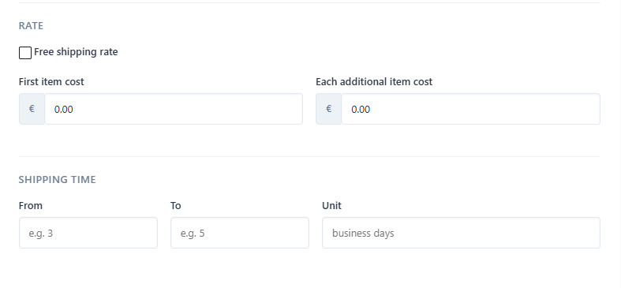
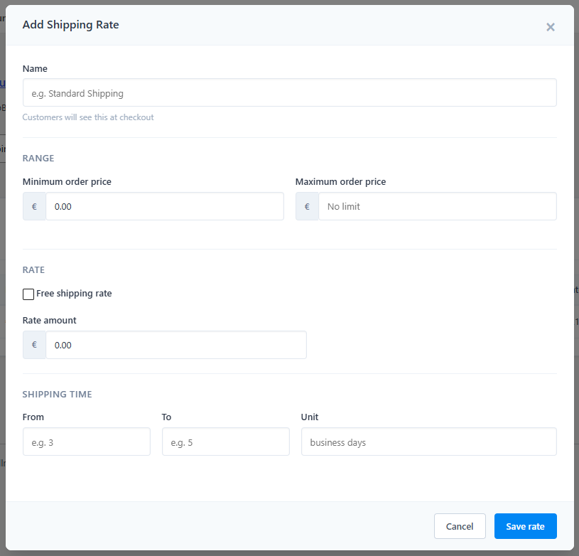

# Hướng dẫn Sử dụng & Cấu hình Plugin EC Advanced Shipping

Tài liệu này hướng dẫn cách cấu hình và sử dụng plugin **EC Advanced Shipping** cho hệ thống WooCommerce. Plugin cung cấp giải pháp tính phí vận chuyển nâng cao với cơ chế lọc sản phẩm (ShopBase-like rules), quản lý phân nhóm và áp dụng chiến lược tính phí linh hoạt.

---

## 1. Giới thiệu các Phương thức Vận chuyển

Plugin bổ sung 2 phương thức vận chuyển chính trong WooCommerce tại **WooCommerce > Settings > Shipping > Shipping Zones > Add shipping method**:

1. **EC Item Based Rates (Tính phí theo số lượng sản phẩm)**:
   - Tính phí dựa trên số lượng sản phẩm trong giỏ hàng.
   - Hỗ trợ các kiểu tính phí: Cố định (Flat cost), Miễn phí (Free shipping), hoặc tính theo công thức: `Phí sản phẩm đầu tiên + (Số lượng - 1) * Phí sản phẩm tiếp theo`.

   

2. **EC Price Based Rates (Tính phí theo giá trị đơn hàng)**:
   - Tính phí dựa trên tổng giá trị (Subtotal) của các sản phẩm thỏa mãn điều kiện.
   - Thiết lập khoảng giá trị tối thiểu (Min Subtotal) và tối đa (Max Subtotal).

   

---

## 2. Hệ thống Quy tắc Lọc Điều kiện (Rule Engine)

Mỗi mức phí (Rate) được cấu hình có thể áp dụng các bộ lọc để chỉ tính toán dựa trên các sản phẩm thỏa mãn:
- **Filters (Điều kiện áp dụng - Logic AND)**: Sản phẩm phải thỏa mãn *tất cả* các điều kiện này thì mới được đưa vào tính toán phí.
- **Exclusions (Điều kiện loại trừ - Logic OR)**: Nếu sản phẩm thỏa mãn *bất kỳ* điều kiện loại trừ nào, sản phẩm đó sẽ bị loại bỏ khỏi tính toán của mức phí này.

*Hình minh họa: Cấu hình bộ lọc Filters*

*Hình minh họa: Cấu hình bộ lọc Exclusions*

### Các trường hỗ trợ lọc:
- **Product**: Lọc theo ID sản phẩm hoặc ID biến thể.
- **Category**: Lọc theo đường dẫn danh mục sản phẩm (Category slug).
- **Tag**: Lọc theo thẻ sản phẩm (Tag slug).
- **Collection**: Lọc theo custom taxonomy `wcek_collection`.
- **Product Type**: Lọc theo custom taxonomy `ec_product_type`.

### Các toán tử so sánh (Operators):
- `in`: Nằm trong danh sách (phân tách bởi dấu phẩy).
- `not_in`: Không nằm trong danh sách (phân tách bởi dấu phẩy).

---

## 3. Phân nhóm & Chiến lược Tính Phí (Group Logic & Strategies)

Khi có nhiều mức phí vận chuyển cùng thỏa mãn các điều kiện của giỏ hàng, gộp chúng vào cùng một **Group** để áp dụng chiến lược kết hợp phí:

- **Highest (Phí cao nhất - Mặc định)**: Lấy mức phí có giá trị cao nhất trong nhóm.

*Hình minh họa: Thiết lập Group cho các mức phí vận chuyển*

---

## 4. Hướng dẫn Thiết lập Trang Quản trị

### Bước 1: Thêm Phương thức Vận chuyển
1. Truy cập **WooCommerce > Settings**.
2. Chọn tab **Shipping** và nhấp vào **Shipping Zone**.
3. Chọn **Add shipping method** và chọn phương thức mong muốn (EC Item Based Rates hoặc EC Price Based Rates).

### Bước 2: Cấu hình Chi tiết Phương thức Vận chuyển
Nhấp **Edit** dưới phương thức vừa thêm để cấu hình các Rate, Rule và lưu cài đặt.

#### 2.1. Thiết lập EC Item Based Rate
- **General & Name**: Thiết lập tên hiển thị của phí vận chuyển và nhóm.
  
  
- **Rate & Shipping Time**: Nhập giá trị phí vận chuyển, công thức tính toán và thời gian giao hàng dự kiến.
  

#### 2.2. Thiết lập EC Price Based Rate
- Thiết lập tương tự với các khoảng Min/Max Subtotal, Phí vận chuyển tương ứng.
  
