# Hướng dẫn Sử dụng và Cấu hình Plugin EC Bulk Update (Phiên bản: 1.2.1)

Tài liệu này hướng dẫn cách cấu hình và sử dụng plugin **EC Bulk Update** trên hệ thống WooCommerce. Plugin cung cấp giải pháp cập nhật hàng loạt (bulk update) sản phẩm và biến thể với hiệu năng cao, tích hợp bộ lọc động kiểu ShopBase, cơ chế chạy ngầm (background job processing), quản lý lịch sử và ghi nhận lỗi chi tiết.

---

## 1. Các Tính năng Chính

* **Bộ lọc Sản phẩm động (Dynamic Product Filters)**: Tìm kiếm và lọc sản phẩm cần cập nhật dựa trên nhiều tiêu chí như title, category, tags, collections, price, stock, status,... với logic kết hợp linh hoạt.
* **Bộ lọc Biến thể (Variant Filters)**: Cho phép bật/tắt để lọc riêng biệt các thuộc tính biến thể (price, stock, specific attributes such as size, color...) đối với các sản phẩm có nhiều biến thể.
* **Hành động Cập nhật Đa dạng (Bulk Actions)**:
  * *Giá bán*: Cập nhật giá bán thường, giá khuyến mãi (increase/decrease by a fixed amount or percentage, override new price, clear sale price) và làm tròn/mỹ hóa giá.
  * *Kho hàng*: Đặt số lượng tồn kho (increase, decrease, set directly) hoặc cập nhật trạng thái kho (In stock, Out of stock).
  * *Phân loại (Taxonomies)*: Thêm, xóa, ghi đè hoặc thay thế các categories, tags, collections, product types.
  * *Tiêu đề & Mô tả*: Thêm tiền tố/hậu tố, tìm kiếm và thay thế chuỗi, ghi đè mô tả (hỗ trợ HTML).
  * *Trạng thái*: Chuyển đổi hàng loạt trạng thái sản phẩm (Published, Draft, Private, Pending Review, Trash).
  * *Hình ảnh*: Thêm hình ảnh mới (hỗ trợ ảnh local từ Media Library hoặc link URL ngoài), xóa hình ảnh theo vị trí xác định, thay đổi vị trí thứ tự của hình ảnh.
* **Xem trước Kết quả (Matched Products Preview)**: Kiểm tra danh sách sản phẩm và số lượng khớp thực tế trước khi áp dụng thay đổi để đảm bảo tính chính xác.
* **Xử lý Chạy ngầm An toàn & Hiệu năng cao (Background Batch Worker)**:
  * Tự động chia nhỏ khối lượng công việc thành từng lô (batch) chạy ngầm để tránh lỗi quá tải bộ nhớ hoặc timeout máy chủ.
  * Tối ưu hiệu năng bằng cách tạm thời dừng đếm liên kết phân loại (`wp_defer_term_counting`), tắt lookup trực tiếp thuộc tính WooCommerce, bỏ qua việc tạo tác vụ Action Scheduler không cần thiết, và xóa cache post/transients ngay sau mỗi lô xử lý thành công.
* **Điều khiển & Giám sát Tiến độ (Job Control & Error Logs)**: Tạm dừng (Pause), tiếp tục (Resume), hủy bỏ (Cancel) tiến trình và xem báo cáo lỗi chi tiết của từng sản phẩm/biến thể bị thất bại.

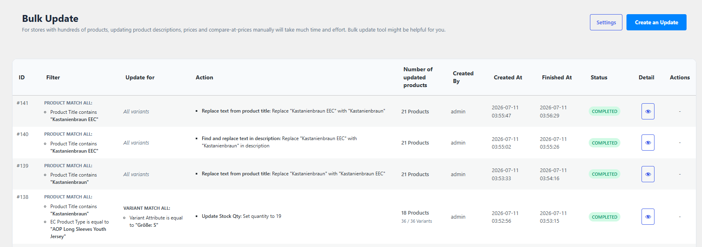
*Hình minh họa: Giao diện quản lý lịch sử các tác vụ Bulk Update*

---

## 2. Hệ thống Lọc Điều kiện (Filter Builder)

Bộ lọc điều kiện của plugin được thiết kế trực quan tương tự ShopBase, hỗ trợ thiết lập logic tổng hợp:

* **All conditions (Logic AND)**: Sản phẩm/Biến thể phải thỏa mãn *tất cả* điều kiện đã đặt ra mới được chọn để cập nhật.
* **Any condition (Logic OR)**: Sản phẩm/Biến thể chỉ cần thỏa mãn *ít nhất một* trong các điều kiện đã đặt ra sẽ được chọn.

### 2.1. Bộ lọc cho Sản phẩm Cha (Product Filters)

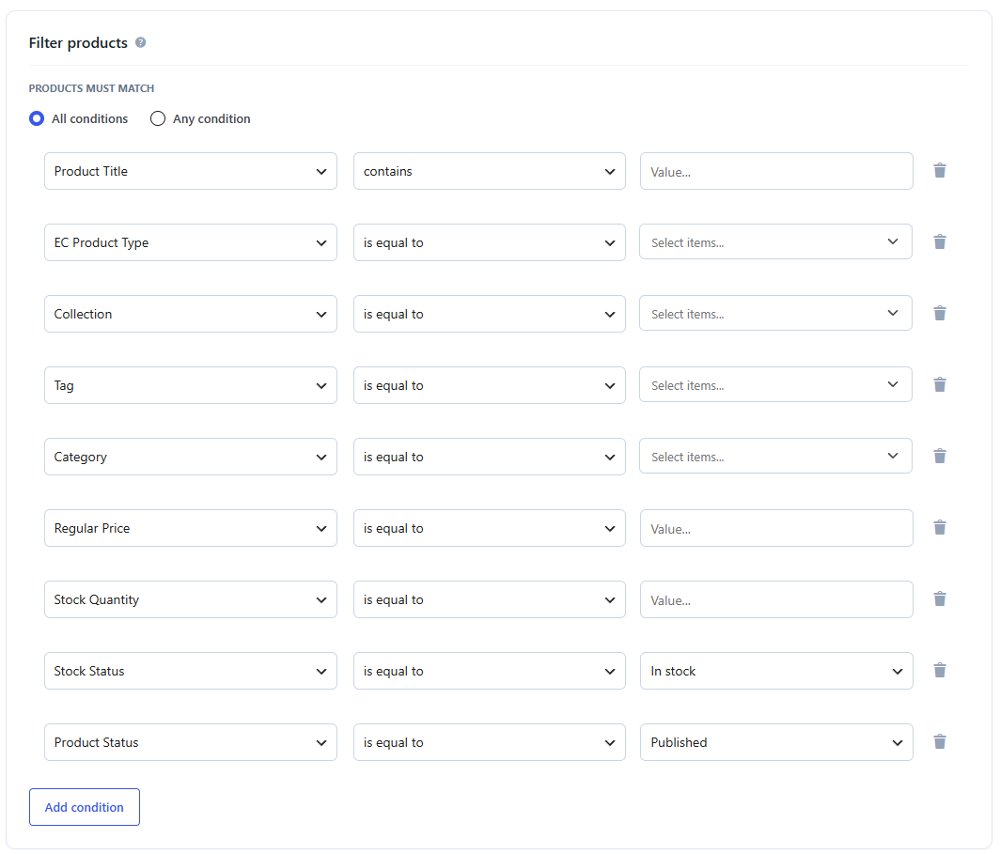
*Hình minh họa: Thiết lập điều kiện lọc sản phẩm cha*

| Trường lọc    | Nhãn hiển thị (UI Label) | Các toán tử hỗ trợ                                                  | Loại dữ liệu / Mô tả                                                                                                                                                   |
| :--------------- | :-------------------------- | :----------------------------------------------------------------------- | :-------------------------------------------------------------------------------------------------------------------------------------------------------------------------- |
| `title`        | **Product Title**     | `LIKE` (Chứa), `NOT LIKE` (Không chứa), `=` (Bằng chính xác) | Tìm kiếm theo từ khóa trong tiêu đề (tách từ giống Admin Search mặc định).                                                                                     |
| `type`         | **EC Product Type**   | `=`, `IN`                                                            | Lọc theo Custom Taxonomy`ec_product_type`.                                                                                                                               |
| `collection`   | **Collection**        | `=`, `IN`                                                            | Lọc theo Custom Taxonomy bộ sưu tập`wcek_collection`.                                                                                                                 |
| `tag`          | **Tag**               | `=`, `IN`                                                            | Lọc theo thẻ sản phẩm`product_tag`.                                                                                                                                   |
| `category`     | **Category**          | `=`, `IN`                                                            | Lọc theo danh mục sản phẩm`product_cat`.                                                                                                                              |
| `price`        | **Regular Price**     | `=`, `<`, `>`                                                      | Lọc theo khoảng giá bán thường của sản phẩm.                                                                                                                       |
| `stock`        | **Stock Quantity**    | `=`, `<`, `>`                                                      | Lọc theo số lượng tồn kho của sản phẩm.                                                                                                                             |
| `stock_status` | **Stock Status**      | `=`                                                                    | Lọc theo trạng thái kho:*In stock* (Còn hàng), *Out of stock* (Hết hàng).                                                                                        |
| `status`       | **Product Status**    | `=`                                                                    | Lọc theo trạng thái bài viết:*Published* (Đã đăng), *Draft* (Bản nháp), *Private* (Riêng tư), *Pending Review* (Chờ duyệt), *Trash* (Thùng rác). |

### 2.2. Bộ lọc cho Biến thể (Variant Filters - Tùy chọn)

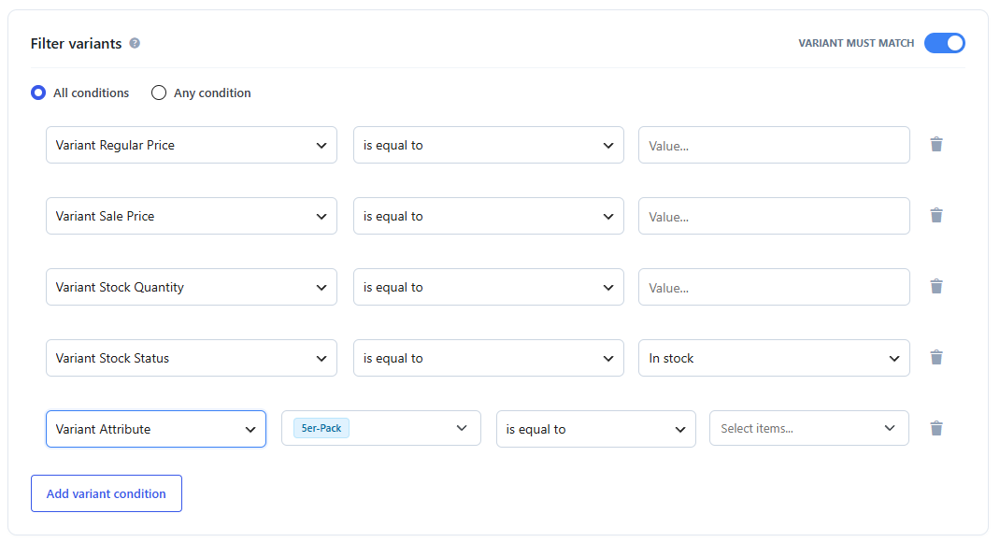
*Hình minh họa: Kích hoạt và thiết lập bộ lọc biến thể con*

> [!TIP]
> **Mẹo cấu hình**: Bật nút switch **Variant Must Match** để áp dụng bộ lọc này. Khi bật, hệ thống sẽ mở rộng các sản phẩm Variable để kiểm tra từng biến thể con. Nếu không bật, thay đổi sẽ áp dụng lên tất cả biến thể thuộc sản phẩm cha thỏa mãn điều kiện.

| Trường lọc            | Nhãn hiển thị (UI Label)      | Các toán tử hỗ trợ | Loại dữ liệu / Mô tả                                                            |
| :----------------------- | :------------------------------- | :---------------------- | :----------------------------------------------------------------------------------- |
| `variant_price`        | **Variant Regular Price**  | `=`, `<`, `>`     | Lọc theo giá bán thường của biến thể.                                        |
| `variant_sale_price`   | **Variant Sale Price**     | `=`, `<`, `>`     | Lọc theo giá khuyến mãi của biến thể.                                         |
| `variant_stock`        | **Variant Stock Quantity** | `=`, `<`, `>`     | Lọc theo số lượng tồn kho của biến thể.                                      |
| `variant_stock_status` | **Variant Stock Status**   | `=`                   | Lọc theo trạng thái kho của biến thể (*In stock*, *Out of stock*).         |
| `variant_attribute`    | **Variant Attribute**      | `=`, `IN`           | Lọc theo các thuộc tính biến thể cụ thể (ví dụ: kích thước, màu sắc). |

---

## 3. Các Hành động Cập nhật Hàng loạt (Bulk Actions)

Có thể thiết lập một hoặc nhiều hành động chạy tuần tự trên các sản phẩm khớp điều kiện:

### 3.1. Nhóm Cập nhật Giá (Price Actions)

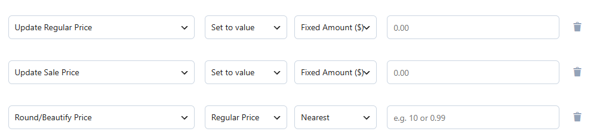
*Hình minh họa: Các thiết lập hành động cập nhật giá bán*

1. **Update Regular Price (Cập nhật giá thường)**:
   * `set`: Đặt giá thường thành một số cố định cụ thể.
   * `increase`: Tăng giá thường theo số tiền cố định (`fixed`) hoặc theo phần trăm (`percent`) so với giá hiện tại.
   * `decrease`: Giảm giá thường theo số tiền cố định hoặc phần trăm (giá trị tối thiểu bị giới hạn ở mức 0).
   * *Logic tự động*: Tự động cập nhật lại trường giá kích hoạt (`_price`) dựa trên việc kiểm định giá khuyến mãi hiện hành. Nếu giá khuyến mãi mới cao hơn hoặc bằng giá thường mới, hệ thống tự động xóa giá khuyến mãi.
2. **Update Sale Price (Cập nhật giá khuyến mãi)**:
   * `set`, `increase`, `decrease` tương tự như giá thường.
   * `clear`: Xóa hoàn toàn giá khuyến mãi của sản phẩm/biến thể. Hệ thống sẽ khôi phục giá kích hoạt về mức giá thường.
   * *Logic tự động*: Nếu giá khuyến mãi mới tính toán ra lớn hơn hoặc bằng giá thường, hệ thống sẽ tự động dọn dẹp giá khuyến mãi (`clear`) để tránh hiển thị sai lệch thông tin trên giao diện người dùng.
3. **Round/Beautify Price (Làm tròn & Mỹ hóa giá)**:
   * Hành động: Áp dụng trên giá thường (`regular_price`), giá khuyến mãi (`sale_price`), hoặc cả hai (`both`).
   * Chế độ làm tròn (`mode`):
     * `lower`: Làm tròn xuống.
     * `upper`: Làm tròn lên.
     * `nearest`: Làm tròn đến mức gần nhất.
   * Giá trị làm tròn (`value`): Hỗ trợ làm tròn theo số nguyên (ví dụ: kết thúc bằng `9`, `99` hay `0` để ra mức giá đẹp dạng $99, $199) hoặc số thập phân (ví dụ: kết thúc bằng `0.99`, `0.95` để ra giá dạng $9.99, $19.95).

### 3.2. Nhóm Cập nhật Kho hàng (Stock Actions)

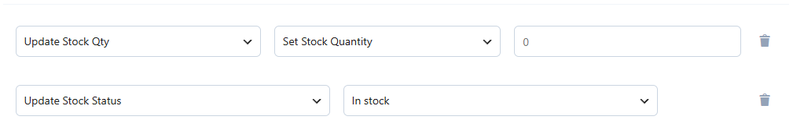
*Hình minh họa: Thiết lập số lượng tồn kho và trạng thái kho*

1. **Update Stock Qty (Cập nhật số lượng tồn kho)**:
   * `set`: Đặt số lượng kho trực tiếp.
   * `increase`: Tăng thêm số lượng tồn kho (yêu cầu giá trị nhập > 0).
   * `decrease`: Giảm bớt số lượng tồn kho (yêu cầu giá trị nhập > 0, giá trị tối thiểu sau giảm giới hạn ở mức 0).
   * *Logic tự động*: Tự động đổi trạng thái kho thành `instock` nếu số lượng mới lớn hơn 0, ngược lại đổi thành `outofstock`.
2. **Update Stock Status (Cập nhật trạng thái kho)**:
   * Hành động đặt trực tiếp trạng thái kho thành **In stock** hoặc **Out of stock**.
   * *Logic tự động*: Khi đặt trạng thái kho thành **In stock**, hệ thống sẽ tự động gán số lượng tồn kho mặc định lấy từ cài đặt hệ thống (Default Instock Qty - mặc định là 1000).

### 3.3. Nhóm Cập nhật Phân loại (Taxonomy Actions)

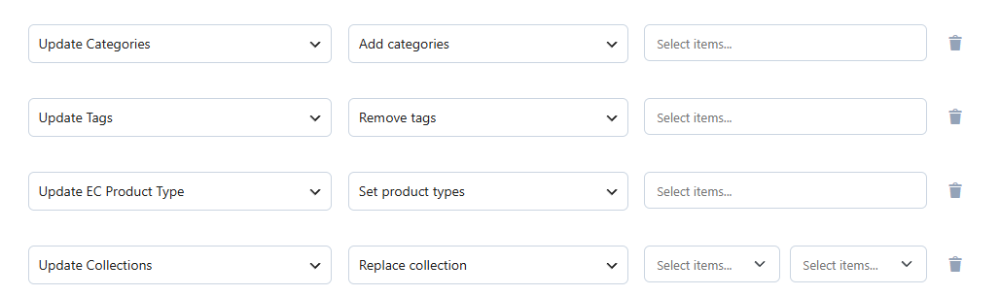
*Hình minh họa: Thiết lập thêm, xóa, ghi đè hoặc thay thế taxonomy*

Áp dụng cho: **Categories** (Danh mục), **Tags** (Thẻ), **Collections** (Bộ sưu tập), và **EC Product Types** (Loại sản phẩm):

* `add`: Thêm các phân loại mới vào danh sách phân loại hiện tại của sản phẩm.
* `remove`: Gỡ bỏ các phân loại chỉ định khỏi sản phẩm.
* `set`: Đặt mới hoàn toàn phân loại chỉ định, ghi đè toàn bộ các phân loại hiện có của sản phẩm.
* `replace`: Thay thế phân loại cũ bằng một phân loại mới được chỉ định (`search_value` -> `replace_value`).

### 3.4. Nhóm Cập nhật Tiêu đề & Mô tả

1. **Tiêu đề (Title)**:
   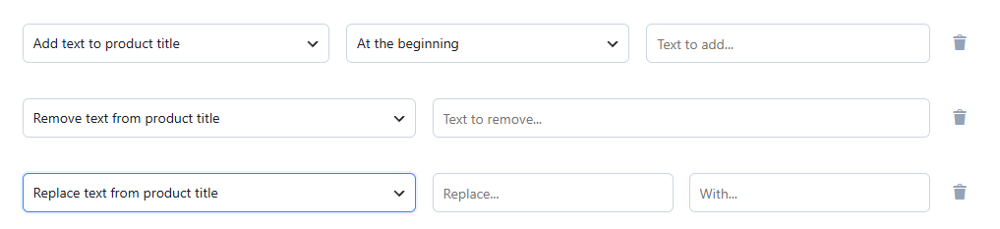
   *Hình minh họa: Thiết lập các tùy chọn thêm/xóa/thay thế tiêu đề*

   * **Add text to product title**: Thêm tiền tố vào trước (`prefix`) hoặc hậu tố vào sau (`suffix`) tiêu đề hiện tại.
   * **Remove text from product title**: Tìm và xóa chuỗi ký tự chỉ định khỏi tiêu đề sản phẩm.
   * **Replace text from product title**: Tìm kiếm chuỗi ký tự chỉ định và thay thế bằng chuỗi ký tự mới.
2. **Mô tả (Description)**:
   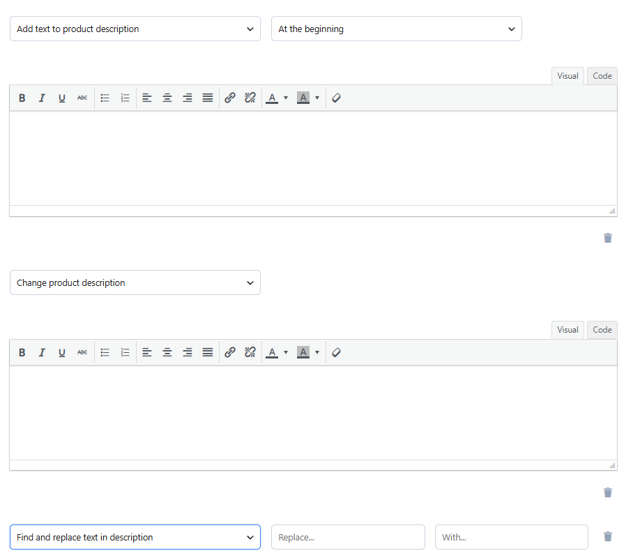
   *Hình minh họa: Thiết lập ghi đè hoặc thay thế đoạn mô tả sản phẩm*

   * **Add text to product description**: Thêm đoạn văn bản (cho phép thẻ HTML) vào đầu (`prefix`) hoặc cuối (`suffix`) mô tả sản phẩm.
   * **Set product description**: Ghi đè toàn bộ mô tả sản phẩm bằng đoạn văn bản mới (cho phép HTML).
   * **Replace text from product description**: Tìm kiếm đoạn văn bản chỉ định trong phần mô tả sản phẩm và thay thế bằng đoạn văn bản mới.

### 3.5. Nhóm Cập nhật Trạng thái (Status Action)

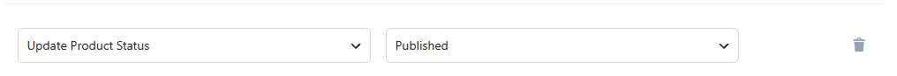
*Hình minh họa: Thiết lập chuyển đổi trạng thái bài viết sản phẩm*

* Thay đổi trạng thái sản phẩm hàng loạt sang các trạng thái: Đã đăng (`publish`), Bản nháp (`draft`), Riêng tư (`private`), Chờ duyệt (`pending`), hoặc Thùng rác (`trash`).

### 3.6. Nhóm Cập nhật Hình ảnh (Image Actions)

Nhóm hành động này chỉ áp dụng cho sản phẩm cha (không áp dụng cho từng biến thể riêng lẻ). Các ảnh của sản phẩm được quản lý dưới dạng danh sách chỉ số (0-based index):

* **Ảnh ở vị trí 0 (Index 0)**: Ảnh đại diện sản phẩm (Featured Image / Thumbnail).
* **Ảnh từ vị trí 1 trở đi (Index 1+)**: Các ảnh trong thư viện ảnh sản phẩm (Product Gallery Images).

Plugin hỗ trợ 3 hành động cụ thể sau:

1. **Add image to product (Thêm hình ảnh vào sản phẩm)**:

   * **Source (Nguồn ảnh)**:
     * `url` (External URL): Sử dụng liên kết ảnh bên ngoài. Hệ thống sẽ tự động tạo một bản ghi đính kèm giả (fake attachment) trong thư viện với ID tác giả là `77777`, lưu đường dẫn thực tế vào meta `fifu_image_url`, `fifu_list_url` và `_wp_attached_file` (được tiền tố bằng dấu chấm phẩy `;`) để tương thích với các plugin như `show-link-image` hoặc `ewcm-connector`.
     * `media` (Media Library): Chọn ảnh sẵn có từ Thư viện Media bằng cách truyền vào ID của attachment.
   * **Position (Vị trí chèn)**:
     * `first`: Chèn vào đầu danh sách (làm Ảnh đại diện sản phẩm).
     * `last`: Chèn vào cuối danh sách ảnh gallery.
     * `last_minus_<offset>` (From the End): Xác định vị trí từ cuối danh sách đếm ngược lại với khoảng lệch (offset). Ví dụ: `last_minus_1` sẽ chèn vào trước ảnh cuối cùng (lùi 1 vị trí so với cuối), `last_minus_0` tương đương với `last`, `last_minus_2` sẽ chèn trước hai ảnh cuối cùng, v.v. (Công thức tính vị trí chèn: `max(0, Tổng số ảnh - offset)`).
     * Số nguyên (chỉ số cụ thể >= 0): Hệ thống sẽ chèn chính xác vào vị trí mong muốn (nếu chỉ số lớn hơn số lượng ảnh hiện tại, ảnh sẽ tự động được thêm vào cuối).

   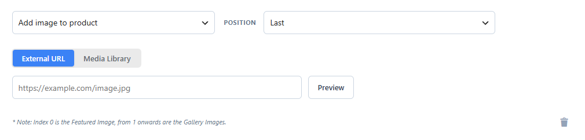
   *Hình minh họa: Thiết lập hành động thêm hình ảnh*
2. **Remove image by position (Xóa hình ảnh theo vị trí)**:

   * **Position (Vị trí xóa)**: Chọn `first`, `last`, `last_minus_<offset>` (From the End) hoặc truyền chỉ số cụ thể cần xóa. Với `last_minus_<offset>` (ví dụ `last_minus_1` để xóa ảnh ngay trước ảnh cuối), hệ thống sẽ tính vị trí xóa theo công thức: `Tổng số ảnh - 1 - offset`.
   * *Logic tự động*: Nếu ảnh bị xóa là ảnh từ link ngoài (External URL), plugin sẽ tự động chạy SQL để xóa hoàn toàn bản ghi đính kèm giả liên quan trong các bảng `wp_posts` và `wp_postmeta` nhằm giải phóng dung lượng cho database. Nếu sản phẩm không có ảnh nào hoặc chỉ số truyền vào nằm ngoài phạm vi hiện tại, hệ thống sẽ bỏ qua và ghi log cảnh báo (`[WARNING]`).

   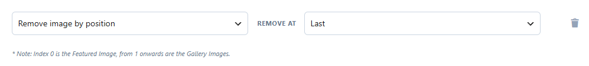
   *Hình minh họa: Thiết lập hành động xóa hình ảnh theo vị trí*
3. **Change image position (Thay đổi vị trí hình ảnh)**:

   * Di chuyển vị trí của một ảnh hiện có trong danh sách.
   * **From Position (Vị trí nguồn)** và **To Position (Vị trí đích)**: Chấp nhận các giá trị `first`, `last`, `last_minus_<offset>` (From the End) hoặc chỉ số cụ thể.
   * *Logic kiểm duyệt*: Yêu cầu sản phẩm phải có từ 2 ảnh trở lên và vị trí nguồn phải hợp lệ, nếu không hệ thống sẽ ghi log cảnh báo và bỏ qua sản phẩm đó.

   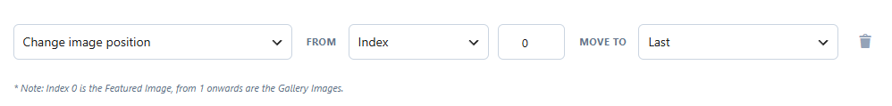
   *Hình minh họa: Thiết lập hành động thay đổi vị trí hình ảnh*

---

## 4. Hướng dẫn Quy trình Thực hiện Bulk Update

### Bước 1: Tạo mới một tác vụ cập nhật (Create an Update)

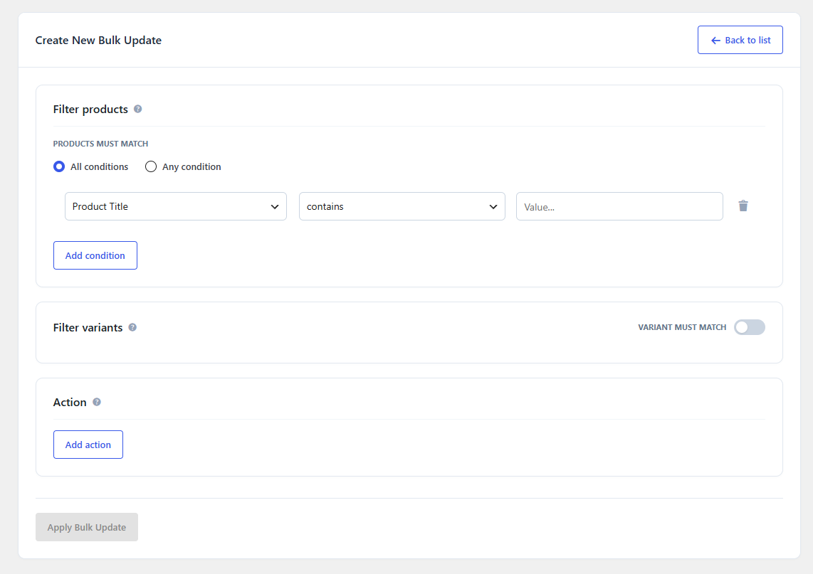
*Hình minh họa: Toàn bộ giao diện cấu hình tạo mới tác vụ Bulk Update*

1. Truy cập menu **Products > EC Bulk Update** trong trang quản trị WordPress.
2. Nhấp vào nút **Create an Update** ở góc phải màn hình.
3. Tại phần **Filter products**, thiết lập các điều kiện để tìm kiếm tập sản phẩm cần áp dụng thay đổi.
4. (Tùy chọn) Bật **Filter variants** nếu chỉ muốn áp dụng cập nhật trên một số biến thể cụ thể của sản phẩm biến thể.
5. Tại phần **Action**, chọn **Add action**, cấu hình chi tiết hành động và tham số tương ứng. Có thể thêm nhiều hành động chạy liên tiếp.
6. Nhấp nút **Apply Bulk Update** ở góc dưới.

### Bước 2: Xem trước dữ liệu (Preview)

1. Sau khi nhấp Apply, một cửa sổ popup **Preview Bulk Update** sẽ hiển thị.
2. Cửa sổ này hiển thị tóm tắt bộ lọc và hành động đã thiết lập, đồng thời hiển thị danh sách các sản phẩm khớp điều kiện kèm theo thông số chi tiết (Ảnh, ID, Tiêu đề, Giá, Tồn kho, Trạng thái).
3. Nếu danh sách sản phẩm hiển thị chính xác, nhấp **Apply** để bắt đầu kích hoạt tác vụ cập nhật ngầm. Nếu cần chỉnh sửa lại, nhấp **Cancel**.

### Bước 3: Giám sát tiến độ và xử lý lỗi

1. Hệ thống chuyển hướng về trang **Lịch sử (Bulk Update History)**.
2. Tác vụ mới tạo sẽ hiển thị ở dòng đầu tiên của bảng với trạng thái ban đầu là `running`.
3. Nhấp nút **Detail** ở cột cuối để mở popup chi tiết tiến trình:
   * Popup hiển thị thanh tiến độ xử lý sản phẩm cha và biến thể trực quan theo thời gian thực (real-time).
   * Cung cấp thông số thống kê số sản phẩm Thành công (Success) và Thất bại (Failed).
   * Nếu có sản phẩm cập nhật thất bại, phần **Failed Logs (Errors)** bên dưới sẽ hiển thị chi tiết: **ID Sản phẩm**, **Lý do lỗi (Failure Reason)** và **Thời điểm lỗi**.
4. Có thể thao tác trực tiếp trên cột **Actions** của bảng lịch sử:
   * **Pause (Tạm dừng)**: Dừng tạm thời tác vụ đang chạy.
   * **Resume (Tiếp tục)**: Tiếp tục chạy tác vụ đang tạm dừng.
   * **Cancel (Hủy bỏ)**: Hủy bỏ hoàn toàn tác vụ (các sản phẩm đã được xử lý thành công trước đó vẫn được giữ nguyên).

---

## 5. Cấu hình Cài đặt Plugin (Settings)

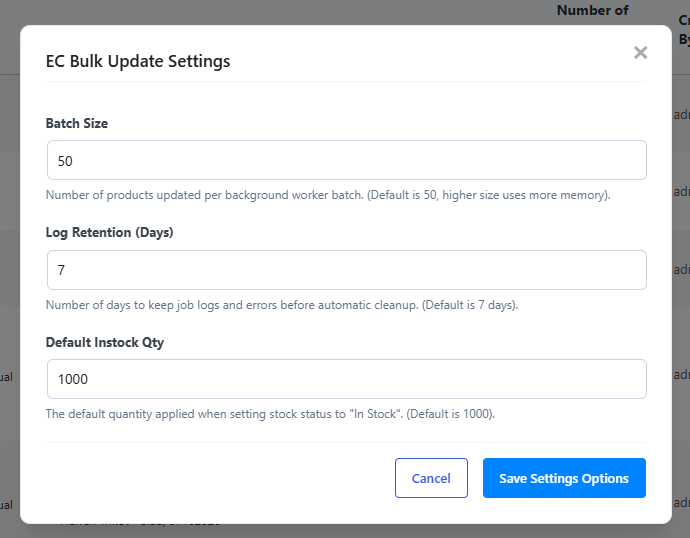
*Hình minh họa: Popup thiết lập các tham số hệ thống cho Bulk Update*

Để truy cập phần cài đặt, tại trang lịch sử **Bulk Update**, nhấp vào nút **Settings** ở góc phải phía trên. Một cửa sổ popup cấu hình xuất hiện:

* **Batch Size (Kích thước mỗi lô)**: Số lượng sản phẩm được xử lý trong mỗi lượt chạy ngầm. Mặc định là `20` sản phẩm (cho phép thiết lập từ `10` đến `500`).

  > [!WARNING]
  > **Lưu ý hiệu năng**: Đặt giá trị Batch Size quá lớn có thể rút ngắn thời gian hoàn thành tác vụ nhưng sẽ tiêu tốn tài nguyên bộ nhớ RAM của máy chủ và tăng nguy cơ gây đứng trang. Nên đặt ở mức từ `20` đến `50`.
  >
* **Log Retention (Thời gian lưu lịch sử)**: Số ngày hệ thống giữ lại lịch sử công việc và log lỗi trước khi tự động dọn dẹp để giảm dung lượng database. Mặc định là `7` ngày (cho phép thiết lập từ `1` đến `90` ngày).
* **Default Instock Qty (Số lượng kho mặc định)**: Số lượng tồn kho tự động áp dụng khi thực hiện hành động cập nhật trạng thái kho sang "In stock" đối với các sản phẩm có số lượng tồn kho là `0` hoặc "empty". Mặc định là `1000`.

Nhấp **Save Settings Options** để lưu lại các cài đặt mới.
