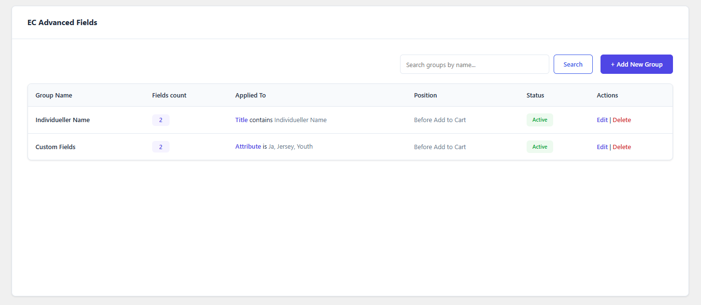
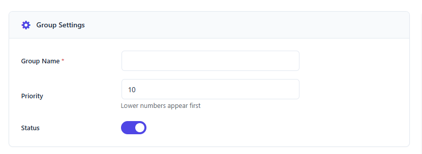
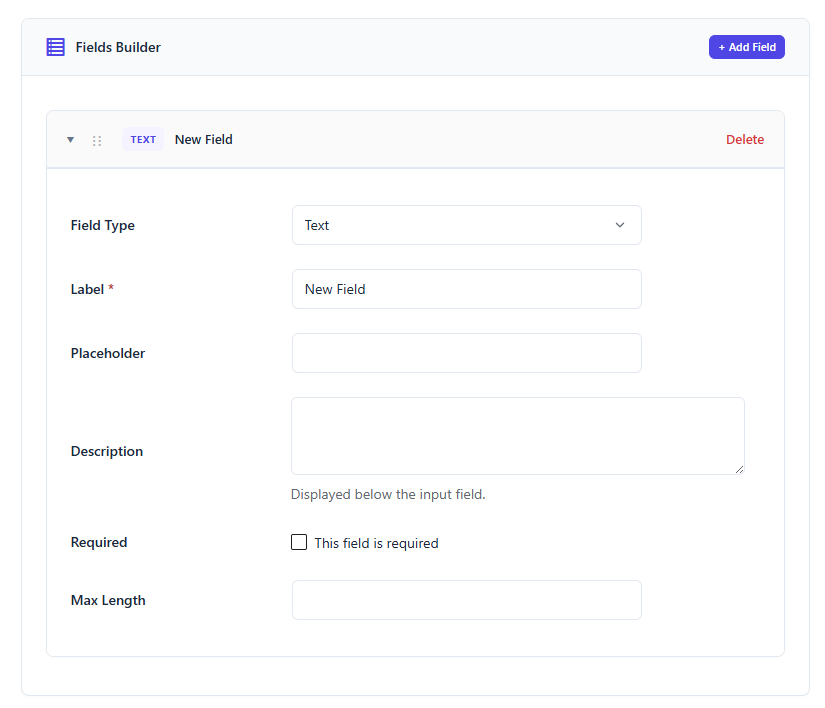
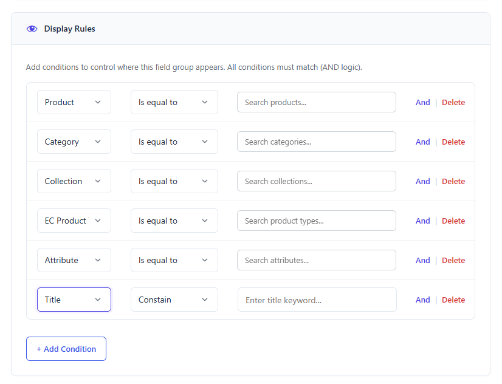
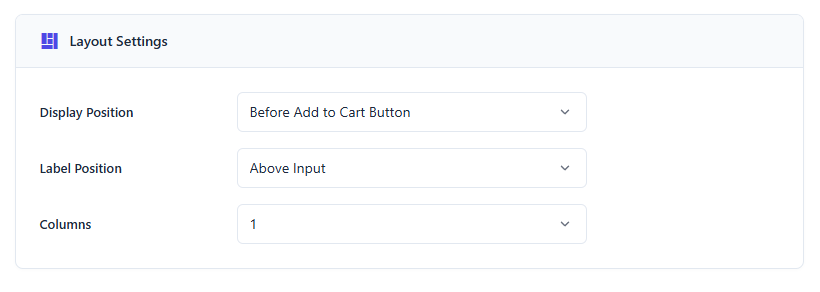
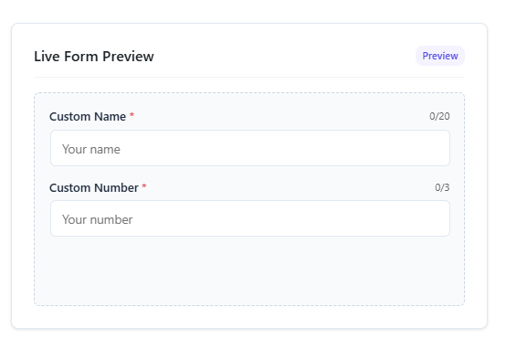

# Hướng dẫn Sử dụng Plugin EC Product Advanced Fields

> [!NOTE]
> **EC Product Advanced Fields** cung cấp tính năng bổ sung và quản lý các Custom Fields cho sản phẩm (Ví dụ: Custom name, Custom number cho các sản phẩm cá nhân hóa).

---

## 1. Truy cập & Quản lý Danh sách Nhóm trường

Để bắt đầu quản lý các nhóm trường nâng cao cho sản phẩm:

- Truy cập vào menu quản trị: **Products -> EC Advanced Fields**.
- Trang quản lý chính hiển thị toàn bộ các nhóm trường đã tạo, cho phép xem nhanh tiêu đề, thứ tự ưu tiên (Priority), trạng thái hoạt động (Status) và cung cấp các tùy chọn chỉnh sửa/xóa nhanh.

    

---

## 2. Cấu hình Chi tiết Nhóm trường (Advanced Field Settings)

Khi thực hiện tạo mới (**Add New**) hoặc chỉnh sửa một nhóm trường, giao diện cấu hình được chia thành các phần chính:

### 2.1. Cấu hình Nhóm (Group Settings)

Thiết lập các thông số cơ bản cho cả nhóm trường:

- **Group Name**: Tiêu đề đại diện của nhóm trường (Ví dụ: *Thông số kỹ thuật điện thoại*).
- **Priority (Thứ tự ưu tiên)**: Thiết lập độ ưu tiên hiển thị. Số càng nhỏ thì nhóm trường này sẽ hiển thị càng cao trong trang biên tập sản phẩm và ngoài frontend.
- **Status (Trạng thái)**: Bật/tắt trạng thái hoạt động của nhóm trường (Active/Inactive).

    

---

### 2.2. Thiết lập Các Trường Con (Fields Builder)

Định nghĩa chi tiết từng trường dữ liệu cụ thể nằm bên trong nhóm:

- Nhấn **Add Field** để tạo một trường mới.
- **Field Type (Loại dữ liệu)**: Hiện hỗ trợ 2 loại chính:
  * `Text`: Trường nhập văn bản ngắn.
  * `Number`: Trường chỉ cho phép nhập ký tự số.
- **Label (Tiêu đề trường)**: Nhãn hiển thị hướng dẫn người dùng nhập liệu (Ví dụ: *Dung lượng PIN (mAh)*).
- **Placeholder**: Gợi ý nhập liệu mờ hiển thị bên trong ô trống.
- **Description**: Đoạn mô tả giải thích ngắn gọn về trường dữ liệu này.
- **Required (Bắt buộc)**:
  * Nếu kích hoạt, khách hàng phải điền dữ liệu trước khi thêm vào giỏ hàng.
  * Hệ thống tự động kích hoạt cơ chế kiểm tra (Validate) nghiêm ngặt ngay khi khách hàng nhấn nút **Add to Cart** hoặc **Buy Now**.
- **Validation**: Đặt giới hạn số lượng ký tự nhập vào tối đa (`Max Length`) để tránh làm vỡ giao diện hiển thị.

    

---

### 2.3. Quy tắc Hiển thị (Display Rules)

Cấu hình giúp hiển thị nhóm trường này cho các sản phẩm đáp ứng đúng điều kiện thiết lập.

- **Quy tắc bộ lọc (Rules)**: Hỗ trợ tạo các điều kiện hiển thị tự động dựa trên:
  * **Product**: Chỉ áp dụng cho một hoặc một vài sản phẩm được chỉ định trong điều kiện.
  * **Category**: Áp dụng cho toàn bộ các sản phẩm thuộc một danh mục cụ thể.
  * **Collection**: Áp dụng cho các sản phẩm thuộc một Collection cụ thể.
  * **EC Product Type**: Áp dụng cho các sản phẩm thuộc Product Type.
  * **Attribute**: Áp dụng cho các sản phẩm có chứa thuộc tính cụ thể trong điều kiện.
  * **Title**: Áp dụng cho các sản phẩm có chứa một phần tiêu đề có trong điều kiện.

    

---

### 2.4. Cấu hình Bố cục (Layout Settings)

Thiết lập cách hiển thị nhóm trường ở frontend của trang chi tiết sản phẩm:

- **Display Position (Vị trí hiển thị)**:
  * `Before Add to Cart Button` (Trước nút thêm vào giỏ hàng).
  * `After Add to Cart Button` (Sau nút thêm vào giỏ hàng).
  * `Before Product Summary` (Trước tóm tắt sản phẩm).
  * `After Product Summary` (Sau tóm tắt sản phẩm).
  * `Product Tabs` (Tab sản phẩm).
- **Label Position (Vị trí nhãn)**:
  * `Above Input` (Trên ô nhập liệu).
  * `Left of Input` (Bên trái ô nhập liệu).
  * `Right of Input` (Bên phải ô nhập liệu).
  * `Placeholder Only` (Chỉ hiển thị dưới dạng gợi ý mờ).
- **Columns (Số cột)**: Thiết lập hiển thị theo số cột (1, 2, 3 hoặc 4 cột) giúp tối ưu diện tích giao diện.

    

---

### 2.5. Xem trước trực quan (Live Form Preview)

Cột bên phải hiển thị trực quan và tức thời giao diện các trường dữ liệu đang cấu hình giúp dễ dàng tinh chỉnh thiết kế trước khi lưu.

    

