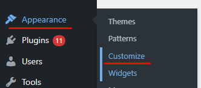
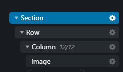
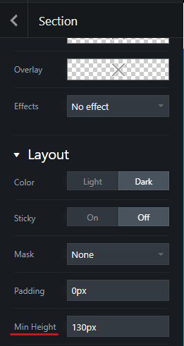
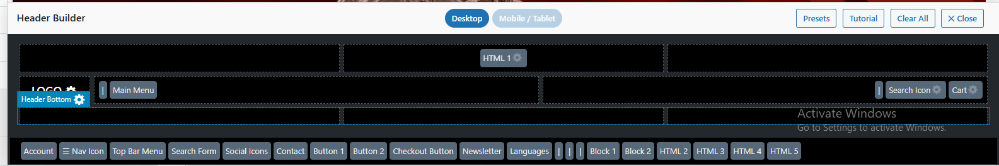
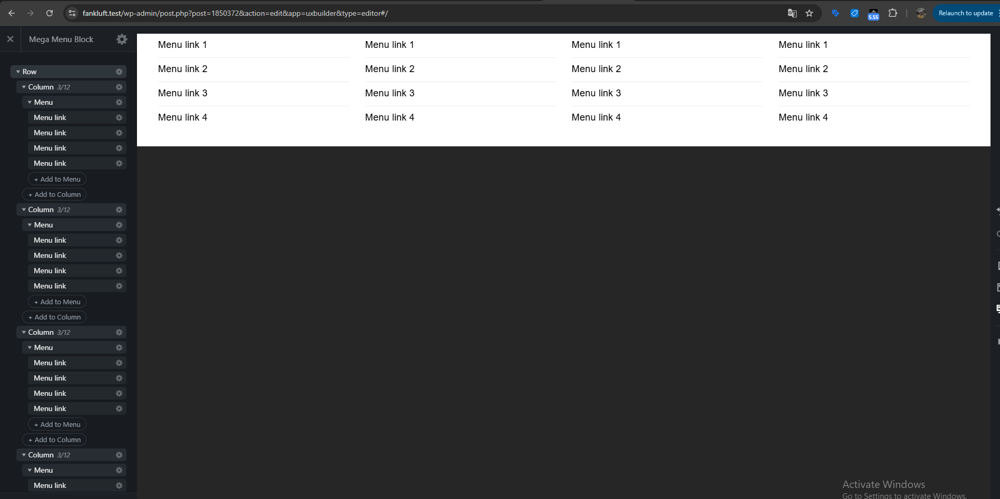
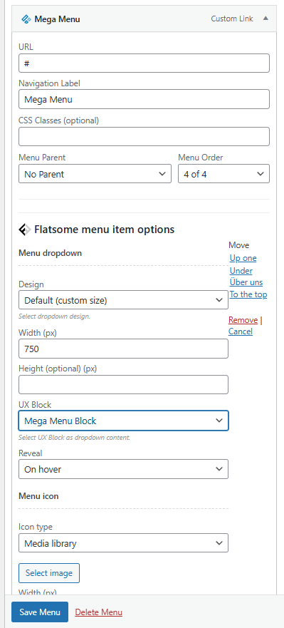
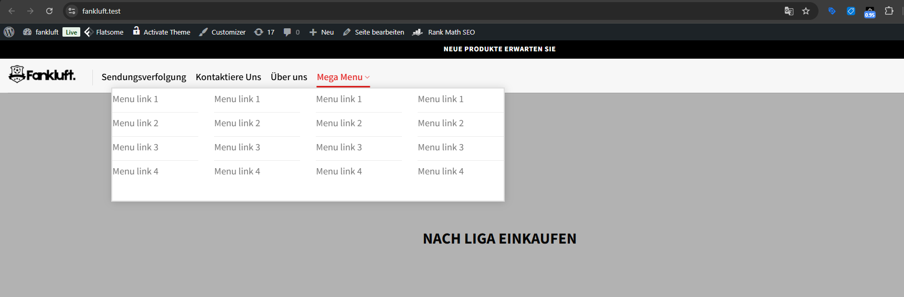

# Hướng dẫn Kỹ thuật Theme Flatsome

## 1. Cấu hình Hệ thống (Customizer)
Quản lý giao diện tập trung thông qua WordPress Customizer.

- **Truy cập**: Dashboard -> **Appearance** -> **Customize** -> **Style**.
    

        
    

- **Colors (Màu sắc)**:
    - **Primary Color**: Thiết lập mã màu chủ đạo cho toàn bộ website.
    - **Secondary Color**: Thiết lập mã màu bổ trợ cho các thành phần tương tác (Button, Icon).

- **Typography (Font chữ)**:
    - **Headlines**: Cấu hình Font Family cho các thẻ tiêu đề (H1-H6).
    - **Base**: Cấu hình Font Family cho nội dung văn bản mặc định.
    - **Yêu cầu kỹ thuật**: Đảm bảo độ tương phản (Contrast) đạt tiêu chuẩn **WCAG AA** (tối thiểu 4.5:1) giữa màu chữ và nền để đảm bảo điểm số **Accessibility**.

---

## 2. Xây dựng Layout (UX Builder)
Công cụ thiết kế kéo thả tích hợp sẵn trong Flatsome.

- **Thành phần cốt lõi (Core Elements)**:
    - **Section**: Container bao bọc ngoài cùng của một khối nội dung. **Luôn thiết lập** **Min Height** (chiều cao tối thiểu) để ngăn chặn hiện tượng nhảy khung (Layout Shift), đảm bảo ổn định chỉ số LCP.
    - **Row/Column**: Hệ thống lưới (Grid) giúp phân chia tỉ lệ và bố cục nội dung linh hoạt.
    - **Slider/Banner**: Module hiển thị hình ảnh động/tĩnh, cần tối ưu kích thước ảnh phù hợp với khung hình.
    - **Text/Headline**: Các thành phần văn bản, cần tuân thủ hệ thống Typography và đảm bảo độ tương phản màu sắc.
    - **Button**: Các điểm tương tác kêu gọi hành động (CTA).

- **Mô hình cấu trúc Layout mẫu**:
    Một Layout chuẩn trong UX Builder cần tuân thủ tính phân cấp và các yêu cầu kỹ thuật sau:
    - **Cấu trúc phân cấp (Hierarchy)**:
        

            
        

    - **Thiết lập Min Height**: Luôn thiết lập chiều cao tối thiểu cho Section để đảm bảo chỉ số LCP ổn định.
        

            
        

- **Tối ưu Responsive**:
    - **Viewport Switcher**: Sử dụng trình xem trước (Mobile/Tablet viewport) để kiểm tra bố cục trên đa thiết bị.
    - **Visibility**: Điều chỉnh trạng thái hiển thị (Show/Hide) của từng Element để tối ưu nội dung trên từng loại màn hình.

---

## 3. Quản lý Header & Footer
- **Header Builder**: Dashboard -> **Flatsome** -> **Theme Options** -> **Header**. 
    - **Tính năng**: Cung cấp giao diện kéo thả trực quan để sắp xếp các thành phần như Logo, Menu, Cart, Search vào các vị trí mong muốn trên Header.
    

        
    

- **Footer Config**: Dashboard -> **Flatsome** -> **Theme Options** -> **Footer**.
    - **Lưu ý tối ưu trải nghiệm người dùng (UX)**: Màu sắc hiển thị trong quá trình tải trang (Initial Load) bị chi phối bởi màu nền của **Absolute Footer**.

---

## 4. Quản lý Khối nội dung (UX Blocks)
Công cụ tạo các thành phần nội dung có khả năng tái sử dụng (Global components).
- **Truy cập**: Dashboard -> **UX Blocks**.
- **Cơ chế**: Thiết kế bằng UX Builder và nhúng vào vị trí bất kỳ qua Shortcode.

## 5. Giải pháp Tối ưu Menu quá dài bằng Mega Menu trong Flatsome

Khi cấu trúc điều hướng danh mục quá dài, việc hiển thị trên Desktop sẽ gây ra lỗi khuất hoặc tràn giao diện theo chiều dọc. Để tối ưu, quy trình kỹ thuật chuẩn yêu cầu tách biệt hệ thống thành 2 menu riêng biệt:

### 5.1. Quy trình tách biệt hệ thống Menu
1. **Menu dành cho Mobile (Mobile Menu)**:
    - **Cách làm**: Khởi tạo một menu độc lập gán cho vị trí hiển thị di động.
    - **Cấu trúc**: Thiết lập cấu trúc phân cấp cây thư mục truyền thống dạng **Item -> Sub-item** (xếp dọc lồng nhau).
    - **Đặc tính kỹ thuật**: Tương thích tốt với thao tác cuộn dọc (Scroll) trên thiết bị di động.

2. **Menu dành cho Desktop (Desktop Menu)**:
    - **Cách làm**: Khởi tạo một menu riêng hiển thị trên Desktop và sử dụng giải pháp **UX Blocks** kết hợp **UX Builder** để làm Mega Menu.
    - **Đặc tính kỹ thuật**: Sử dụng bố cục dàn ngang để tận dụng chiều rộng màn hình, triệt tiêu lỗi hiển thị theo chiều dọc.

---

### 5.2. Các bước cấu hình Mega Menu trên Desktop bằng UX Blocks

- **Bước 1 (Thiết kế nội dung bằng UX Blocks & UX Builder)**:
    - Truy cập **Dashboard -> UX Blocks -> Add New** (Thêm Block mới) để tạo khối nội dung.
    - Truy cập **UX Builder** để vào giao diện thiết kế kéo thả.
    - **Dựng cấu trúc**: Thêm các phần tử **Section**, **Row** và **Column** để phân chia số cột mong muốn hiển thị ngang.
    - **Thiết kế chi tiết**: Trong từng cột Column, kéo thả khối element **Menu** để dựng danh sách liên kết (mỗi khối **Menu** sẽ thêm các **Menu Item** con để điền Label, Link). Có thể kết hợp thêm các element khác như **Text** (làm tiêu đề cột), **Icon Box**, hoặc **Image**. Sau khi hoàn tất, nhấn **Update**.
    

        </img>
    

- **Bước 2 (Gán vào Menu hệ thống)**:
    - Truy cập **Dashboard -> Appearance -> Menus**, chọn Menu chính hiển thị trên Desktop.
    - Tìm và nhấp vào mục cha (Parent item) muốn gán Mega Menu để mở bảng cấu hình:
        - Tại tùy chọn **Dropdown Content** (hoặc **Block**), chọn đúng tên **UX Block** đã thiết kế ở Bước 1.
        - Điều chỉnh thông số **Dropdown Width** thành **Full Width** (hoặc Custom width).
    

        </img>
    

- **Kết quả hiển thị ngoài Frontend**:
    Sau khi cấu hình thành công, giao diện Mega Menu sẽ hiển thị trên Desktop theo đúng bố cục được thiết kế:
    

        </img>
    

## 6. Tài liệu tham khảo
- [Flatsome Documentation](https://docs.uxthemes.com/)

