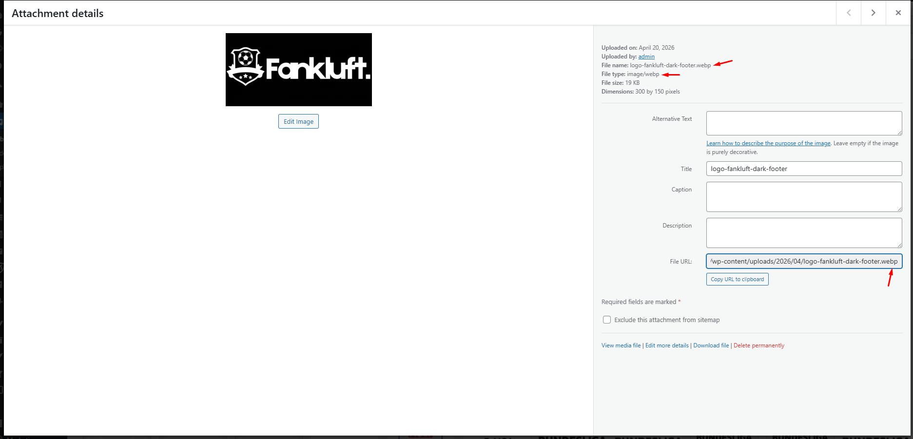
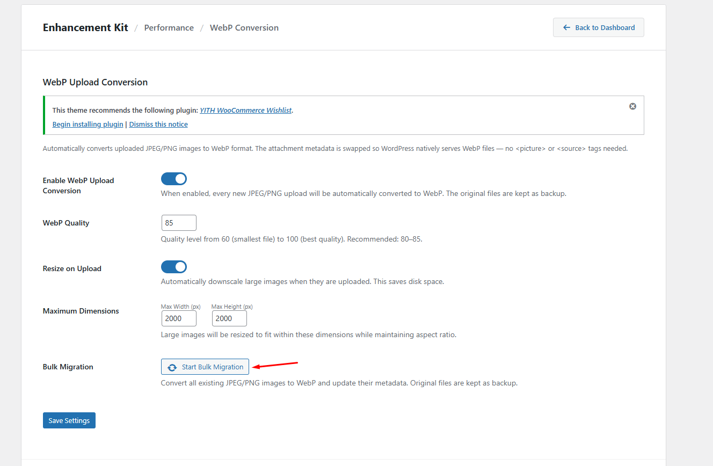

# Quy chuẩn Kỹ thuật Media & Content

## 1. Thông số kỹ thuật Logo
- **Kích thước tiêu chuẩn**:
  - **Header Logo**: Rộng tối đa 250px, Cao tối đa 100px (Tỷ lệ 2:1 hoặc 3:1).

  - **Sticky Logo**: Chiều cao khuyến nghị 40-50px.
    - **Favicon**: 512x512px.

    ví dụ: 
    

        
    

---

## 2. Thông số kỹ thuật Banner
### Banner Desktop
- **Kích thước**: `1920x700px` hoặc `1920x800px`.
- **Dung lượng**: Tối đa `200KB`.
    ví dụ: 
    
    

        
    
 

### Banner Mobile
- **Kích thước**: `750x1000px` hoặc `800x1200px`.
- **Dung lượng**: Tối đa `100KB`.

---

## 3. Định dạng Ảnh WebP (Bắt buộc)
Mọi tài nguyên hình ảnh tải lên hệ thống ( Banner, Logo) phải sử dụng định dạng `.webp`.

    

### Cơ chế chuyển đổi (WebP Conversion)
Hệ thống sử dụng module WebP thuộc plugin **WC Enhancement Kit** để quản lý định dạng:

1. **Auto Conversion**: Tự động chuyển đổi và tối ưu hóa hình ảnh ngay khi upload vào Media Library.
2. **Bulk Migration**: Tính năng chuyển đổi hàng loạt cho các tài nguyên cũ:
   - **Đường dẫn**: Dashboard -> **Settings** -> **WC Enhancement Kit**.
   - **Thực hiện**: Tại card **WebP Conversion**, chọn **Start bulk migration** để kích hoạt quy trình quét toàn bộ thư viện.
   

       
   
