# Hướng dẫn Sử dụng Plugin WooCommerce Enhancement Kits

> [!NOTE]
> Đây là tài liệu hướng dẫn kỹ thuật và vận hành chi tiết dành cho plugin **WooCommerce Enhancement Kits**.

---

## Danh Mục Tính Năng (Quick Navigation)

1. [**Global Settings**](#1-cấu-hình-chung--chọn-template) - Cài đặt cơ bản và chọn mẫu tương thích theme.
2. [**Giao diện Sản phẩm (Single Product UI)**](#2-giao-diện-trang-sản-phẩm-single-product-ui) - Tối ưu hóa các nút bấm, trường số lượng và nội dung bổ sung.
3. [**Hiển thị Biến thể (Variation Display)**](#3-hiển-thị-biến-thể-variation-display) - Tối ưu hóa trình chọn thuộc tính và luồng chọn biến thể thông minh.
4. [**Tab Sản phẩm (Product Tabs)**](#4-tab-sản-phẩm-product-tabs) - Tạo các tab thông tin mở rộng theo phân quyền người dùng và danh mục.
5. [**Tùy chỉnh Thanh toán (Custom Checkout)**](#5-tùy-chỉnh-thanh-toán-custom-checkout) - Ẩn/hiện linh hoạt các trường trong checkout form.
6. [**Bộ sưu tập (Collection)**](#6-bộ-sưu-tập-collection) - Tạo trang danh mục sản phẩm động dựa trên bộ lọc điều kiện và sắp xếp thủ công.
7. [**Phân trang (Pagination)**](#7-phân-trang-pagination) - Tùy chỉnh thẩm mỹ khối phân trang.
8. [**Công cụ Admin & Bảo mật (Admin Tool)**](#8-công-cụ-admin--bảo-mật-admin-tool) - Chặn Brute Force, tinh chỉnh bảng quản trị, xóa nhanh chống timeout và bảo trì sửa lỗi cơ sở dữ liệu.
9. [**Product Importer**](#9-trình-nhập-liệu-sản-phẩm-product-importer) - Hỗ trợ nhập CSV từ Shopbase/WooCommerce với cơ chế tự phục hồi.
10. [**Trình dán ảnh (Image Attacher)**](#10-trình-dán-ảnh-image-attacher) - Tải ảnh hàng loạt thông qua liên kết từ xa không lưu trữ.
11. [**Tối ưu hình ảnh WebP (WebP Conversion)**](#11-tối-ưu-hình-ảnh-webp-webp-conversion) - Tự động chuyển đổi sang WebP khi tải lên và tối ưu hóa hàng loạt.
12. [**Bảng size (Size Charts)**](#12-bảng-size-size-charts) - Quản lý bảng kích thước dạng popup theo sản phẩm, gán động theo Product Type hoặc gán hàng loạt qua Product Tag.
13. [**Hóa đơn Khách hàng (Customer Invoice)**](#13-hóa-đơn-khách-hàng-customer-invoice) - Cung cấp trang hóa đơn công khai truy cập qua URL bảo mật (không cần đăng nhập) tích hợp trạng thái đơn hàng.
14. [**Bộ lọc Nâng cao (Product Advanced Filter)**](#14-bộ-lọc-nâng-cao-product-advanced-filter) - Cung cấp sidebar bộ lọc sản phẩm nâng cao kiểu Shopify/ShopBase trên trang danh sách sản phẩm quản trị.

---

## 1. Global Configuration

- **Truy cập**: Dashboard -> **Enhancement Kit**
- **Chọn Template**: Cần chọn chính xác giao diện mẫu tương ứng với theme đang dùng (**Flatsome** hoặc **WoodMart**) để đảm bảo plugin hoạt động đồng bộ với CSS của theme.

    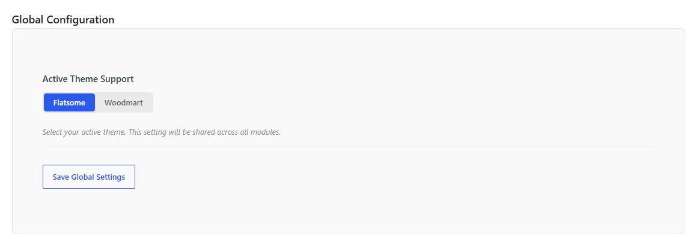

---

## 2. Quick Purchase & AJAX Setting

> [!IMPORTANT]
> **Khả năng tương thích**: Toàn bộ tính năng trong mục này chỉ hoạt động và được thiết kế tối ưu cho theme **Flatsome**. Nếu website sử dụng theme **WoodMart**, khuyến nghị **tắt hoàn toàn** các thiết lập thuộc module này để tránh xung đột giao diện hoặc lỗi hiển thị.

Module tối ưu hiển thị các thành phần cốt lõi của trang sản phẩm đơn, được thiết kế tối ưu nhất cho theme **Flatsome**.

### 2.1. General

* **Breadcrumbs**: Cho phép ẩn/hiện Breadcrumbs mặc định trên trang sản phẩm.
* **Quantity Width**: Điều chỉnh chiều rộng (width) của ô nhập số lượng sản phẩm.
* **Button Witdth**: Tùy chỉnh kích thước nút trên trang sản phẩm.

    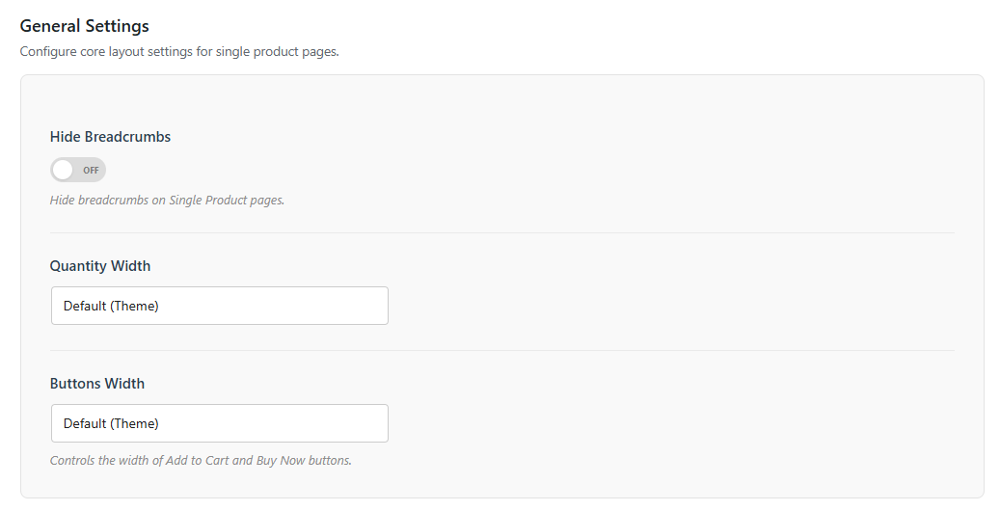

### 2.2. Buy Now

    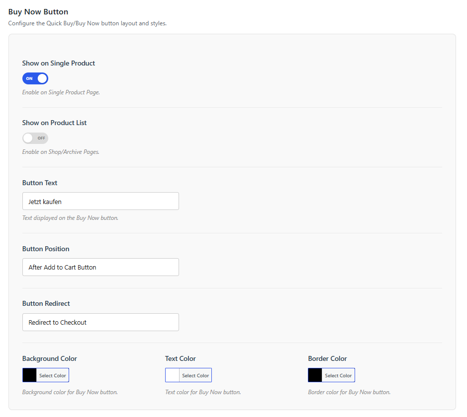

* **Hiển thị**:
  * `Show on Single Product`: Hiện trên trang chi tiết sản phẩm.
  * `Show on Product List`: Hiện trên các trang danh mục / trang lưu trữ.
* **Button Text**:  hiển thị (Ví dụ: "Buy Now"). Lưu ý: khi thay đổi ngôn ngữ site cần đổi text tại đây cho phù hợp
* **Button Position**: Vị trí hiển thị so với nút Add to Cart (Có 2 tùy chọn: *Trước nút Add to Cart* hoặc *Sau nút Add to Cart*).
* **Button Redirect**: Trang đích khi click nút (Có thể chọn chuyển hướng đến **Checkout** hoặc **Cart**). Mặc định khuyến nghị là **Checkout**.
* **Styling**: Các tùy chọn bên dưới cho phép cấu hình trực quan màu chữ, màu nền, hover color và đường viền của nút.

### 2.3. Add to Cart Ajax

    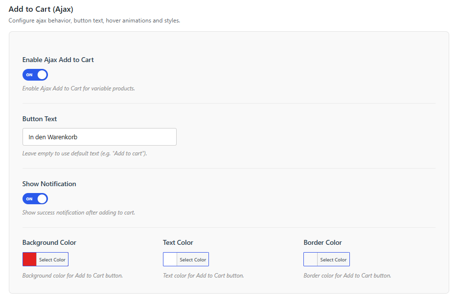

* **Enable Ajax Add to Cart**: Kích hoạt tính năng thêm vào giỏ hàng bằng AJAX mà không cần tải lại trang.
  * *Lưu ý*: Mặc định theme Flatsome không hỗ trợ cơ chế AJAX Add to Cart đối với các sản phẩm biến thể (Variable Products).
* **Button Text**: Tùy chỉnh văn bản hiển thị trên nút thêm vào giỏ hàng (Ví dụ: "Add To Cart"). Nếu để trống, hệ thống sẽ sử dụng văn bản mặc định của WooCommerce (Ví dụ: "Add to cart" hoặc "Thêm vào giỏ"). *Lưu ý: Khi thay đổi ngôn ngữ hiển thị của website, hãy dịch lại nhãn này tại đây cho phù hợp.*
* **Show Notification**: Bật/tắt hiển thị popup thông báo thành công sau khi khách hàng nhấn nút thêm sản phẩm vào giỏ hàng.
* **Tùy chỉnh màu sắc (Colors Settings)**:
  * **Background Color**: Lựa chọn mã màu HEX làm màu nền của nút Add to Cart.
  * **Text Color**: Lựa chọn mã màu HEX làm màu chữ hiển thị trên nút Add to Cart.
  * **Border Color**: Lựa chọn mã màu HEX làm màu đường viền của nút Add to Cart.

### 2.4. Product Price

    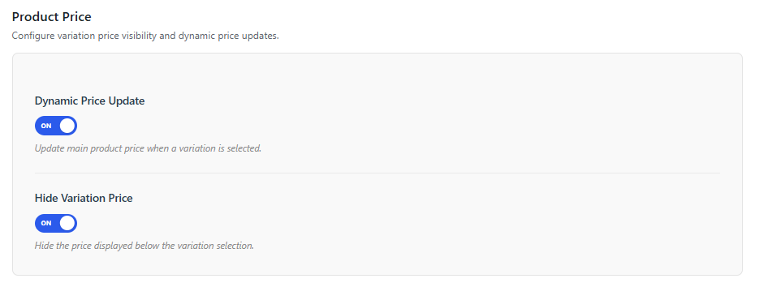

* **Dynamic Price Range (Ẩn khoảng giá)**: Đối với sản phẩm có nhiều biến thể, plugin hỗ trợ ẩn khoảng giá mặc định của WooCommerce (`Min Price - Max Price`) và tự động thay thế bằng giá cụ thể của biến thể đang được chọn chỉ hỗ trợ theme **Flatsome**. với theme Woodmart phần này theme sẽ tự cấu hình.
* **Hide Variantion Price**: ẩn price hiển thị của variant tại vị trí mặc định

## 3. Variation Display Module

Module quản lý, định dạng lại URL biến thể, tối ưu hóa hiệu năng tải trang và trình chọn thuộc tính (swatches).

### 3.1. Cấu hình Chung & Tối ưu (General Settings)

    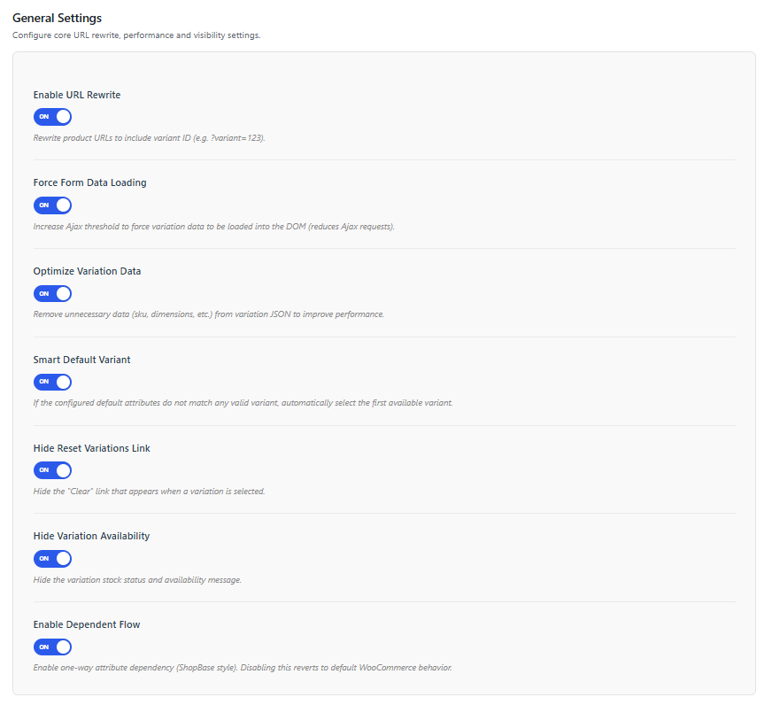

* **Enable URL Rewrite**: Kích hoạt viết lại URL sản phẩm để bao gồm ID biến thể khi biến thể được chọn (ví dụ: `?variant=123`).
* **Force Form Data Loading**: Kích hoạt việc tải trước dữ liệu của tất cả các biến thể vào DOM để tránh việc hệ thống gửi yêu cầu AJAX liên tục khi người dùng đổi lựa chọn thuộc tính.
* **Optimize Variation Data**: Tự động dọn dẹp và loại bỏ các dữ liệu dư thừa không cần thiết (như sku, kích thước vật lý, cân nặng, trạng thái download...) trong chuỗi dữ liệu JSON của các biến thể để cải thiện tốc độ tải trang.
* **Smart Default Variant**: Nếu các thuộc tính mặc định (Default Form Values) của sản phẩm không tương ứng với bất kỳ biến thể hợp lệ nào (hoặc hết hàng), hệ thống sẽ tự động chọn biến thể khả dụng đầu tiên để kích hoạt sẵn khi khách tải trang.
* **Hide Reset Variations Link**: Ẩn liên kết "Xóa lựa chọn (Clear)" mặc định của WooCommerce xuất hiện bên cạnh các dropdowns/swatches.
* **Hide Variation Availability**: Ẩn hiển thị văn bản về trạng thái kho hàng và tính khả dụng của biến thể bên dưới thuộc tính.
* **Enable Dependent Flow**: Bật luồng lựa chọn thuộc tính phụ thuộc một chiều (theo kiểu giao diện ShopBase). Nếu tắt tùy chọn này, hệ thống sẽ quay về cơ chế hoạt động mặc định của WooCommerce.

### 3.2. Cấu hình SEO (SEO Settings)

    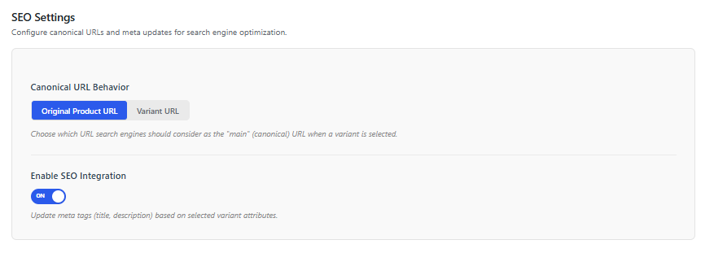

Hỗ trợ tối ưu hóa SEO và thẻ Meta cho trang chi tiết sản phẩm khi người dùng truy cập hoặc chọn một biến thể cụ thể (Variant URL).

* **Canonical URL Behavior (Hành vi thẻ Canonical)**:
  Quyết định đường dẫn chuẩn (Canonical URL) mà công cụ tìm kiếm (Google, Bing...) sẽ lập chỉ mục khi một biến thể được chọn:
  * `Original Product URL` (Mặc định): Canonical URL luôn trỏ về trang sản phẩm chính (đường dẫn gốc không chứa tham số `?variant=...`). Tùy chọn này giúp tránh lỗi trùng lặp nội dung (Duplicate Content) giữa các biến thể.
  * `Variant URL`: Canonical URL trỏ trực tiếp đến đường dẫn cụ thể của biến thể đang hiển thị (ví dụ: `yourdomain.com/product/slug/?variant=123`). Hữu ích khi mỗi biến thể là một thực thể sản phẩm độc lập có nhu cầu SEO riêng biệt.
* **Enable SEO Integration (Kích hoạt Tích hợp SEO)**:
  * Khi bật (`yes`), plugin tự động cập nhật các thẻ meta tương ứng với biến thể hiện tại:
    * Thay đổi thẻ `<link rel="canonical" ...>` trong phần `<head>` của trang theo hành vi được cấu hình ở trên.
    * Tự động lọc và cập nhật thẻ Open Graph URL (`og:url`) trỏ về URL biến thể khi chia sẻ lên mạng xã hội (tương thích hoàn toàn với plugin **Yoast SEO** thông qua hook `wpseo_opengraph_url`).

### 3.3. Cấu hình Giao diện (Styling Settings)

    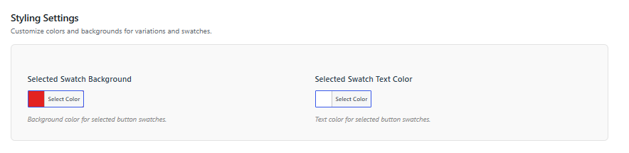

Cho phép tinh chỉnh màu sắc hiển thị của các Swatches dạng nút bấm (Button Swatches) khi ở trạng thái hoạt động:

* **Selected Swatch Background**: Thiết lập màu nền (Mã màu HEX) cho ô thuộc tính khi được người dùng click chọn.
* **Selected Swatch Text Color**: Thiết lập màu chữ hiển thị (Mã màu HEX) trên ô thuộc tính khi được người dùng click chọn.

---

## 4. Product Tabs

Giúp mở rộng trang sản phẩm bằng cách bổ sung thêm các tab thông tin có điều kiện (Như quy trình vận chuyển, chính sách đổi trả, bảng size...).

### 4.1. Tổng quan Danh sách Product Tabs (Overview)

    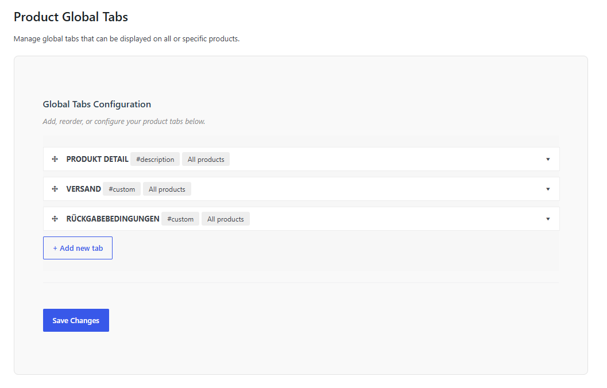

Quản lý danh sách các tab bổ sung hiện có trên hệ thống, cho phép xem nhanh trạng thái áp dụng, chỉnh sửa hoặc xóa nhanh các cấu hình tab.

### 4.2. Cấu hình chi tiết Tab (Tab Configuration)

    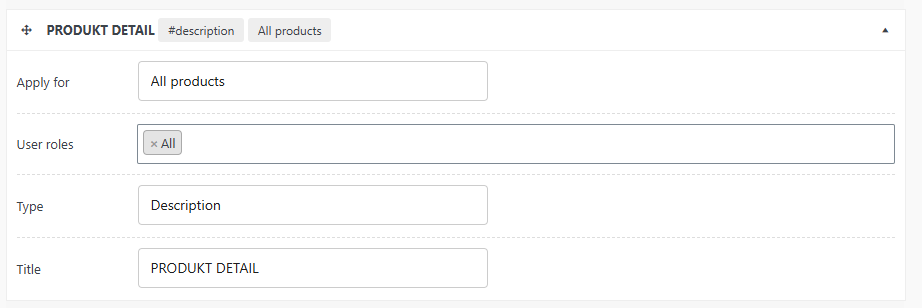

* **Apply For (Điều kiện áp dụng)**: Cấu hình linh hoạt phạm vi hiển thị tab dựa trên: **Product** (Sản phẩm cụ thể), **Category** (Danh mục), **Brand** (Thương hiệu), hoặc **Tags** (Thẻ sản phẩm).
* **User Roles**: Cho phép cấu hình hiển thị tab đặc thù theo từng vai trò của người dùng (Ví dụ: Tab chính sách sỉ chỉ hiện cho tài khoản Wholesale).
* **Type (Loại nội dung)**: Hỗ trợ loại tab có sẵn (`Description`, `Additional Information`, `Review`) hoặc loại tự định nghĩa nội dung (`Custom`).
* **Title & Content**: Đặt tiêu đề hiển thị và soạn thảo nội dung (Hỗ trợ định dạng HTML phong phú).

---

## 5. Tùy chỉnh Thanh toán (Custom Checkout)

> [!IMPORTANT]
> **Khả năng tương thích**: Tính năng này chỉ hoạt động trên theme **Flatsome**. Nếu website sử dụng theme **WoodMart**, khuyến nghị **tắt hoàn toàn** thiết lập này (hoặc sử dụng các tính năng tối ưu checkout mặc định có sẵn của WoodMart) để tránh xung đột mã nguồn.

Tính năng hỗ trợ dọn dẹp và tối ưu hóa biểu mẫu thanh toán ngoài trang Checkout giúp tăng tỷ lệ chuyển đổi đơn hàng.

* **Đường dẫn**: Dashboard -> **Enhancement Kit** -> **Custom Checkout**
* **Tính năng**: Cho phép bật/tắt (ẩn/hiện) và đặt bắt buộc (Required) hoặc không bắt buộc đối với các trường thông tin mặc định của WooCommerce như:
  * Company Name (Tên công ty)
  * Address Line 2 (Địa chỉ dòng 2)
  * Phone Number (Số điện thoại)
  * Postcode / ZIP (Mã bưu điện)
  * State / County (Tỉnh thành/Quận huyện)

---

## 6. Bộ sưu tập (Collection)

Tính năng nâng cao hỗ trợ gom nhóm sản phẩm tự động dựa trên các bộ lọc điều kiện động và quản lý sắp xếp thứ tự thủ công chuyên nghiệp.

* **Truy cập**: Dashboard -> **Products** -> **Collection**.

### 6.1. Lưu ý quan trọng về Đường dẫn tĩnh (Permalink Slug)

> [!WARNING]
> Slug mặc định được sử dụng cho taxonomy này là `collections`. Tuyệt đối không gán slug này cho bất kỳ danh mục, trang hay thành phần nào khác trong cấu hình **Settings -> Permalinks**.
>
> Trường hợp truy cập trang bộ sưu tập ngoài giao diện gặp lỗi **404 Not Found**, hãy truy cập vào **Settings -> Permalinks**, kiểm tra xem có xung đột slug hay không, rồi nhấn nút **Save Changes** để làm mới lại liên kết tĩnh của hệ thống.

### 6.2. Tạo mới một Bộ sưu tập

1. Vào mục **Collections**, điền thông tin cơ bản: **Name** (Tên bộ sưu tập), **Parent Collection** (Bộ sưu tập cha - nếu có), **Description** (Mô tả).
2. **Media (Hình ảnh)**:
   * `Thumbnail`: Ảnh đại diện của bộ sưu tập khi hiển thị trong danh sách chung (Collection List).
   * `Banner`: Ảnh biểu ngữ kích thước lớn hiển thị ở đầu trang chi tiết của bộ sưu tập đó ngoài frontend.

    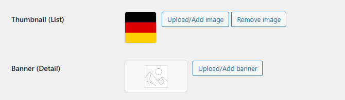

3. **Bộ lọc điều kiện (Filters)**:
   Hệ thống cho phép cấu hình linh hoạt các quy tắc lọc động để tự động thêm hoặc loại trừ sản phẩm khỏi bộ sưu tập:

   * **Quy tắc so khớp điều kiện (Logic Match)**:

     * `All conditions` (Phép AND - Mặc định): Sản phẩm phải thỏa mãn **tất cả** các điều kiện được thiết lập dưới đây mới được thêm vào bộ sưu tập.
     * `Any condition` (Phép OR): Sản phẩm chỉ cần thỏa mãn **ít nhất một** điều kiện được thiết lập dưới đây.
   * **Bảng chi tiết các Tiêu chí lọc**:

     | Tiêu chí lọc                    | Mô tả                                                                                                            | Toán tử hỗ trợ              | Cách nhập dữ liệu / Ghi chú                                                                                                                                                |
     | :--------------------------------- | :----------------------------------------------------------------------------------------------------------------- | :------------------------------ | :------------------------------------------------------------------------------------------------------------------------------------------------------------------------------ |
     | **Product** (Sản phẩm)     | Chọn hoặc loại trừ trực tiếp các sản phẩm cụ thể.                                                       | `In` / `Not In`             | Tìm kiếm và chọn tên sản phẩm qua ô nhập Autocomplete.                                                                                                                 |
     | **Category** (Danh mục)     | Lọc các sản phẩm thuộc danh mục sản phẩm WooCommerce.                                                      | `In` / `Not In`             | Tìm kiếm và chọn danh mục qua ô nhập Autocomplete.                                                                                                                       |
     | **Tag** (Thẻ)               | Lọc các sản phẩm theo thẻ (tag) sản phẩm.                                                                   | `In` / `Not In`             | Tìm kiếm và chọn tag sản phẩm qua ô nhập Autocomplete.                                                                                                                  |
     | **Brand** (Thương hiệu)   | Lọc theo thương hiệu (hệ thống tự động phát hiện custom taxonomy thương hiệu đang chạy trên web). | `In` / `Not In`             | Tìm kiếm và chọn thương hiệu qua ô nhập Autocomplete.                                                                                                                  |
     | **Attribute** (Thuộc tính) | Lọc theo giá trị các thuộc tính sản phẩm (Màu sắc, kích thước,...).                                   | `In` / `Not In`             | Tìm kiếm và chọn thuộc tính qua ô nhập Autocomplete.                                                                                                                    |
     | **Title** (Tiêu đề)       | Lọc so khớp theo từ khóa xuất hiện trong tiêu đề sản phẩm.                                              | `Contains` / `Not Contains` | Ô nhập dạng văn bản (Text Input). Có thể nhập nhiều từ khóa cách nhau bằng dấu phẩy`,` (áp dụng logic OR - khớp một trong số các từ khóa là được). |

    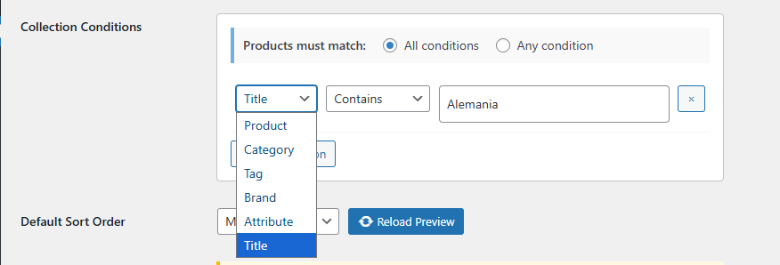

4. **Thứ tự sắp xếp sản phẩm (Product Sorting)**:
   * Cung cấp các chế độ sắp xếp tự động: *Default, Product title A-Z, Product title Z-A, Highest price, Lowest price, Newest, Oldest*.
   * **Sắp xếp thủ công (Manual sorting)**:
     * Chọn tùy chọn **Manual**, sau đó nhấn **Reload Preview** để tải danh sách sản phẩm hiện có.
     * Sử dụng chuột để kéo thả (drag-and-drop) sắp xếp thứ tự hiển thị của từng sản phẩm.
     * Để thao tác nhanh hàng loạt, sử dụng checkbox chọn nhiều sản phẩm cùng lúc rồi dùng nút lệnh di chuyển nhanh: **Move to top** (Lên đầu), **Move to bottom** (Xuống cuối), hoặc **Move to position** (Chuyển tới vị trí số X).

    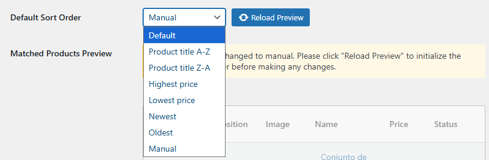

### 6.3. Tích hợp hiển thị bộ sưu tập ngoài Giao diện

* **Flatsome (UX Builder)**: Plugin tự động tích hợp các element chuyên dụng vào UX Builder giúp dễ dàng kéo thả hiển thị danh sách sản phẩm theo Bộ sưu tập (Tương tự như cách gọi danh mục thông thường).
* **Woodmart (Elementor)**: Sử dụng widget **Product (grid/carousel)** của Woodmart hoặc các widget tương ứng của Elementor, chọn nguồn dữ liệu (Data Source) là **Collection** để hiển thị sản phẩm mong muốn.

### 6.4. Cơ chế đồng bộ sản phẩm vào Collection (Collection Sync)

Hệ thống đồng bộ hóa sản phẩm vào bộ sưu tập theo các cơ chế sau để đảm bảo tính chính xác và tối ưu hiệu năng máy chủ:

* **Đồng bộ thời gian thực (Event-driven)**: Tự động chạy ngay khi thực hiện thêm mới hoặc chỉnh sửa/cập nhật một sản phẩm bất kỳ.
* **Đồng bộ sau khi Import**: Tự động kích hoạt ngay sau khi tiến trình nhập dữ liệu (Import) sản phẩm kết thúc thành công.
* **Đồng bộ tự động định kỳ (Cron Job)**: Chạy tự động đồng bộ lại toàn bộ các bộ sưu tập vào lúc **2:00 AM giờ UTC** hàng ngày. Tính năng này có thể được chủ động Bật hoặc Tắt linh hoạt trong phần cấu hình quản trị (Xem chi tiết hướng dẫn tại [Cài đặt Đồng bộ Bộ sưu tập](#81-hỗ-trợ-trang-quản-trị-admin-tools)).
* **Đồng bộ thủ công tức thì (Manual Sync)**: Kích hoạt đồng bộ hóa toàn bộ các bộ sưu tập ngay lập tức bằng nút bấm hành động thủ công khi cần cập nhật giao diện ngoài frontend ngay tức thì (Xem chi tiết hướng dẫn tại [Cài đặt Đồng bộ Bộ sưu tập](#81-hỗ-trợ-trang-quản-trị-admin-tools)).
* **Ghi log**: Tất cả nhật ký đồng bộ chi tiết được ghi nhận tại đường dẫn: **WooCommerce -> Status -> Logs** -> tìm file log có tiền tố `wcek-collection-sync`.

---

## 7. Phân trang (Pagination)

> [!IMPORTANT]
> **Khả năng tương thích**: Tính năng này chỉ hoạt động trên theme **Flatsome**. Nếu website sử dụng theme **WoodMart**, khuyến nghị **tắt hoàn toàn** tính năng Phân trang này để tránh làm vỡ định dạng phân trang mặc định của WoodMart.

Cho phép làm đẹp và cá nhân hóa thiết kế nút phân trang tại các trang danh mục sản phẩm (Archive / Shop Pages).

* **Đường dẫn**: Dashboard -> **Enhancement Kit** -> **Pagination** (Legacy: Dashboard -> **Settings** -> **WC Enhancement Kit** -> **Pagination**).
* **Cấu hình giao diện**:
  * `Active Item Background`: Màu nền của nút trang hiện tại.
  * `Active Item Text Color`: Màu chữ của nút trang hiện tại.
  * `Border Radius`: Bo góc nút phân trang. Sử dụng đơn vị `px` để tạo nút hình vuông bo nhẹ góc (Ví dụ: `4px`), hoặc nhập tỷ lệ phần trăm `%` (Ví dụ: `50%`) để hiển thị nút dạng hình tròn hoàn hảo.

---

## 8. Admin Tool

Nhóm tính năng hỗ trợ tinh chỉnh trang quản trị backend, tối ưu hóa tìm kiếm, quản lý bộ nhớ đệm kho hàng và tăng cường bảo mật hệ thống WordPress.

### 8.1. Hỗ trợ trang Quản trị (Admin Tools)

* **SEO Quick View**: Tích hợp một cột hiển thị trạng thái SEO (Thẻ Title, Meta Description) trực tiếp tại danh sách sản phẩm. Khi click vào sẽ hiển thị một cửa sổ bật lên (popup) tóm tắt thông tin SEO của sản phẩm đó mà không cần truy cập vào trang chỉnh sửa chi tiết.
* **Enable Horizontal Scrolling**: Tự động sửa lỗi CSS hiển thị bảng danh sách sản phẩm của WooCommerce trên màn hình nhỏ, bổ sung thanh cuộn ngang để bảng không bị méo mó hay vỡ giao diện khi kích hoạt nhiều cột thông tin.

    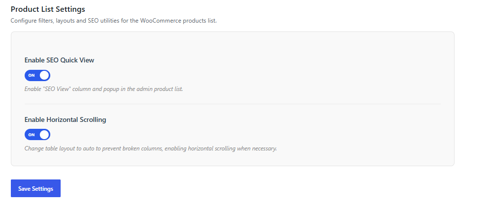

* **Collection Sync Setting (Cài đặt Đồng bộ Bộ sưu tập)**: Tích hợp công cụ quản lý đồng bộ các Collection sản phẩm giúp tối ưu hiệu năng máy chủ và dữ liệu:
  * **Hộp chọn Bật/Tắt Cron Job**: Checkbox cho phép kích hoạt hoặc vô hiệu hóa lịch chạy tự động ngầm (**Cron Job**) vào lúc **2:00 giờ sáng UTC**. Việc này giúp khống chế tác vụ đồng bộ chỉ chạy vào khung giờ thấp điểm ít khách truy cập, tránh việc hệ thống liên tục chạy đồng bộ tự động trong ngày gây quá tải CPU/RAM của server.
  * **Nút bấm Sync All Now**: Cho phép kích hoạt đồng bộ hóa toàn bộ các Collection ngay lập tức một cách thủ công khi vừa cập nhật hàng loạt sản phẩm mới để cập nhật hiển thị ngoài frontend lập tức.

    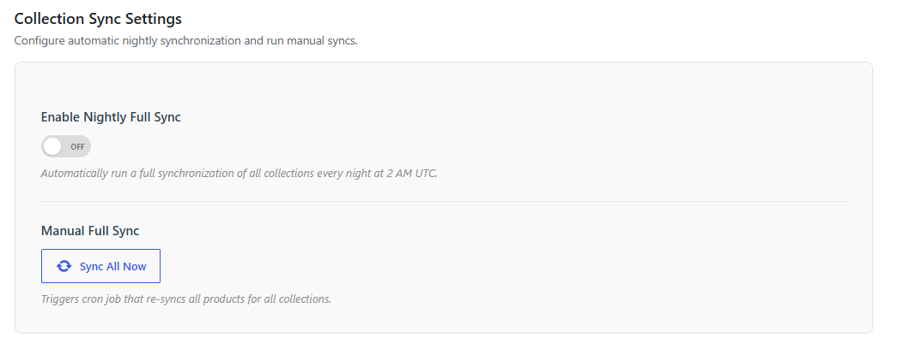

### 8.2. Tối ưu hóa Tìm kiếm (Search Settings)

* **Optimize Search**: Tăng tốc độ tìm kiếm sản phẩm bằng cách chỉ tìm kiếm theo tiêu đề sản phẩm (Product Title) trên cả trang quản trị (Admin) và ngoài giao diện người dùng (Frontend - đối với theme đang hoạt động). Điều này giúp giảm đáng kể thời gian truy vấn SQL khi cơ sở dữ liệu có hàng chục nghìn sản phẩm.

    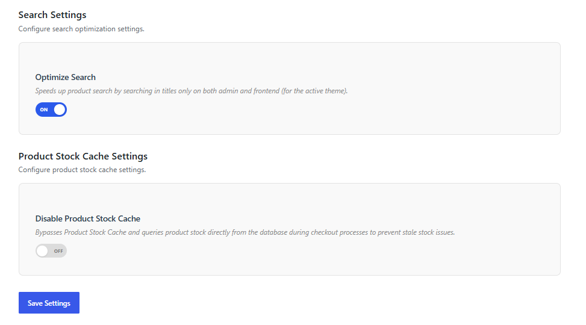

### 8.3. Bảo mật hệ thống & Tối ưu bộ nhớ đệm (Security & Stock Cache Settings)

Cung cấp các thiết lập bảo mật cấp WordPress để hạn chế các cuộc tấn công quét thông tin và ngăn chặn lỗi bất đồng bộ số lượng tồn kho.

    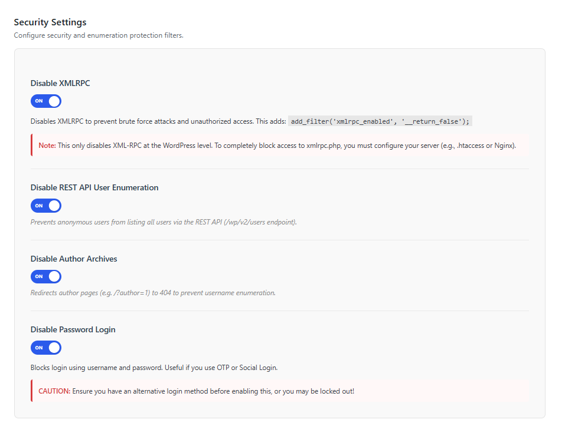

* **Vô hiệu hóa XML-RPC (Disable XMLRPC)**: Vô hiệu hóa giao thức XML-RPC để ngăn chặn tấn công dò mật khẩu (Brute Force) và các truy cập trái phép.
  * > [!NOTE]
    > Lựa chọn này chỉ vô hiệu hóa XML-RPC ở mức ứng dụng WordPress. Để chặn hoàn toàn truy cập tới tệp `xmlrpc.php`, bạn nên cấu hình thêm ở cấp máy chủ (ví dụ sử dụng tệp `.htaccess` trên Apache hoặc cấu hình block trên Nginx).
    >
* **Chặn dò tìm Username (Disable REST API User Enumeration)**: Ngăn chặn người dùng ẩn danh liệt kê danh sách tài khoản thành viên/quản trị viên thông qua REST API (endpoint `/wp/v2/users`).
* **Vô hiệu hóa trang lưu trữ tác giả (Disable Author Archives)**: Tự động chuyển hướng trang lưu trữ cá nhân của tác giả (ví dụ: `/?author=1`) về trang lỗi 404 nhằm tránh việc hacker khai thác dò tìm username của admin.
* **Chặn đăng nhập bằng mật khẩu (Disable Password Login)**: Chặn hoàn toàn phương thức đăng nhập bằng tên người dùng và mật khẩu thông thường. Cực kỳ hữu ích khi website đã chuyển sang sử dụng đăng nhập qua OTP hoặc tài khoản Google/Mạng xã hội.
  * > [!CAUTION]
    > Tuyệt đối **không bật** tùy chọn này nếu bạn chưa cấu hình và thử nghiệm thành công phương thức đăng nhập thay thế (như đăng nhập qua Google), nếu không bạn sẽ bị khóa tài khoản và không thể truy cập trang quản trị.
    >
* **Tối ưu bộ nhớ đệm tồn kho (Disable Product Stock Cache)**: Bỏ qua bộ nhớ đệm đối tượng (Redis Object Cache) đối với thông tin số lượng tồn kho sản phẩm trong quá trình thanh toán (checkout) và giỏ hàng (cart). Tính năng này truy vấn trực tiếp số lượng tồn kho thực tế từ cơ sở dữ liệu để ngăn chặn tình trạng lệch kho (stale stock) khi có nhiều lượt mua hàng đồng thời.

### 8.3. Thao tác xóa nhanh hàng loạt (Bulk Actions)

* **Vấn đề**: Khi làm việc với kho dữ liệu lớn, việc chuyển hàng trăm sản phẩm vào thùng rác hoặc xóa vĩnh viễn bằng công cụ mặc định của WooCommerce rất dễ gây lỗi cạn kiệt bộ nhớ hoặc timeout của server.
* **Giải pháp**: Plugin bổ sung hai bộ lọc hành động tùy biến siêu nhẹ: **Move to trash** (Đưa vào thùng rác) và **Delete permanently** (Xóa vĩnh viễn). Cơ chế xử lý đã được tối ưu hóa để chạy nền mượt mà, phân mảng thông minh giúp tránh nghẽn server.
* **Ghi nhật ký**: Toàn bộ quá trình xóa được ghi chi tiết tại log: **WooCommerce -> Status -> Logs** -> file `wcek-bulk-actions`.

### 8.4. Bảo trì Cơ sở dữ liệu (SQL Quick Fixes)

Cung cấp công cụ quét và xử lý các bản ghi dữ liệu không nhất quán hoặc bị lỗi trong cơ sở dữ liệu (Database).

* **Đường dẫn truy cập**: Dashboard -> **Enhancement Kit**  -> chọn tab **Database Maintenance** (SQL Quick Fixes).
* **Sửa lỗi ngày sửa đổi của ảnh đính kèm (Fix Invalid Attachment Date)**:
  * **Mô tả**: Sửa lỗi các tệp hình ảnh đính kèm (attachments) có ngày sửa đổi (`post_modified` hoặc `post_modified_gmt`) bị lỗi định dạng hoặc bằng không (năm `0` hoặc giá trị `0000-00-00 00:00:00`). Công cụ này cập nhật các trường này khớp với ngày tạo ảnh (`post_date` / `post_date_gmt`).
  * **Cách thực hiện**:
    1. Nhấn nút **Check Invalid Date** để hệ thống quét và kiểm tra số lượng bản ghi hình ảnh bị lỗi trong cơ sở dữ liệu.
    2. Nếu phát hiện bản ghi lỗi, hệ thống hiển thị nút **Fix Now**.
    3. Nhấn **Fix Now** và xác nhận qua hộp thoại cảnh báo để tiến hành cập nhật sửa đổi dữ liệu tự động.

---

## 9. Trình nhập liệu sản phẩm (Product Importer)

Công cụ nhập dữ liệu sản phẩm hiệu năng cao, hỗ trợ định dạng CSV từ Shopbase và WooCommerce tiêu chuẩn.

> [!NOTE]
> **Phương án dự phòng**: Trình nhập liệu tích hợp này chỉ đóng vai trò làm **phương án dự phòng và chỉ nên dùng để nhập các tệp tin có số lượng sản phẩm nhỏ**. Để đảm bảo độ ổn định, tránh timeout và đạt hiệu suất đồng bộ dữ liệu lớn, cần liên hệ **bộ phận kỹ thuật** để cài đặt và sử dụng plugin nhập liệu chính thức của hệ thống.

* **Cách sử dụng**: Vào mục Product Importer, chọn đúng định dạng file mẫu (Shopbase hoặc WooCommerce), tải tệp CSV lên (Hỗ trợ tải lên nhiều tệp cùng lúc để xử lý xếp hàng) và nhấn bắt đầu.
* **Cơ chế Hủy bỏ (Cancel)**: Có thể click **Cancel Import** bất cứ lúc nào để dừng luồng xử lý hiện tại.
* **Cơ chế Tự khôi phục & Tiếp tục (Resume & Auto-recovery)**:
  * Trong trường hợp máy chủ bị mất kết nối internet giữa chừng, mất nguồn hoặc nghẽn, hệ thống có tính năng khóa luồng song song để ngăn chặn việc chạy đè dữ liệu.
  * Khi kết nối ổn định lại, truy cập trang Importer, hệ thống sẽ hiển thị thông báo khôi phục tự động: *"Auto-recovering from interrupted job..."*.
  * Admin có thể chọn **Resume** để hệ thống tiếp tục đọc CSV từ dòng bị gián đoạn, hoặc chọn **Discard** để hủy bỏ hoàn toàn phiên làm việc lỗi đó.
  * **Mẹo xử lý sự cố kẹt tiến trình (Troubleshooting)**:
    Nếu tiến trình tự động khôi phục bị kẹt cứng và không chạy tiếp, hãy làm theo quy trình sau:
    1. Truy cập vào menu quản trị: **Tools -> Scheduled Actions** (hoặc WooCommerce -> Status -> Scheduled Actions).
    2. Tìm trong tab **Processing** và **Pending** xem có tồn tại 2 Jobs bị trùng lặp cùng có chứa đối số (Arguments) dạng `'import_id' => 'wcek_id'` hay không.
    3. Thực hiện **Xóa (Delete)** tiến trình bị kẹt đang nằm trong trạng thái **Processing**. Ngay sau đó, tiến trình nằm trong danh sách chờ **Pending** sẽ tự động được kích hoạt và chạy tiếp tục tác vụ nhập liệu bình thường mà không bị trùng lặp dữ liệu sản phẩm.
* **Nhật ký tiến trình**: Xem log chi tiết tại **WooCommerce -> Status -> Logs** -> file `wcek-importer`.

---

## 10. Trình dán ảnh (Image Attacher)

Công cụ hỗ trợ tải và đính kèm nhanh hình ảnh vào thư viện Media của WordPress thông qua danh sách liên kết (URL) hình ảnh trực tuyến mà không cần tải về máy tính rồi upload thủ công.

* **Đường dẫn**: Dashboard -> **Media** -> **Upload via Link**.

    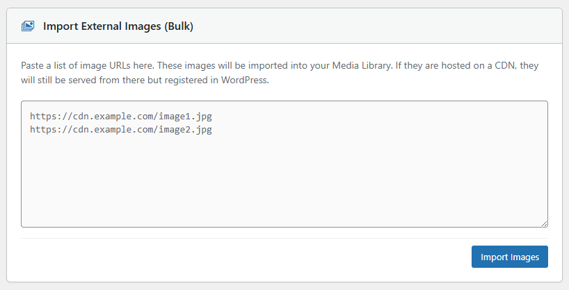

* **Cách thực hiện**:
  1. Nhập hoặc dán danh sách các đường dẫn (URL) ảnh trực tuyến vào ô nhập liệu lớn. **Lưu ý**: Mỗi một URL hình ảnh phải nằm trên một dòng riêng biệt (**mỗi 1 URL là 1 dòng**).
  2. Click nút **Import Images** để hệ thống tự động tải các ảnh này về server nền và đồng bộ vào thư viện Media mặc định của WordPress.
* **Lưu ý**:
  > [!IMPORTANT]
  > Không sử dụng chức năng này để tải lên các tài nguyên ảnh hệ thống quan trọng như logo chính, favicon của website. Chức năng này chỉ phù hợp để chuẩn bị nhanh ảnh mô tả hoặc ảnh gallery cho sản phẩm hàng loạt.
  >

---

## 11. Tối ưu hình ảnh WebP (WebP Conversion)

Hệ thống tích hợp module WebP Conversion để tự động chuyển đổi, thu nhỏ kích thước và tối ưu hóa dung lượng hình ảnh hỗ trợ cải thiện điểm số hiệu năng trên Google PageSpeed Insights.

* **Đường dẫn**: Dashboard -> **Enhancement Kit** -> **WebP Conversion** (Legacy: Dashboard -> **Settings** -> **WC Enhancement Kit** -> **WebP Conversion**).

    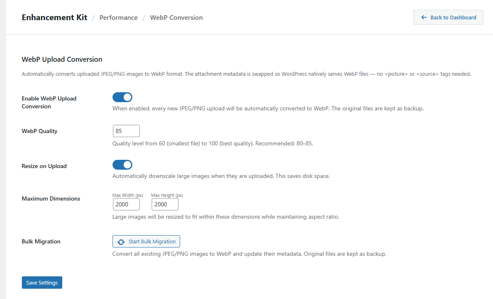

### 11.1. Cấu hình chi tiết (WebP Settings)

* **Enable WebP Upload Conversion**: Hộp chọn (Checkbox) cho phép bật hoặc tắt tính năng tự động chuyển đổi định dạng ảnh sang WebP ngay khi upload.
* **WebP Quality (Chất lượng ảnh WebP)**: Trường nhập số quy định chất lượng nén của hình ảnh sau khi chuyển đổi:
  * **Giá trị nhỏ nhất (Min)**: `60`
  * **Giá trị lớn nhất (Max)**: `100`
  * **Giá trị mặc định (Default)**: `85` (Cân bằng giữa dung lượng tối ưu và chất lượng hình ảnh).
* **Resize on Upload & Maximum Dimensions (Giới hạn kích thước ảnh)**:
  * Tự động thay đổi kích thước (Resize) của hình ảnh quá khổ khi tải lên để tránh lãng phí tài nguyên máy chủ.
  * **Giá trị mặc định (Default)**: `2000` px.
  * **Giá trị nhỏ nhất (Min)**: `100` px.
  * Nếu ảnh tải lên có chiều rộng hoặc chiều cao vượt quá giới hạn cấu hình này, hệ thống sẽ tự động thu nhỏ (Scale) về đúng kích thước giới hạn tối đa trước khi thực hiện chuyển đổi WebP.

### 11.2. Chuyển đổi Hàng loạt (Bulk Migration)

* **Mục đích**: Chuyển đổi toàn bộ tài nguyên hình ảnh cũ đã tải lên website từ trước khi cài đặt plugin sang định dạng WebP.
* **Cách thực hiện**: Click vào nút hành động **Start Bulk Migration** (hoặc **Bulk Migration**).
* **Cơ chế hoạt động**:
  * **Xử lý phân mảng (Batch processing)**: Để tránh quá tải CPU/RAM của server, hệ thống tự động chia nhỏ tiến trình chạy ngầm thành từng đợt, xử lý **20 ảnh cho 1 lần** (batch 20 images).
  * **Cơ chế tự sửa lỗi & Thử lại (Retry)**: Trong trường hợp quá trình xử lý gặp sự cố kết nối hoặc lỗi máy chủ cục bộ đối với một số hình ảnh nhất định, hệ thống tự động kích hoạt **cơ chế thử lại tối đa 3 lần** (retry 3 times) cho mỗi ảnh trước khi đánh dấu lỗi, đảm bảo tỷ lệ hoàn thành mà không cần thao tác thủ công.

### 11.3. Cơ chế tự động dọn dẹp khi Xóa ảnh (Image Deletion)

* Khi người dùng thực hiện xóa một tệp ảnh bất kỳ trong thư viện **Media Library**:
  * Hệ thống sẽ **tự động xóa sạch đồng thời cả phiên bản ảnh tối ưu dạng `.webp` lẫn tệp ảnh gốc ban đầu**

---

## 12. Bảng size (Size Charts)

> [!TIP]
> **Video hướng dẫn**: Xem video hướng dẫn chi tiết các bước thiết lập và vận hành module Size Charts [tại đây](https://drive.google.com/file/d/1sGmHxD09Jf83WFgekRkyPWxEJUWQl44o/view?usp=drive_link).

Module **Size Charts** tương tự giao diện và cơ chế hoạt động của **Shopbase** (hiển thị popup bảng size tại trang chi tiết sản phẩm), đồng thời bổ sung thêm phương thức mapping theo **Product Type** bên cạnh **Product Tag** gốc.

### 12.1. Quản lý Danh sách Bảng Size (Size Charts List)

* **Truy cập**: Dashboard -> **Enhancement Kit** -> **Size Charts**.
* **Các thành phần giao diện**:
  * **Thanh tìm kiếm**: Tìm kiếm bảng size theo **Name** hoặc **Title**.
  * **Các nút chức năng**:
    * `Add New Size Chart`: Đi đến trang tạo mới bảng size.
    * `Assign to Products`: Chuyển nhanh đến trang cập nhật hàng loạt (Bulk Update).
    * `Settings`: Cài đặt cấu hình chung (Sẽ bổ sung chi tiết sau).
  * **Bảng danh sách (List Table)**:
    * **Image**: Ảnh của bảng size.
    * **Name**: Tên hiển thị trong danh sách quản lý nội bộ.
    * **Title**: Tiêu đề hiển thị trên popup.
    * **Mapping**: Cơ chế ánh xạ (`Product Tag` hoặc `Product Type`).
    * **Status**: Trạng thái (Active/Inactive).
    * **Actions**: Nút chỉnh sửa (`Edit`) và xóa (`Delete`).

    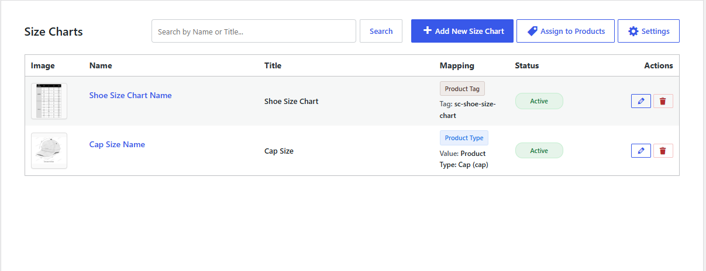

---

### 12.2. Tạo mới / Chỉnh sửa Bảng Size (Add New / Edit Size Chart)

Giao diện thêm mới và chỉnh sửa bảng size gồm 2 phần cấu hình: **Mapping Configuration** và **Chart Details**.

    

#### A. Cấu hình Ánh xạ (Mapping Configuration)

Chọn 1 trong 2 cơ chế mapping:

1. **Product Tag**:
   * **Hoạt động**: Khi lưu bảng size, hệ thống tự động tạo một sản phẩm Tag tương ứng theo **Title** và có tiền tố là `sc` (Ví dụ: Title `Unisex Hoodie` -> Tag `sc-unisex-hoodie`).
   * Sản phẩm được gắn tag này sẽ hiển thị bảng size tương ứng.
   * **Luồng xử lý**: Sau khi lưu, bấm nút **Assign to Products** để chuyển sang trang Bulk Update gán tag cho các sản phẩm.

    

2. **Product Type**:
   * **Hoạt động**: Chọn giá trị phân loại sản phẩm (**Product Type term value**).
   * Bất kỳ sản phẩm nào thuộc Product Type đã chọn sẽ tự động hiển thị bảng size ngoài frontend.
   * **Luồng xử lý**: Sau khi lưu, quá trình hoàn tất (không cần qua bước Bulk Update).

    

#### B. Chi tiết bảng size (Chart Details)

* **Title (Bắt buộc)**: Tiêu đề của bảng size hiển thị trên popup.
* **Name**: Tên hiển thị trong danh sách quản lý.
* **Chart Image (Bắt buộc)**: Ảnh bảng size lấy từ WordPress Media.
* **Description / Fit Notes**: Mô tả hoặc ghi chú thêm (hỗ trợ nhập text hoặc HTML).

    

---

### 12.3. Cập nhật Bảng Size Hàng Loạt (Bulk Update Size Chart to Products)

Trang Bulk Update dùng để gán hoặc gỡ tag bảng size hàng loạt cho sản phẩm.

    

Giao diện Bulk Update bao gồm các thành phần:

#### 1. Chọn Bảng Size & Hành động (Select Target Chart & Action)

* **Select Target Chart**: Chọn bảng size mục tiêu.
  * > [!IMPORTANT]
    >
  * > Chỉ những bảng size dùng cơ chế **Mapping Tag** mới hiển thị.
    >
  * > Quy tắc hiển thị: Ưu tiên hiển thị **Name**, nếu Name trống sẽ hiển thị **Title**.
    >
* **Action**: Có 2 loại hành động:
  * `Assign Tag`: Gán tag của bảng size đã chọn vào các sản phẩm thỏa mãn điều kiện.
  * `Remove Tag`: Gỡ tag của bảng size khỏi các sản phẩm thỏa mãn điều kiện.

    

#### 2. Điều kiện Lọc (Filter Conditions)

Cấu hình logic tương tự module condition của **Collection** (Bộ sưu tập), bao gồm:

* Lọc theo **Category** (Danh mục sản phẩm).
* Lọc theo **Tags** (Nhãn sản phẩm hiện có).
* Lọc theo **Collection** (Bộ sưu tập sản phẩm).
* Lọc theo **Title** (Từ khóa trong tiêu đề sản phẩm).
  * > [!TIP]
    >
  * > **Quy tắc OR cho tiêu đề (Title)**: Các từ khóa phân tách nhau bằng dấu phẩy `,` sẽ được hiểu theo logic HOẶC (Ví dụ: `T-shirt, Jacket` sẽ lọc các sản phẩm có tiêu đề chứa từ "T-shirt" **HOẶC** "Jacket").
    >

    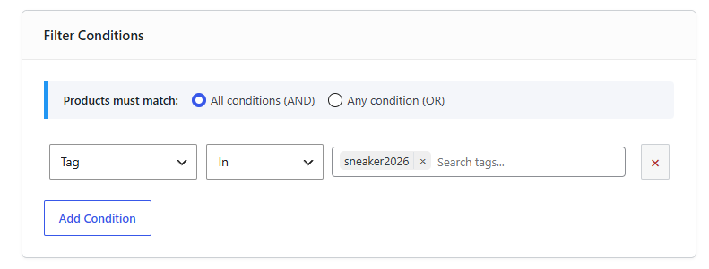

#### 3. Xem trước sản phẩm khớp điều kiện (Matching Products Preview)

* Hiển thị danh sách sản phẩm thỏa mãn điều kiện lọc sẽ được gán/gỡ tag.
* Dùng để kiểm tra trước danh sách sản phẩm khớp điều kiện.

    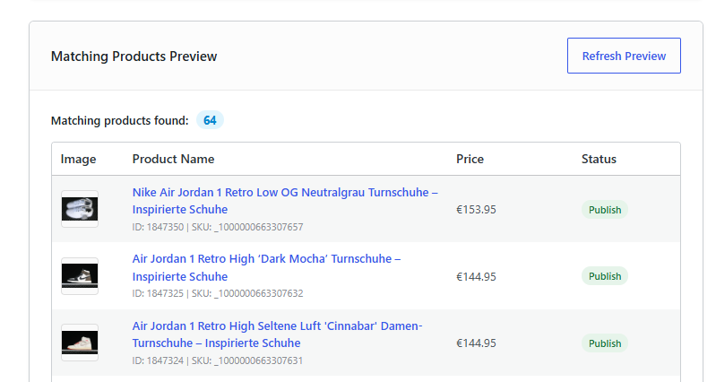

#### 4. Tiến trình xử lý (Bulk Action)

* Hiển thị thông tin tóm tắt tiến trình và thanh tiến trình.
* **Xử lý theo batch**: Mỗi batch xử lý **50 sản phẩm**.
* **ProgressBar**: Hiển thị phần trăm hoàn thành tiến trình của mỗi batch.

    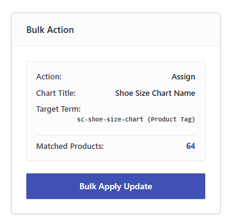

---

### 12.4. Cấu hình chung (Settings)

* **Truy cập**: Dashboard -> **Enhancement Kit** -> **Size Charts** -> chọn tab **Settings**.

Các tùy chọn cấu hình bao gồm:

* **Enable Size Charts**: Tích chọn để bật hoặc tắt hoạt động của module Size Charts.
* **Cấu hình nhãn & Kiểu dáng (Text & Styling)**:
  * `Size Guide Link Text`: Thay đổi nội dung hiển thị của liên kết mở bảng size (Ví dụ: "Size Guide" hoặc "Bảng size").
  * `Size Guide Text Color`: Chọn màu chữ cho liên kết.
  * `Size Guide Hover Text Color`: Chọn màu chữ khi di chuột qua liên kết.
  * `Underline Size Guide Text`: Tích chọn để hiển thị gạch chân liên kết mở bảng size.
* **Allowed Attributes (Product Type mapping)**:
  * Chọn các thuộc tính (attribute) được phép tải trước và hiển thị tại ô chọn attribute value trong phần mapping term khi cấu hình Product Type.
  * *Mặc định*: Nếu không chọn thuộc tính nào, hệ thống tự động tìm và kiểm tra danh sách mặc định gồm: `Product Type (pa_product-type)`, `Produkttyp (pa_produkttyp)`, `Type de produit (pa_type-de-produit)`, `Tipo de producto (pa_tipo-de-producto)`.
  * *Lưu ý*: Chỉ cấu hình hiển thị các giá trị cần thiết, tùy chỉnh để tương thích chính xác với thuộc tính của từng website.
* **Size Attributes (Vị trí hiển thị)**:
  * Chọn các thuộc tính đại diện cho kích thước.
  * *Mặc định*: Nếu không chọn thuộc tính nào, danh sách mặc định sau sẽ được áp dụng: `Size (pa_size)`, `Sizes (pa_sizes)`, `Grosse (pa_grosse)`, `Taille (pa_taille)`, `Tamano (pa_tamano)`, `Tamanho (pa_tamanho)`.
  * *Lưu ý*: Nếu sản phẩm chứa nhiều hơn một thuộc tính nằm trong danh sách được chọn này, hệ thống sẽ ưu tiên hiển thị liên kết bảng size theo thuộc tính kích thước `Size (pa_size)`. Trường hợp sản phẩm không chứa thuộc tính `pa_size` thì sẽ hiển thị tại thuộc tính đầu tiên khớp trong danh sách mà sản phẩm có.
  * **Cơ chế hiển thị trên giao diện (Frontend Display)**:
    * **Cách 1 - Hiển thị phía trên Label của thuộc tính size**: Áp dụng khi sản phẩm có chứa thuộc tính nằm trong danh sách Size Attributes được cấu hình hoặc mặc định.
      

          
      

    * **Cách 2 - Hiển thị tại Hook trước khối giỏ hàng**: Áp dụng khi sản phẩm không có thuộc tính kích thước nào thuộc danh sách trên. Liên kết tự động hiển thị tại hook `woocommerce_before_add_to_cart_form` (phía trước khối chọn số lượng và nút Add to Cart).
      

          
      

    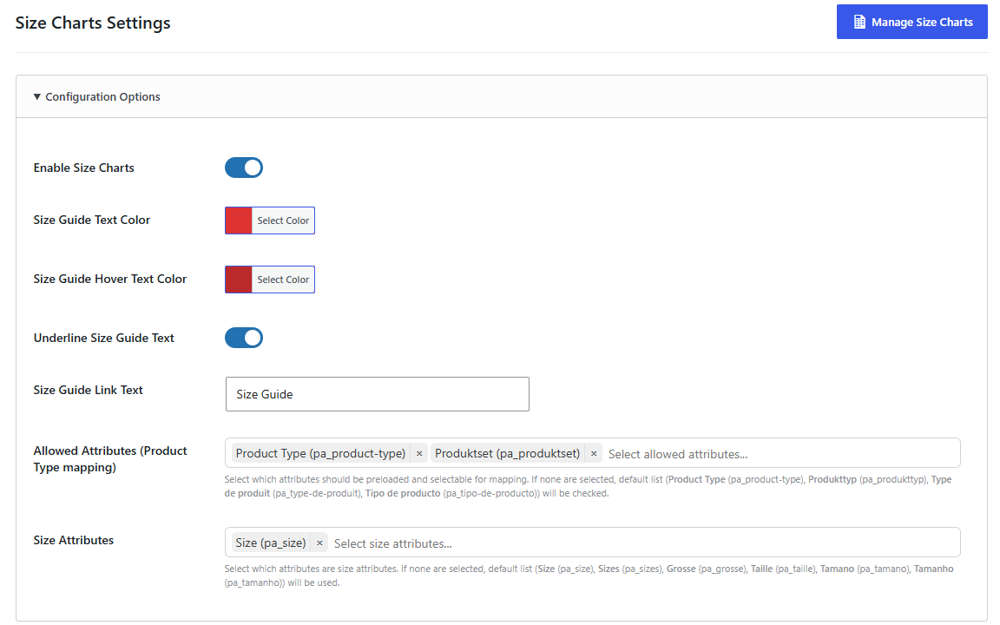

---

## 13. Hóa đơn Khách hàng (Customer Invoice)

Module **Customer Invoice** tạo một trang hóa đơn công khai (public-facing invoice page) cho phép người dùng truy cập trực tiếp qua URL bảo mật để xem chi tiết đơn hàng và hành trình vận chuyển mà không cần đăng nhập tài khoản.

### 13.1. Cơ chế Hoạt động & Bảo mật

* **Định danh bằng Order Key**: URL hóa đơn được sinh dựa trên mã khóa đơn hàng gốc của WooCommerce (`order_key`) để định danh và bảo mật truy cập:
  `{site_url}/orders/customer-invoice/{order_key}`
  *(Ví dụ: `https://yourstore.com/orders/customer-invoice/wc_order_abc123xyz`)*
* **Truy cập trực tiếp**: Khách hàng truy cập thông tin đơn hàng thông qua liên kết (gửi qua email, tin nhắn hoặc hệ thống thông báo) mà không cần xác thực tài khoản.
* **HPOS & Legacy Compatible**: Tương thích với hệ thống lưu trữ dữ liệu đơn hàng mới của WooCommerce (High-Performance Order Storage - HPOS) và kiểu lưu trữ truyền thống (Post tables).

### 13.2. Cấu trúc và Giao diện của Trang Hóa đơn (Frontend)

Trang hóa đơn sử dụng template độc lập (standalone full-page template), không tải các file header/footer của theme đang kích hoạt để tối ưu hóa hiển thị:

1. **Header**: Hiển thị logo cửa hàng (truy xuất từ thiết lập `site_logo` của theme hoặc `custom_logo` của WordPress core; nếu trống sẽ hiển thị tên website dưới dạng văn bản) kèm theo ảnh huy hiệu (Trust Badges).
2. **Tiêu đề**: Hiển thị tiêu đề cảm ơn, số đơn hàng (order number) và ngày tạo đơn.
3. **Khối thông tin đơn hàng (Information Card)**: Hiển thị các thông tin:
   * Địa chỉ giao hàng (Shipping address - nếu trống sẽ tự động lấy Địa chỉ thanh toán).
   * Địa chỉ thanh toán (Billing address).
   * Phương thức vận chuyển (Shipping method).
   * Phương thức thanh toán (Payment method).
4. **Hành trình Đơn hàng (Order Status Timeline)**:
   * **Trạng thái đặc biệt**: Nếu đơn hàng có trạng thái là hủy (`cancelled`), đã hoàn tiền (`refunded`), hoặc thất bại (`failed`), giao diện hiển thị nhãn trạng thái tương ứng thay vì hiển thị timeline.
   * **Sơ đồ timeline**: Đối với các trạng thái thông thường, hành trình đơn hàng hiển thị qua 3 mốc:
     * **Bước 1: Order placed**: Áp dụng khi đơn hàng có trạng thái `pending` hoặc `on-hold`. Ngày hiển thị lấy từ ngày tạo đơn hàng.
     * **Bước 2: In process**: Áp dụng khi đơn hàng có trạng thái `processing`, `shipped`, hoặc `in-transit`.
     * **Bước 3: Shipped**: Áp dụng khi đơn hàng có trạng thái `completed` hoặc `delivered`.
   * **Truy xuất ngày tự động**: Ngày hoàn thành của mỗi bước được hệ thống tự động lọc từ nhật ký ghi chú nội bộ của đơn hàng (internal order notes) khi đơn hàng được cập nhật trạng thái tương ứng.
5. **Khối tóm tắt đơn hàng (Order Summary - Sidebar)**:
   * Danh sách sản phẩm kèm ảnh đại diện thu nhỏ (thumbnail) và số lượng.
   * Tên sản phẩm chứa liên kết dẫn về URL của sản phẩm trên website.
   * Các thuộc tính biến thể (kích thước, màu sắc...) hoặc metadata đi kèm của sản phẩm.
   * Chi tiết tính toán: Tạm tính (Subtotal), Chiết khấu (Discount), Phí vận chuyển (Shipping), Thuế (Tax), và Tổng thanh toán (Total).
6. **Chính sách giao hàng (Delivery Policies)**: Hiển thị nội dung chính sách vận chuyển do quản trị viên thiết lập ở cột bên phải.
7. **Nút hành động (CTA Buttons)**:
   * Nút **Contact us**: Liên kết đến trang liên hệ được chỉ định.
   * Nút **Continue shopping**: Liên kết đến trang cửa hàng (Shop page) hoặc trang tùy chọn được thiết lập.
8. **Liên kết chân trang (Footer Links)**: Các đường dẫn đến các trang pháp lý: *Refund policy, Shipping policy, Terms of service, Privacy policy, DMCA*.

---

### 13.3. Hướng dẫn Cấu hình cho Quản trị viên (Admin Settings)

Thiết lập giao diện và liên kết cho trang hóa đơn trong trang quản trị:

* **Đường dẫn truy cập**: Dashboard -> **Enhancement Kit** -> chọn tab **Customer Invoice** (hoặc `Dashboard -> WC Enhancement Kit` -> chọn tab **Customer Invoice**).

Tại đây, quản trị viên có thể cấu hình các thông số sau:

#### 1. Nhãn hiệu & Màu sắc (Branding)

* **Primary Color**: Thiết lập mã màu chủ đạo cho trang hóa đơn (áp dụng cho nút "Continue shopping", các bước đã hoàn thành trên timeline và các chi tiết giao diện khác).

#### 2. Các liên kết trang (Page Links)

Chọn trang từ danh sách trang hiện có trên website để liên kết với các mục trên hóa đơn:

* **Contact Us Page**: Trang liên hệ hỗ trợ.
* **Continue Shopping Page**: Trang chuyển hướng khi nhấn "Continue shopping" (mặc định sẽ là trang Shop nếu để trống).
* **Refund Policy Page**: Trang chính sách hoàn tiền ở footer.
* **Shipping Policy Page**: Trang chính sách vận chuyển ở footer.
* **Terms of Service Page**: Trang điều khoản dịch vụ ở footer.
* **Privacy Policy Page**: Trang chính sách bảo mật ở footer.
* **DMCA Page**: Trang chính sách DMCA ở footer.

#### 3. Chính sách giao hàng (Delivery Policies)

* Cấu hình nội dung hiển thị trong mục **DELIVERY POLICIES** ở sidebar bằng trình soạn thảo trực quan (WYSIWYG Editor), hỗ trợ văn bản định dạng và mã HTML.

*Nhấn **Save Settings** để lưu cấu hình.*

---

## 14. Bộ lọc Nâng cao (Product Advanced Filter)

Module **Product Advanced Filter** cung cấp thanh sidebar trượt (slide-in sidebar) tương tự giao diện Shopify/ShopBase, tích hợp trực tiếp vào trang quản lý danh sách sản phẩm của WordPress (Dashboard -> Products) để lọc sản phẩm theo các tiêu chí nâng cao.

### 14.1. Cách vận hành trên Trang Danh sách Sản phẩm (Frontend Admin)

Sau khi được kích hoạt, hệ thống sẽ tự động thêm nút **EC Advanced Filter** vào thanh công cụ lọc sản phẩm mặc định của WooCommerce:

1. **Kích hoạt Sidebar**: Nhấp vào nút **EC Advanced Filter** để mở sidebar trượt từ cạnh phải màn hình.
2. **Chọn Tiêu chí Lọc**:
   - Đối với các bộ lọc phân loại (Taxonomy): Cho phép tìm kiếm và chọn nhiều mục cùng lúc.
   - Đối với các trường văn bản (Titles, IDs, Product Handles (Slug)): Cho phép nhập danh sách nhiều dòng (mỗi dòng một giá trị) để lọc hàng loạt.
   - Nhấn **Clear** tại góc dưới mỗi khối để đặt lại giá trị riêng của khối đó, hoặc nhấn **Clear All** ở chân trang để xóa toàn bộ lựa chọn bộ lọc.
3. **Thực thi bộ lọc**: Nhấn nút **Apply** màu xanh ở góc dưới cùng để áp dụng các bộ lọc. Trang danh sách sản phẩm sẽ tự động làm mới và tải lại kết quả khớp.
4. **Quản lý Tiêu chí đang lọc (Active Chips)**:
   - Khi có bộ lọc đang hoạt động, một hàng chip tóm tắt các tiêu chí (Active Filter Chips) sẽ hiển thị nổi bật phía trên bảng danh sách sản phẩm.
   - Admin có thể nhấn vào biểu tượng dấu `x` trên từng chip để loại bộ nhanh tiêu chí đó hoặc nhấn liên kết **Clear All** để xóa toàn bộ bộ lọc ngay lập tức.

### 14.2. Hướng dẫn Cấu hình cho Quản trị viên (Admin Settings)

* **Đường dẫn truy cập**: Dashboard -> **Enhancement Kit** -> chọn tab **Product Advanced Filter** (hoặc `Dashboard -> Settings -> WC Enhancement Kit` -> chọn tab **Product Advanced Filter**).

Các tùy chọn cấu hình được chia làm 3 nhóm chính:

#### 1. Các trường lọc hoạt động (Active Filter Fields)

Tích chọn (Bật/Tắt) hiển thị các khối lọc tương ứng trong sidebar trượt:

* **EC Product Type Filter**: Lọc các sản phẩm thuộc custom taxonomy `ec_product_type`.
* **Collections Filter**: Lọc theo bộ sưu tập động/thủ công (`wcek_collection`).
* **Tags Filter**: Lọc sản phẩm theo thẻ tag (`product_tag`).
* **Category Filter**: Lọc sản phẩm theo danh mục (`product_cat`).
* **Titles Filter**: Tìm kiếm sản phẩm theo danh sách các từ khóa tiêu đề (hỗ trợ nhiều dòng, mỗi dòng đại diện cho một cụm từ khóa khác nhau, hoạt động theo logic OR).
* **Product IDs Filter**: Lọc chính xác các sản phẩm theo danh sách mã ID (nhập mỗi dòng một ID).
* **Product Handles (Slug) Filter**: Lọc các sản phẩm theo danh sách đường dẫn tĩnh/slug (nhập mỗi dòng một slug).
* **Price Range Filter**: Lọc theo khoảng giá biến thể tối thiểu (`_regular_price`).
* **Product Image Filter**: Lọc hiển thị chỉ sản phẩm có ảnh hoặc chỉ sản phẩm không có ảnh đại diện (`_thumbnail_id`).
* **Publish Status Filter**: Lọc nhanh theo trạng thái xuất bản sản phẩm (Published, Draft, Pending, Trash).

#### 2. Ẩn Bộ lọc Mặc định của WooCommerce (Hide WooCommerce Filters)

Giúp tinh gọn giao diện mặc định của WooCommerce bằng cách ẩn các dropdown lọc cồng kềnh phía trên bảng sản phẩm:

* **Hide Category Filter**: Ẩn ô chọn danh mục sản phẩm mặc định.
* **Hide Product Type Filter**: Ẩn ô chọn loại sản phẩm mặc định.
* **Hide Stock Status Filter**: Ẩn ô chọn trạng thái kho hàng mặc định.
* **Hide Brand Filter**: Ẩn ô chọn brand mặc định của WooCommerce.
* **Hide Rank Math SEO Filter**: Ẩn ô chọn lọc phân tích SEO của Rank Math nếu có cài đặt.

#### 3. Hiển thị Bộ lọc Dropdown tùy biến (Show Dropdown Filters)

Bổ sung các dropdown chọn nhanh tùy biến hiển thị ngay trên thanh công cụ lọc sản phẩm của WooCommerce (không cần mở sidebar):

* **Show Tag Filter**: Hiện dropdown lọc theo thẻ sản phẩm (`product_tag`).
* **Show Collection Filter**: Hiện dropdown lọc theo bộ sưu tập (`wcek_collection`).
* **Show EC Product Type Filter**: Hiện dropdown lọc theo loại EC Product Type (`ec_product_type`).

*Nhấn nút **Save Changes** để lưu lại toàn bộ cấu hình cài đặt.*
