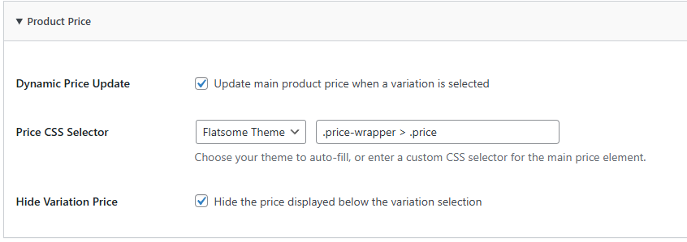
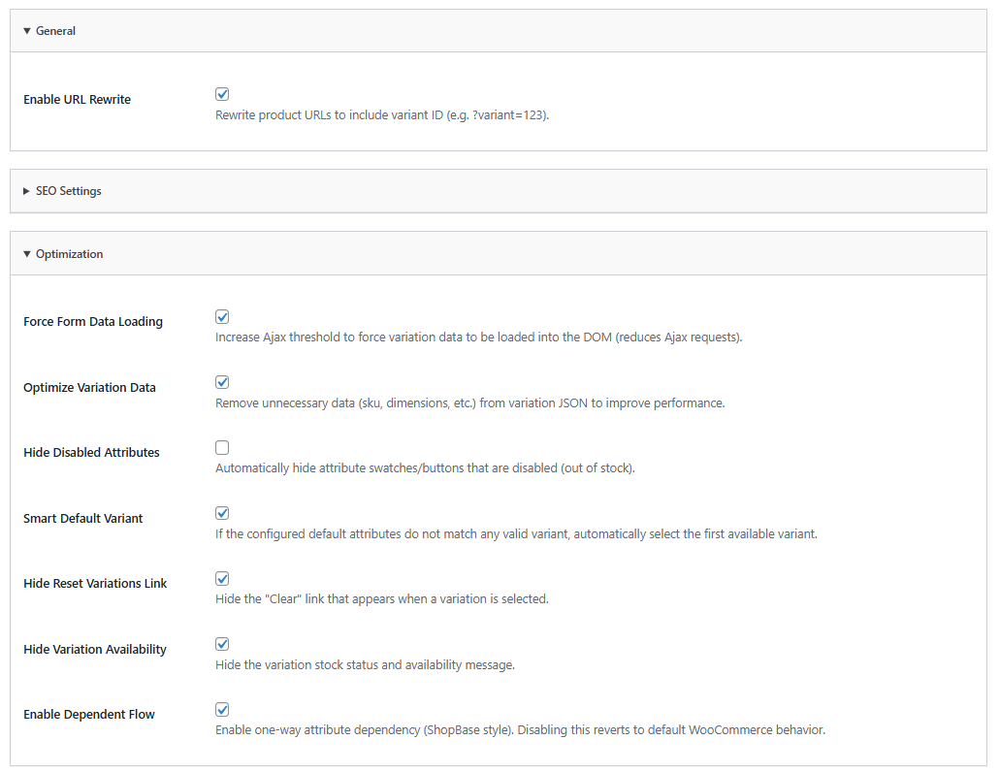
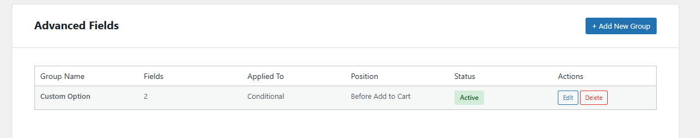
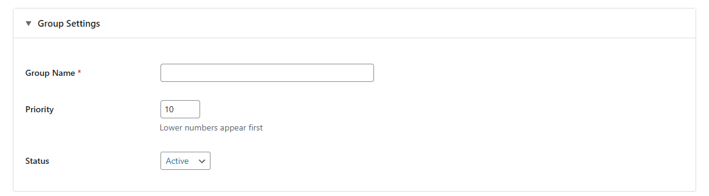
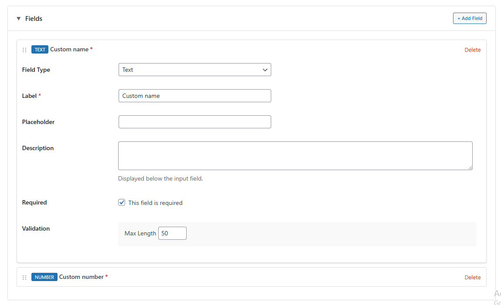
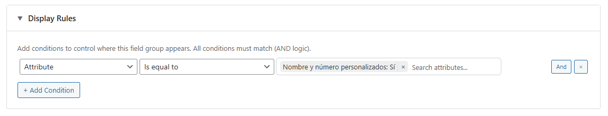
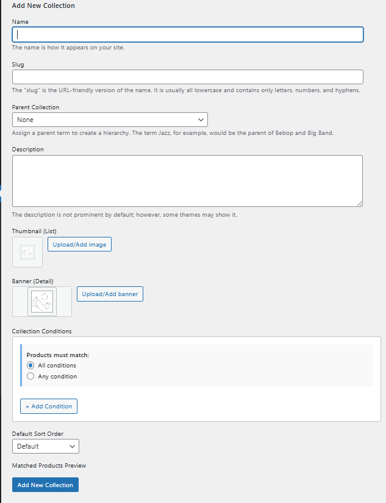
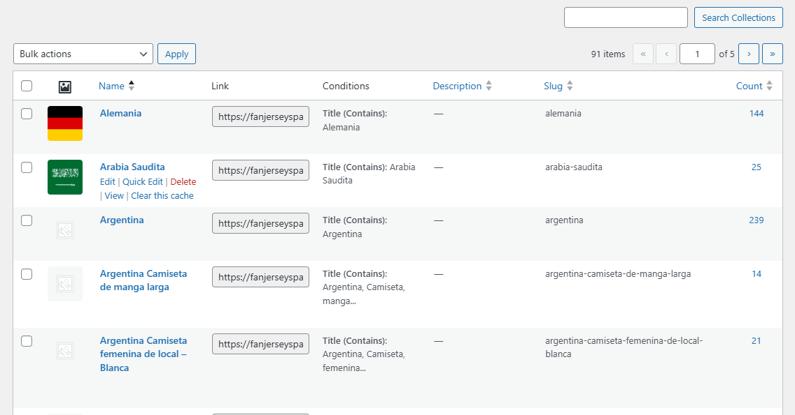
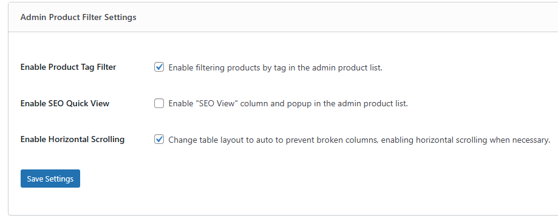
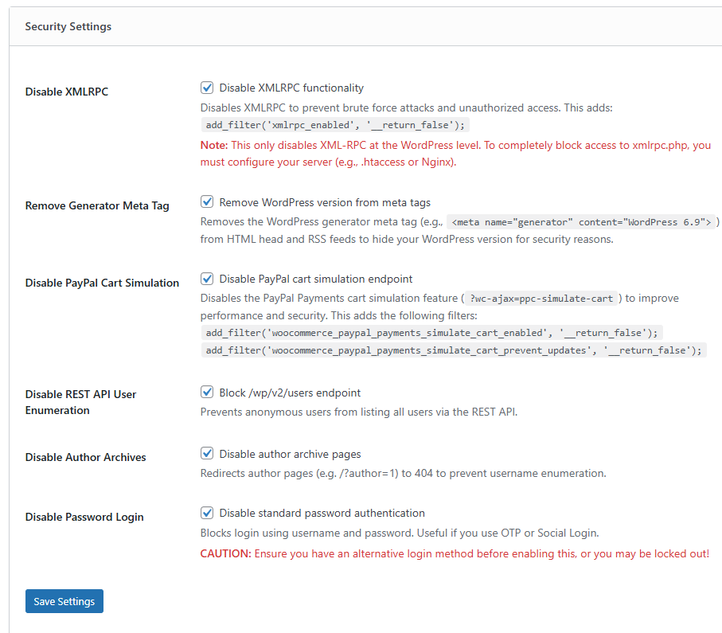

# Hướng dẫn Sử dụng Plugin WC Enhancement Kit

> Đây là các điểm cần lưu ý chính khi sử dụng plugin. Tài liệu hướng dẫn sử dụng chi tiết và đầy đủ có tại: [Google Docs - WC Enhancement Kit Guide](https://docs.google.com/document/d/1nW-ad7lRfS3UATdKyQ0E3tejxrnFDEB6zzRJFmpT4Uw/edit?usp=sharing)

## Quick Start

1.  [**Global Settings**](#1-cấu-hình-chung--cài-đặt): Cài đặt chung và chọn Template cho Plugin.
2.  [**Single Product UI**](#2-giao-diện-trang-sản-phẩm-single-product-ui): Tối ưu hiển thị trang sản phẩm (Chỉ dành cho Flatsome).
3.  [**Variation Display**](#3-hiển-thị-biến-thể-variation-display): Tối ưu hóa trình chọn thuộc tính sản phẩm.
4.  [**WebP Conversion**](#4-tối-ưu-ảnh-webp-conversion): Tự động tối ưu hóa định dạng ảnh sang WebP.
5.  [**Product Tabs**](#5-tab-sản-phẩm-product-tabs): Quản lý các tab thông tin bổ sung.
6.  [**Product Advanced Fields**](#6-trường-nâng-cao-product-advanced-fields): Tự động tạo các trường dữ liệu tùy chỉnh cho sản phẩm.
7.  [**Collection**](#7-bộ-sưu-tập-collection): Công cụ tạo danh mục sản phẩm động.
8.  [**Admin Utilities**](#8-công-cụ-admin--nhập-liệu): Các công cụ quản trị, bảo mật và nhập liệu.

---

## 1. Cấu hình Chung & Cài đặt
- **Truy cập**: Dashboard -> **WC Enhancement Kit**.
- **Chọn Template**: Đảm bảo chọn đúng giao diện mẫu tương ứng với theme đang dùng (**Flatsome** hoặc **WoodMart**).

---

## 2. Giao diện Trang Sản phẩm (Single Product UI)
Module tối ưu hiển thị, chỉ khả dụng cho theme **Flatsome**.

- **Buy Now Button**:
    
    - **Position**: Hỗ trợ thay đổi vị trí nút (Trước hoặc Sau nút Add to Cart).
    - **Animation**: Cấu hình loại hiệu ứng (Animation Type) và tỷ lệ thu phóng (Scale).
- **Product Price**:
    
    - **Price Range**: Chức năng ẩn khoảng giá (Min - Max price) của sản phẩm có biến thể.
    - **Variation Price**: Hiển thị giá cụ thể của biến thể đã chọn.
- **Extra Content**:
    - **Hooks**: Hỗ trợ chèn nội dung (Text, Image, HTML) vào các vị trí Hook trên trang sản phẩm.
---

## 3. Hiển thị Biến thể (Variation Display)
Module quản lý và tối ưu hóa trình chọn thuộc tính sản phẩm.

- **Smart Default Variant**: Tự động chọn biến thể đầu tiên khi tải trang.
- **Force Form Data Loading**: Kích hoạt cơ chế tải trước dữ liệu để tăng tốc độ phản hồi khi khách hàng chọn option.
- **Hide Reset Link**: Ẩn liên kết "Clear/Xóa" mặc định của WooCommerce.
- **Selected Swatch Style**: Tùy chỉnh màu sắc (Color/Background) cho trạng thái đang được chọn (Active state) của Swatch.

---

## 4. Tối ưu ảnh (WebP Conversion)
Module chuyển đổi định dạng ảnh sang WebP để tối ưu tốc độ tải trang.
Truy cập qua: **Settings > WC Enhancement Kit > WebP Conversion**

- **Enable WebP Upload Conversion**: Hệ thống tự động chuyển đổi mọi ảnh upload sang `.webp`.
- **WebP Quality**: Chất lượng ảnh WebP (%).
- **Resize on Upload và Maximum Dimensions**:
    - **Resize on Upload**: Tự động thay đổi kích thước ảnh gốc trước khi upload lên server.
    - **Maximum Dimensions**: Thiết lập kích thước tối đa (Width x Height) mà ảnh gốc sẽ được resize về trước khi convert sang WebP. Các ảnh có kích thước lớn hơn sẽ được tự động giảm về ngưỡng này.
- **Bulk Migration**:
    - Chức năng quét và xử lý hàng loạt ảnh cũ chưa được tối ưu sang định dạng WebP.
    - Convert ảnh ngay khi được bấm start với từng batch 20 ảnh.
    

---

## 5. Tab Sản phẩm (Product Tabs)
Module mở rộng thông tin sản phẩm thông qua các tab tùy chỉnh.
Truy cập qua: **Settings > WC Enhancement Kit > Product Tabs**

- **Apply For**: Cấu hình phạm vi hiển thị (Toàn trang, Category, Brand hoặc Sản phẩm cụ thể).
- **Tab Type**: Hỗ trợ loại `Default` (có sẵn) hoặc `Custom` (tự định nghĩa nội dung).
- **Title**: Tiêu đề Tab.

---

## 6. Trường nâng cao (Product Advanced Fields)
Module cho phép tạo và quản lý các nhóm trường thông tin tùy chỉnh cho sản phẩm (ví dụ: SKU phụ, thông số kỹ thuật, ghi chú bảo hành).
Truy cập qua: **Settings > WC Enhancement Kit > Product Advanced Fields**

- **Quản lý danh sách**: Tổng quan các nhóm trường đã tạo và trạng thái hoạt động của chúng.

### Cấu hình chi tiết (Advanced Field Settings)
Khi tạo mới hoặc chỉnh sửa một nhóm trường, bạn cần thực hiện cấu hình qua 3 tab chính:

1. **Group Setting**: Thiết lập tiêu đề cho nhóm trường và thứ tự hiển thị của nhóm trong trang chỉnh sửa sản phẩm.

2. **Fields**: Định nghĩa các trường dữ liệu con bên trong nhóm (bao gồm: Tên trường - Label, Khóa định danh - Key, và các tùy chọn hiển thị).

3. **Display Rule**: Thiết lập quy tắc hiển thị của nhóm trường (ví dụ: chỉ hiển thị cho một số danh mục sản phẩm cụ thể hoặc áp dụng cho toàn bộ cửa hàng).

---

## 7. Bộ sưu tập (Collection)
Tính năng tạo trang danh sách sản phẩm nâng cao với quy tắc lọc động.
- **Truy cập**: Dashboard -> **Products** -> **Collection**.

- **URL Slug**: Cấu hình đường dẫn tĩnh (mặc định: `/collections/`).
- **Giao diện thêm mới**: Thêm mới các bộ sưu tập và tùy chỉnh giao diện.

- **Giao diện quản lý**: Quản lý các bộ sưu tập.

- **Collection Fields**:
    - **Media**: Thiết lập ảnh Thumbnail và Banner cho từng bộ sưu tập.
    
    - **Filters**: Thiết lập tiêu chí lọc sản phẩm (Attribute, Title, Category, Tags, Brand, Product).
    

- **Product Sorting**: Hỗ trợ sắp xếp thủ công (Manual drag-drop) thứ tự sản phẩm.
    

---

## 8. Công cụ Admin & Nhập liệu
Tối ưu hóa quy trình quản trị và nâng cao tính bảo mật cho hệ thống backend.
Truy cập qua **Settings > WC Enhancement Kit > Admin Utilities**.

### 8.1. Công cụ Quản trị (Admin Tools)
- **Product Tags Filter**: Bổ sung bộ lọc theo thẻ (Tags) tại trang danh sách sản phẩm, hỗ trợ tìm kiếm và phân loại kho hàng nhanh chóng.
- **SEO Quick View**: Tích hợp cột xem nhanh dữ liệu SEO (Title, Meta Description) trực tiếp tại danh sách sản phẩm mà không cần vào trang chỉnh sửa.

### 8.2. Bảo mật hệ thống (Admin Security)
Cung cấp các lớp bảo mật bổ sung để bảo vệ website khỏi các cuộc tấn công phổ biến:
- **XML-RPC & REST API**: Vô hiệu hóa các giao thức truy cập từ xa không cần thiết để chặn tấn công Brute Force.
- **Hide System Info**: Loại bỏ Generator Meta Tag để ẩn phiên bản WordPress đang sử dụng.
- **User Privacy**: Chặn việc dò tìm Username qua REST API và vô hiệu hóa trang lưu trữ tác giả (Author Archives).

### 8.3. Trình nhập liệu sản phẩm (Product Importer)
- **Đa định dạng**: Hỗ trợ nhập liệu linh hoạt từ Shopbase CSV và WooCommerce chuẩn CSV.
- **Cơ chế Auto-recovery**: Tự động khôi phục và tiếp tục quy trình nhập liệu nếu xảy ra sự cố gián đoạn kết nối, đảm bảo dữ liệu không bị trùng lặp hoặc bỏ sót.

---

