# Hướng dẫn Sử dụng Plugin WooCommerce Enhancement Kits

> [!NOTE]
> Đây là tài liệu hướng dẫn kỹ thuật và vận hành chi tiết dành cho plugin **WooCommerce Enhancement Kits**.

---

## Danh Mục Tính Năng (Quick Navigation)

1. [**Cấu hình Chung (Global Settings)**](#1-cấu-hình-chung--chọn-template) - Cài đặt cơ bản và chọn mẫu tương thích theme.
2. [**Giao diện Sản phẩm (Single Product UI)**](#2-giao-diện-trang-sản-phẩm-single-product-ui) - Tối ưu hóa các nút bấm, trường số lượng và nội dung bổ sung.
3. [**Hiển thị Biến thể (Variation Display)**](#3-hiển-thị-biến-thể-variation-display) - Tối ưu hóa trình chọn thuộc tính và luồng chọn biến thể thông minh.
4. [**Tab Sản phẩm (Product Tabs)**](#4-tab-sản-phẩm-product-tabs) - Tạo các tab thông tin mở rộng theo phân quyền người dùng và danh mục.
5. [**Tùy chỉnh Thanh toán (Custom Checkout)**](#5-tùy-chỉnh-thanh-toán-custom-checkout) - Ẩn/hiện linh hoạt các trường trong checkout form.
6. [**Bộ sưu tập (Collection)**](#6-bộ-sưu-tập-collection) - Tạo trang danh mục sản phẩm động dựa trên bộ lọc điều kiện và sắp xếp thủ công.
7. [**Phân trang (Pagination)**](#7-phân-trang-pagination) - Tùy chỉnh thẩm mỹ khối phân trang.
8. [**Công cụ Admin & Bảo mật (Admin Utilities)**](#8-công-cụ-admin-bảo-mật--nhập-liệu) - Chặn Brute Force, tinh chỉnh bảng quản trị và các hành động xóa nhanh chống timeout.
9. [**Trình nhập liệu sản phẩm (Product Importer)**](#9-trình-nhập-liệu-sản-phẩm-product-importer) - Hỗ trợ nhập CSV từ Shopbase/WooCommerce với cơ chế tự phục hồi.
10. [**Trình dán ảnh (Image Attacher)**](#10-trình-dán-ảnh-image-attacher) - Tải ảnh hàng loạt thông qua liên kết từ xa không lưu trữ.
11. [**Tối ưu hình ảnh WebP (WebP Conversion)**](#11-tối-ưu-hình-ảnh-webp-webp-conversion) - Tự động chuyển đổi sang WebP khi tải lên và tối ưu hóa hàng loạt.
12. [**Bảng size (Size Charts)**](#12-bảng-size-size-charts) - Quản lý bảng kích thước dạng popup theo sản phẩm, gán động theo Product Type hoặc gán hàng loạt qua Product Tag.

---

## 1. Cấu hình Chung & Chọn Template
- **Truy cập**: Dashboard -> **Enhancement Kit** (Legacy: Dashboard -> **WC Enhancement Kit**).
- **Chọn Template**: Cần chọn chính xác giao diện mẫu tương ứng với theme đang dùng (**Flatsome** hoặc **WoodMart**) để đảm bảo plugin hoạt động đồng bộ với CSS của theme.

    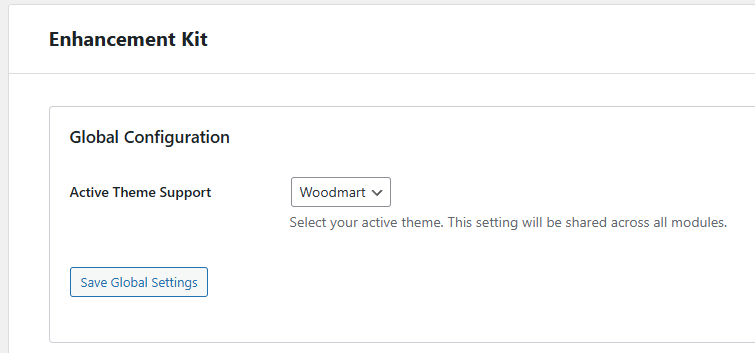

---

## 2. Giao diện Trang Sản phẩm (Single Product UI)
> [!IMPORTANT]
> **Khả năng tương thích**: Toàn bộ tính năng trong mục này chỉ hoạt động và được thiết kế tối ưu cho theme **Flatsome**. Nếu website đang sử dụng theme **WoodMart**, bạn **nên tắt hoàn toàn** các thiết lập thuộc module này để tránh xung đột giao diện hoặc lỗi hiển thị.

Module tối ưu hiển thị các thành phần cốt lõi của trang sản phẩm đơn, được thiết kế tối ưu nhất cho theme **Flatsome**.

### 2.1. Thẻ General
* **Breadcrumbs**: Cho phép ẩn/hiện Breadcrumbs mặc định trên trang sản phẩm đơn.
* **Quantity Width**: Điều chỉnh chiều rộng (width) của ô nhập số lượng sản phẩm.
* **Button Size**: Tùy chỉnh kích thước nút trên trang sản phẩm đơn.

    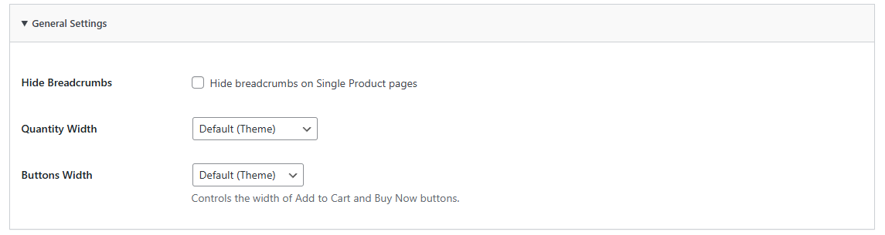

### 2.2. Nút Buy Now (Mua Ngay)

    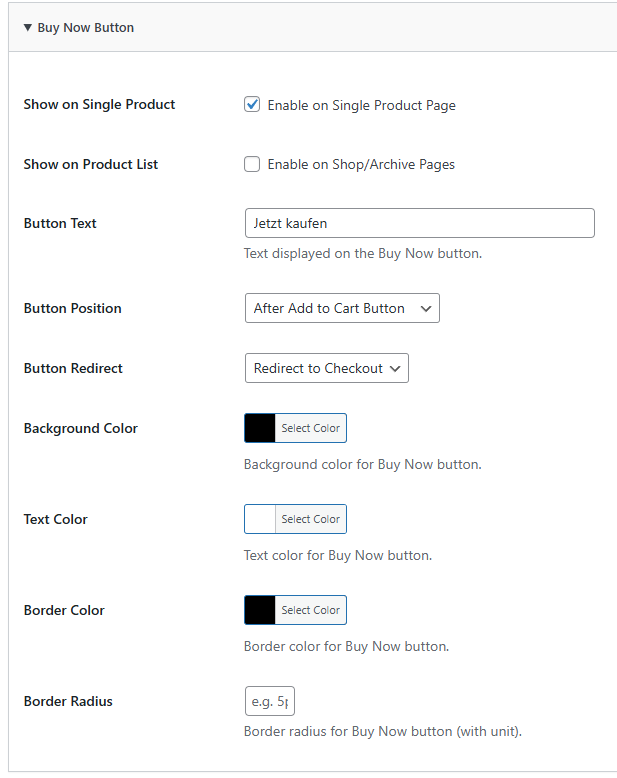

* **Hiển thị**: 
  * `Show on Single Product`: Hiện trên trang chi tiết sản phẩm.
  * `Show on Product List`: Hiện trên các trang danh mục / trang lưu trữ.
* **Button Text**: Nhãn nút hiển thị (Ví dụ: "Buy Now" hoặc "Mua Ngay").
* **Button Position**: Vị trí hiển thị so với nút Add to Cart (Có 2 tùy chọn: *Trước nút Add to Cart* hoặc *Sau nút Add to Cart*).
* **Button Redirect**: Trang đích khi click nút (Có thể chọn chuyển hướng đến **Checkout** hoặc **Cart**). Mặc định khuyến nghị là **Checkout**.
* **Styling**: Các tùy chọn bên dưới cho phép cấu hình trực quan màu chữ, màu nền, hover color và đường viền của nút.

### 2.3. Nút Add to Cart (Thêm Vào Giỏ Hàng)
* **Hover Animation**: Tích hợp các hiệu ứng chuyển động vi mô khi di chuột vào nút (Khuyến nghị sử dụng kiểu **Scale** với giá trị **Animation Value: 1.05**).
* **Buy Together**: Nếu trang sản phẩm có sử dụng phần "Mua cùng nhau" (Buy together), nút **Add all to cart** sẽ tự động được đồng bộ kiểu dáng và hiệu ứng theo nút Add to Cart chính này.

    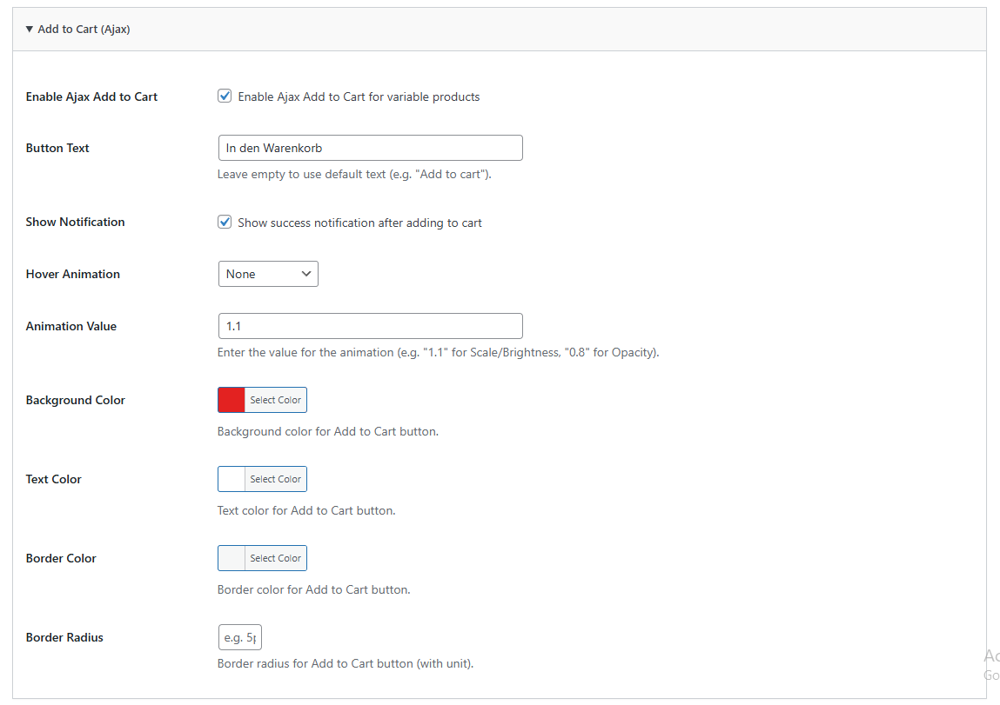

### 2.4. Hiển thị Giá sản phẩm (Product Price)

    

* **Price Range (Ẩn khoảng giá)**: Đối với sản phẩm có nhiều biến thể, plugin hỗ trợ ẩn khoảng giá mặc định của WooCommerce (`Min Price - Max Price`) và tự động thay thế bằng giá cụ thể của biến thể đang được chọn (Hiện hỗ trợ tốt nhất cho **Flatsome** và **Astra**).
* **Custom Option (Vị trí tùy chỉnh)**: Có thể tùy biến chèn giá tại vị trí bất kỳ mong muốn thông qua hook nếu website sử dụng các plugin dựng layout khác.

### 2.5. Nội dung Bổ sung (Extra Content)
* **Hooks**: Cho phép chèn văn bản, mã HTML hoặc hình ảnh vào các vị trí hook tiêu chuẩn của WooCommerce trên trang sản phẩm đơn.
* **Cách sử dụng**: Chọn loại nội dung (Type) và điền dữ liệu tương ứng. Nếu chọn loại **Image**, dán link ảnh; nếu chọn loại **Text**, nhập nội dung (Khuyến nghị sử dụng loại **HTML** kết hợp CSS nội dòng để dễ kiểm soát tính thẩm mỹ).

---

## 3. Hiển thị Biến thể (Variation Display)
Module quản lý, định dạng lại URL biến thể và tối ưu hóa trình chọn thuộc tính (swatches).

    

* **Variant URL Query**: Tạo link liên kết trực tiếp tới từng biến thể sản phẩm thông qua tham số URL dưới dạng `?variant=variant_id`. 
* **Force Form Data Loading**: Tự động tải trước toàn bộ dữ liệu biến thể ra form để tăng tốc độ phản hồi.
* **Optimize Variation Data**: Tự động dọn dẹp và loại bỏ các dữ liệu dư thừa trong cấu trúc `variant-form` giúp giảm tải dung lượng HTML tải về.
* **Hide Disabled Attributes (Khuyến nghị: KHÔNG NÊN BẬT)**: Tự động ẩn các giá trị thuộc tính không tạo thành biến thể hợp lệ. Việc này dễ gây hiểu lầm cho người dùng về các option sản phẩm hiện có.
* **Smart Default Variant**: Tự động chọn (Active) sẵn biến thể đầu tiên khi khách hàng tải trang sản phẩm nếu sản phẩm đó chưa được cấu hình biến thể mặc định trong admin.
* **Hide Reset Variations Link**: Ẩn liên kết "Clear/Xóa" mặc định của WooCommerce để giao diện trông gọn gàng, tinh giản hơn.
* **Enable Dependent Flow (Kiểu Shopbase)**: Chuyển đổi luồng chọn thuộc tính thành dạng phụ thuộc tầng nấc giống như giao diện Shopbase.
* **Selected Swatch Style**: Tùy chỉnh trực tiếp màu chữ (`Selected Swatch Text Color`) và màu nền (`Selected Swatch Background`) của swatch khi ở trạng thái được chọn (Active).

    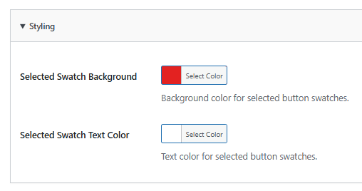

---

## 4. Tab Sản phẩm (Product Tabs)
Giúp mở rộng trang sản phẩm bằng cách bổ sung thêm các tab thông tin có điều kiện (Như quy trình vận chuyển, chính sách đổi trả, bảng size...).

    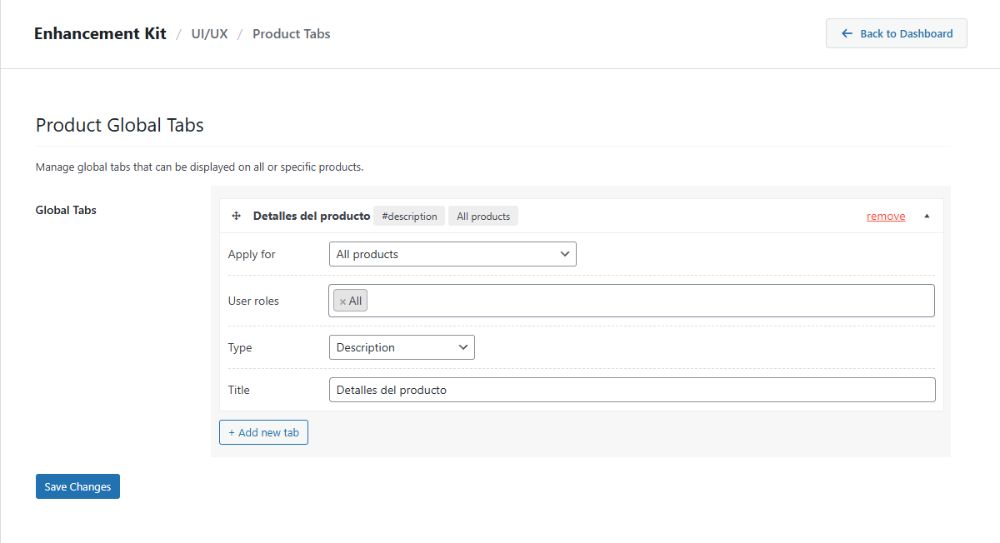

* **Apply For (Điều kiện áp dụng)**: Cấu hình linh hoạt phạm vi hiển thị tab dựa trên: **Product** (Sản phẩm cụ thể), **Category** (Danh mục), **Brand** (Thương hiệu), hoặc **Tags** (Thẻ sản phẩm).
* **User Roles**: Cho phép cấu hình hiển thị tab đặc thù theo từng vai trò của người dùng (Ví dụ: Tab chính sách sỉ chỉ hiện cho tài khoản Wholesale).
* **Type (Loại nội dung)**: Hỗ trợ loại tab có sẵn (`Description`, `Additional Information`, `Review`) hoặc loại tự định nghĩa nội dung (`Custom`).
* **Title & Content**: Đặt tiêu đề hiển thị và soạn thảo nội dung (Hỗ trợ định dạng HTML phong phú).

---

## 5. Tùy chỉnh Thanh toán (Custom Checkout)
> [!IMPORTANT]
> **Khả năng tương thích**: Tính năng này chỉ hoạt động trên theme **Flatsome**. Nếu website sử dụng theme **WoodMart**, bạn **nên tắt hoàn toàn** thiết lập này (hoặc sử dụng các tính năng tối ưu checkout mặc định có sẵn của WoodMart) để tránh xung đột mã nguồn.

Tính năng hỗ trợ dọn dẹp và tối ưu hóa biểu mẫu thanh toán ngoài trang Checkout giúp tăng tỷ lệ chuyển đổi đơn hàng.

* **Đường dẫn**: Dashboard -> **Enhancement Kit** -> **Custom Checkout** (Legacy: Dashboard -> **Settings** -> **WC Enhancement Kit** -> **Custom Checkout**).
* **Tính năng**: Cho phép bật/tắt (ẩn/hiện) và đặt bắt buộc (Required) hoặc không bắt buộc đối với các trường thông tin mặc định của WooCommerce như:
  * Company Name (Tên công ty)
  * Address Line 2 (Địa chỉ dòng 2)
  * Phone Number (Số điện thoại)
  * Postcode / ZIP (Mã bưu điện)
  * State / County (Tỉnh thành/Quận huyện)

---

## 6. Bộ sưu tập (Collection)
Tính năng nâng cao hỗ trợ gom nhóm sản phẩm tự động dựa trên các bộ lọc điều kiện động và quản lý sắp xếp thứ tự thủ công chuyên nghiệp.

* **Truy cập**: Dashboard -> **Products** -> **Collection**.

### 6.1. Lưu ý quan trọng về Đường dẫn tĩnh (Permalink Slug)
> [!WARNING]
> Slug mặc định được sử dụng cho taxonomy này là `collections`. Tuyệt đối không gán slug này cho bất kỳ danh mục, trang hay thành phần nào khác trong cấu hình **Settings -> Permalinks**.
> 
> Trường hợp truy cập trang bộ sưu tập ngoài giao diện gặp lỗi **404 Not Found**, hãy truy cập ngay vào **Settings -> Permalinks**, kiểm tra xem có xung đột slug hay không, rồi nhấn nút **Save Changes** để làm mới lại liên kết tĩnh của hệ thống.

### 6.2. Tạo mới một Bộ sưu tập
1. Vào mục **Collections**, điền thông tin cơ bản: **Name** (Tên bộ sưu tập), **Parent Collection** (Bộ sưu tập cha - nếu có), **Description** (Mô tả).
2. **Media (Hình ảnh)**:
   * `Thumbnail`: Ảnh đại diện của bộ sưu tập khi hiển thị trong danh sách chung (Collection List).
   * `Banner`: Ảnh biểu ngữ kích thước lớn hiển thị ở đầu trang chi tiết của bộ sưu tập đó ngoài frontend.

    

3. **Bộ lọc điều kiện (Filters)**:
   * Thiết lập quy tắc tự động thêm sản phẩm vào bộ sưu tập dựa trên: **Attribute** (Thuộc tính), **Title** (Tiêu đề sản phẩm), **Category** (Danh mục), **Tags** (Thẻ), hoặc **Brand** (Thương hiệu).
   * **Lưu ý quy tắc OR với Tiêu đề (Title)**: Khi lọc theo tiêu đề, các từ khóa phân tách bằng dấu phẩy `,` sẽ được hệ thống hiểu theo điều kiện HOẶC (Ví dụ: `Man, Woman` nghĩa là lấy sản phẩm có tiêu đề chứa từ "Man" **HOẶC** chứa từ "Woman").

    

4. **Thứ tự sắp xếp sản phẩm (Product Sorting)**:
   * Cung cấp các chế độ sắp xếp tự động: *Default, Product title A-Z, Product title Z-A, Highest price, Lowest price, Newest, Oldest*.
   * **Sắp xếp thủ công (Manual sorting)**:
     * Chọn tùy chọn **Manual**, sau đó nhấn **Reload Preview** để tải danh sách sản phẩm hiện có.
     * Sử dụng chuột để kéo thả (drag-and-drop) sắp xếp thứ tự hiển thị của từng sản phẩm.
     * Để thao tác nhanh hàng loạt, sử dụng checkbox chọn nhiều sản phẩm cùng lúc rồi dùng nút lệnh di chuyển nhanh: **Move to top** (Lên đầu), **Move to bottom** (Xuống cuối), hoặc **Move to position** (Chuyển tới vị trí số X).

    

### 6.3. Tích hợp hiển thị bộ sưu tập ngoài Giao diện
* **Flatsome (UX Builder)**: Plugin tự động tích hợp các element chuyên dụng vào UX Builder giúp dễ dàng kéo thả hiển thị danh sách sản phẩm theo Bộ sưu tập (Tương tự như cách gọi danh mục thông thường).
* **Woodmart (Elementor)**: Sử dụng widget **Product (grid/carousel)** của Woodmart hoặc các widget tương ứng của Elementor, chọn nguồn dữ liệu (Data Source) là **Collection** để hiển thị sản phẩm mong muốn.

### 6.4. Cơ chế đồng bộ sản phẩm vào Collection (Collection Sync)
Hệ thống đồng bộ hóa sản phẩm vào bộ sưu tập theo các cơ chế sau để đảm bảo tính chính xác và tối ưu hiệu năng máy chủ:
* **Đồng bộ thời gian thực (Event-driven)**: Tự động chạy ngay khi thực hiện thêm mới hoặc chỉnh sửa/cập nhật một sản phẩm bất kỳ.
* **Đồng bộ sau khi Import**: Tự động kích hoạt ngay sau khi tiến trình nhập dữ liệu (Import) sản phẩm kết thúc thành công.
* **Đồng bộ tự động định kỳ (Cron Job)**: Chạy tự động đồng bộ lại toàn bộ các bộ sưu tập vào lúc **2:00 AM giờ UTC** hàng ngày. Tính năng này có thể được chủ động Bật hoặc Tắt linh hoạt trong phần cấu hình quản trị (Xem chi tiết hướng dẫn tại [Cài đặt Đồng bộ Bộ sưu tập](#81-hỗ-trợ-trang-quản-trị-admin-tools)).
* **Đồng bộ thủ công tức thì (Manual Sync)**: Kích hoạt đồng bộ hóa toàn bộ các bộ sưu tập ngay lập tức bằng nút bấm hành động thủ công khi cần cập nhật giao diện ngoài frontend ngay tức thì (Xem chi tiết hướng dẫn tại [Cài đặt Đồng bộ Bộ sưu tập](#81-hỗ-trợ-trang-quản-trị-admin-tools)).
* **Ghi log**: Tất cả nhật ký đồng bộ chi tiết được ghi nhận tại đường dẫn: **WooCommerce -> Status -> Logs** -> tìm file log có tiền tố `wcek-collection-sync`.

---

## 7. Phân trang (Pagination)
> [!IMPORTANT]
> **Khả năng tương thích**: Tính năng này chỉ hoạt động trên theme **Flatsome**. Nếu website đang sử dụng theme **WoodMart**, bạn **nên tắt hoàn toàn** tính năng Phân trang này để tránh làm vỡ định dạng phân trang mặc định và tinh tế của WoodMart.

Cho phép làm đẹp và cá nhân hóa thiết kế nút phân trang tại các trang danh mục sản phẩm (Archive / Shop Pages).

* **Đường dẫn**: Dashboard -> **Enhancement Kit** -> **Pagination** (Legacy: Dashboard -> **Settings** -> **WC Enhancement Kit** -> **Pagination**).
* **Cấu hình giao diện**:
  * `Active Item Background`: Màu nền của nút trang hiện tại.
  * `Active Item Text Color`: Màu chữ của nút trang hiện tại.
  * `Border Radius`: Bo góc nút phân trang. Sử dụng đơn vị `px` để tạo nút hình vuông bo nhẹ góc (Ví dụ: `4px`), hoặc nhập tỷ lệ phần trăm `%` (Ví dụ: `50%`) để hiển thị nút dạng hình tròn hoàn hảo.

---

## 8. Công cụ Admin & Bảo mật (Admin Utilities)
Nhóm tính năng hỗ trợ tinh chỉnh trang quản trị backend, bảo mật hệ thống WordPress và dọn dẹp dữ liệu lớn tránh timeout.

    

### 8.1. Hỗ trợ trang Quản trị (Admin Tools)
* **Product Tag Filter**: Bổ sung bộ lọc nhanh theo Thẻ (Tag) ngay tại đầu bảng danh sách tất cả sản phẩm, giúp admin lọc và tìm kiếm kho hàng tiện lợi.
* **SEO Quick View**: Tích hợp một cột hiển thị trạng thái SEO (Thẻ Title, Meta Description) trực tiếp tại danh sách sản phẩm. Khi click vào sẽ hiển thị một cửa sổ bật lên (popup) tóm tắt thông tin SEO của sản phẩm đó mà không cần truy cập vào trang chỉnh sửa chi tiết.
* **Enable Horizontal Scrolling**: Tự động sửa lỗi CSS hiển thị bảng danh sách sản phẩm của WooCommerce trên màn hình nhỏ, bổ sung thanh cuộn ngang để bảng không bị méo mó hay vỡ giao diện khi kích hoạt nhiều cột thông tin.
* **Collection Sync Setting (Cài đặt Đồng bộ Bộ sưu tập)**: Tích hợp công cụ quản lý đồng bộ các Collection sản phẩm giúp tối ưu hiệu năng máy chủ và dữ liệu:
  * **Hộp chọn Bật/Tắt Cron Job**: Checkbox cho phép kích hoạt hoặc vô hiệu hóa lịch chạy tự động ngầm (**Cron Job**) vào lúc **2:00 giờ sáng UTC**. Việc này giúp khống chế tác vụ đồng bộ chỉ chạy vào khung giờ thấp điểm ít khách truy cập, tránh việc hệ thống liên tục chạy đồng bộ tự động trong ngày gây quá tải CPU/RAM của server.
  * **Nút bấm Sync All Now**: Cho phép kích hoạt đồng bộ hóa toàn bộ các Collection ngay lập tức một cách thủ công, cực kỳ hữu dụng khi bạn vừa cập nhật hàng loạt sản phẩm mới và muốn cập nhật hiển thị ngoài frontend ngay lập tức.

    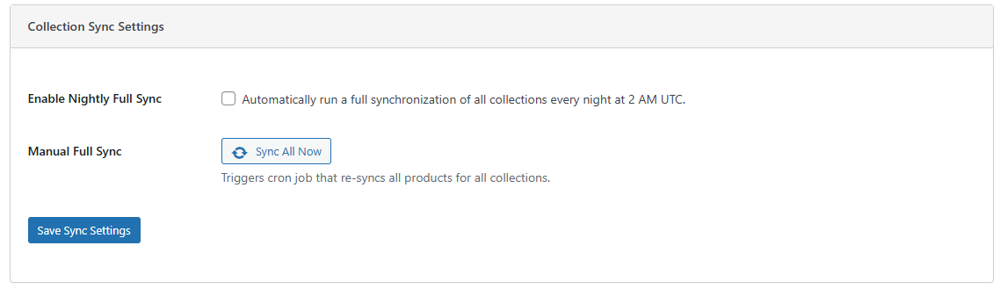

### 8.2. Bảo mật hệ thống (Admin Security)
Cung cấp các thiết lập bảo mật cấp WordPress để hạn chế các cuộc tấn công quét thông tin:

    

* **Ẩn XML-RPC & REST API**: Vô hiệu hóa giao thức XML-RPC và chặn các truy cập REST API không cần thiết nhằm ngăn chặn tấn công dò mật khẩu (Brute Force).
* **Block PayPal simulate-cart**: Chặn truy cập vào API `simulate-cart` của plugin PayPal mặc định để chống spam đơn hàng ảo.
* **Chặn dò tìm Username**: Vô hiệu hóa endpoint `/wp/v2/users` trong REST API nhằm ngăn chặn hacker thu thập danh sách tài khoản quản trị.
* **Author Archives 404**: Trả về mã lỗi 404 (Không tìm thấy trang) nếu người dùng không có quyền quản trị cố gắng truy cập trang lưu trữ của tác giả bài viết.
* **Chặn đăng nhập bằng mật khẩu thường (Lưu ý quan trọng)**:
  > [!CAUTION]
  > Tuyệt đối **không bật** tùy chọn chặn đăng nhập bằng username/mật khẩu trừ khi website của bạn đã cấu hình thành công một phương thức đăng nhập thay thế an sau qua bên thứ ba (Ví dụ: Đăng nhập bằng tài khoản Google, Firebase, OTP...).

### 8.3. Thao tác xóa nhanh hàng loạt (Bulk Actions)
* **Vấn đề**: Khi làm việc với kho dữ liệu lớn, việc chuyển hàng trăm sản phẩm vào thùng rác hoặc xóa vĩnh viễn bằng công cụ mặc định của WooCommerce rất dễ gây lỗi cạn kiệt bộ nhớ hoặc timeout của server.
* **Giải pháp**: Plugin bổ sung hai bộ lọc hành động tùy biến siêu nhẹ: **Move to trash** (Đưa vào thùng rác) và **Delete permanently** (Xóa vĩnh viễn). Cơ chế xử lý đã được tối ưu hóa để chạy nền mượt mà, phân mảng thông minh giúp tránh nghẽn server.
* **Ghi nhật ký**: Toàn bộ quá trình xóa được ghi chi tiết tại log: **WooCommerce -> Status -> Logs** -> file `wcek-bulk-actions`.

---

## 9. Trình nhập liệu sản phẩm (Product Importer)
Công cụ nhập dữ liệu sản phẩm hiệu năng cao, hỗ trợ định dạng CSV từ Shopbase và WooCommerce tiêu chuẩn.

> [!NOTE]
> **Phương án dự phòng**: Trình nhập liệu tích hợp này chỉ đóng vai trò làm **phương án dự phòng và chỉ nên dùng để nhập các tệp tin có số lượng sản phẩm nhỏ**. Để đảm bảo độ ổn định, tránh timeout và đạt hiệu suất đồng bộ dữ liệu lớn tốt nhất, vui lòng liên hệ **team Tech** để được hướng dẫn, cài đặt và sử dụng plugin import chính thức của hệ thống.

> [!WARNING]
> Nếu website của bạn đang cài đặt và kích hoạt plugin tăng tốc **WP Rocket**, bắt buộc phải **TẮT (Disable)** tạm thời plugin này trước khi chạy tiến trình Import sản phẩm để tránh xảy ra xung đột bộ đệm và lỗi xử lý dữ liệu.

* **Cách sử dụng**: Vào mục Product Importer, chọn đúng định dạng file mẫu (Shopbase hoặc WooCommerce), tải tệp CSV lên (Hỗ trợ tải lên nhiều tệp cùng lúc để xử lý xếp hàng) và nhấn bắt đầu.
* **Cơ chế Hủy bỏ (Cancel)**: Có thể click **Cancel Import** bất cứ lúc nào để dừng luồng xử lý hiện tại.
* **Cơ chế Tự khôi phục & Tiếp tục (Resume & Auto-recovery)**:
  * Trong trường hợp máy chủ bị mất kết nối internet giữa chừng, mất nguồn hoặc nghẽn, hệ thống có tính năng khóa luồng song song để ngăn chặn việc chạy đè dữ liệu.
  * Khi kết nối ổn định lại, truy cập trang Importer, hệ thống sẽ hiển thị thông báo khôi phục tự động: *"Auto-recovering from interrupted job..."*.
  * Admin có thể chọn **Resume** để hệ thống tiếp tục đọc CSV từ dòng bị gián đoạn, hoặc chọn **Discard** để hủy bỏ hoàn toàn phiên làm việc lỗi đó.
  * **Mẹo xử lý sự cố kẹt tiến trình (Troubleshooting)**: 
    Nếu tiến trình tự động khôi phục bị kẹt cứng và không chạy tiếp, hãy làm theo quy trình sau:
    1. Truy cập vào menu quản trị: **Tools -> Scheduled Actions** (hoặc WooCommerce -> Status -> Scheduled Actions).
    2. Tìm trong tab **Processing** và **Pending** xem có tồn tại 2 Jobs bị trùng lặp cùng có chứa đối số (Arguments) dạng `'import_id' => 'wcek_id'` hay không.
    3. Thực hiện **Xóa (Delete)** tiến trình bị kẹt đang nằm trong trạng thái **Processing**. Ngay sau đó, tiến trình nằm trong danh sách chờ **Pending** sẽ tự động được kích hoạt và chạy tiếp tục tác vụ nhập liệu bình thường mà không bị trùng lặp dữ liệu sản phẩm.
* **Nhật ký tiến trình**: Xem log chi tiết tại **WooCommerce -> Status -> Logs** -> file `wcek-importer`.

---

## 10. Trình dán ảnh (Image Attacher)
Công cụ hỗ trợ tải và đính kèm nhanh hình ảnh vào thư viện Media của WordPress thông qua danh sách liên kết (URL) hình ảnh trực tuyến mà không cần tải về máy tính rồi upload thủ công.

* **Đường dẫn**: Dashboard -> **Media** -> **Upload via Link**.

    

* **Cách thực hiện**:
  1. Nhập hoặc dán danh sách các đường dẫn (URL) ảnh trực tuyến vào ô nhập liệu lớn. **Lưu ý**: Mỗi một URL hình ảnh phải nằm trên một dòng riêng biệt (**mỗi 1 URL là 1 dòng**).
  2. Click nút **Import Images** để hệ thống tự động tải các ảnh này về server nền và đồng bộ vào thư viện Media mặc định của WordPress.
* **Lưu ý**:
  > [!IMPORTANT]
  > Không sử dụng chức năng này để tải lên các tài nguyên ảnh hệ thống quan trọng như logo chính, favicon của website. Chức năng này chỉ phù hợp để chuẩn bị nhanh ảnh mô tả hoặc ảnh gallery cho sản phẩm hàng loạt.

---

## 11. Tối ưu hình ảnh WebP (WebP Conversion)
Hệ thống tích hợp module WebP Conversion mạnh mẽ, tự động chuyển đổi, thu nhỏ kích thước và tối ưu hóa dung lượng hình ảnh để đạt điểm hiệu năng cao nhất trên Google PageSpeed Insights.

* **Đường dẫn**: Dashboard -> **Enhancement Kit** -> **WebP Conversion** (Legacy: Dashboard -> **Settings** -> **WC Enhancement Kit** -> **WebP Conversion**).

    

### 11.1. Cấu hình chi tiết (WebP Settings)
* **Enable WebP Upload Conversion**: Hộp chọn (Checkbox) cho phép bật hoặc tắt tính năng tự động chuyển đổi định dạng ảnh sang WebP ngay khi upload.
* **WebP Quality (Chất lượng ảnh WebP)**: Trường nhập số quy định chất lượng nén của hình ảnh sau khi chuyển đổi:
  * **Giá trị nhỏ nhất (Min)**: `60`
  * **Giá trị lớn nhất (Max)**: `100`
  * **Giá trị mặc định (Default)**: `85` (Cân bằng hoàn hảo giữa dung lượng siêu nhẹ và độ sắc nét thị giác).
* **Resize on Upload & Maximum Dimensions (Giới hạn kích thước ảnh)**:
  * Tự động thay đổi kích thước (Resize) của hình ảnh quá khổ khi tải lên để tránh lãng phí tài nguyên máy chủ.
  * **Giá trị mặc định (Default)**: `2000` px.
  * **Giá trị nhỏ nhất (Min)**: `100` px.
  * Nếu ảnh tải lên có chiều rộng hoặc chiều cao vượt quá giới hạn cấu hình này, hệ thống sẽ tự động thu nhỏ (Scale) về đúng kích thước giới hạn tối đa trước khi thực hiện chuyển đổi WebP.

### 11.2. Chuyển đổi Hàng loạt (Bulk Migration)
* **Mục đích**: Chuyển đổi toàn bộ tài nguyên hình ảnh cũ đã tải lên website từ trước khi cài đặt plugin sang định dạng WebP.
* **Cách thực hiện**: Click vào nút hành động **Start Bulk Migration** (hoặc **Bulk Migration**).
* **Cơ chế hoạt động**:
  * **Xử lý phân mảng (Batch processing)**: Để tránh quá tải CPU/RAM của server, hệ thống tự động chia nhỏ tiến trình chạy ngầm thành từng đợt, xử lý **20 ảnh cho 1 lần** (batch 20 images).
  * **Cơ chế tự sửa lỗi & Thử lại (Retry)**: Trong trường hợp quá trình xử lý gặp sự cố kết nối hoặc lỗi máy chủ cục bộ đối với một số hình ảnh nhất định, hệ thống tự động kích hoạt **cơ chế thử lại tối đa 3 lần** (retry 3 times) cho mỗi ảnh trước khi đánh dấu lỗi, đảm bảo tỷ lệ hoàn thành tuyệt đối mà không cần admin thao tác thủ công.

### 11.3. Cơ chế tự động dọn dẹp khi Xóa ảnh (Image Deletion)
* Khi người dùng thực hiện xóa một tệp ảnh bất kỳ trong thư viện **Media Library**:
  * Hệ thống sẽ **tự động xóa sạch đồng thời cả phiên bản ảnh tối ưu dạng `.webp` lẫn tệp ảnh gốc ban đầu**

---

## 12. Bảng size (Size Charts)

> [!TIP]
> **Video hướng dẫn**: Xem video hướng dẫn chi tiết các bước thiết lập và vận hành module Size Charts [tại đây](https://drive.google.com/file/d/1sGmHxD09Jf83WFgekRkyPWxEJUWQl44o/view?usp=drive_link).

Module **Size Charts** clone giao diện và cơ chế hoạt động của **Shopbase** (hiển thị popup bảng size tại trang chi tiết sản phẩm), đồng thời bổ sung thêm phương thức mapping theo **Product Type** bên cạnh **Product Tag** gốc.

### 12.1. Quản lý Danh sách Bảng Size (Size Charts List)

* **Truy cập**: Dashboard -> **Enhancement Kit** -> **Size Charts**.
* **Các thành phần giao diện**:
  * **Thanh tìm kiếm**: Tìm kiếm bảng size theo **Name** hoặc **Title**.
  * **Các nút chức năng**:
    * `Add New Size Chart`: Đi đến trang tạo mới bảng size.
    * `Assign to Products`: Chuyển nhanh đến trang cập nhật hàng loạt (Bulk Update).
    * `Settings`: Cài đặt cấu hình chung (Sẽ bổ sung chi tiết sau).
  * **Bảng danh sách (List Table)**:
    * **Image**: Ảnh của bảng size.
    * **Name**: Tên hiển thị trong danh sách quản lý nội bộ.
    * **Title**: Tiêu đề hiển thị trên popup.
    * **Mapping**: Cơ chế ánh xạ (`Product Tag` hoặc `Product Type`).
    * **Status**: Trạng thái (Active/Inactive).
    * **Actions**: Nút chỉnh sửa (`Edit`) và xóa (`Delete`).

    

---

### 12.2. Tạo mới / Chỉnh sửa Bảng Size (Add New / Edit Size Chart)

Giao diện thêm mới và chỉnh sửa bảng size gồm 2 phần cấu hình: **Mapping Configuration** và **Chart Details**.

    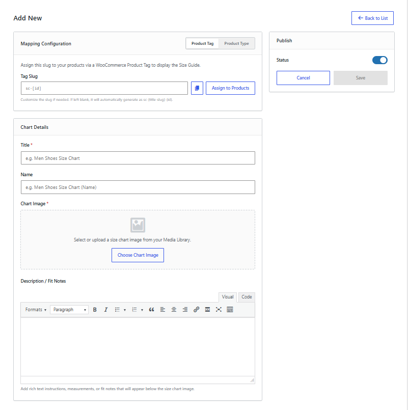

#### A. Cấu hình Ánh xạ (Mapping Configuration)
Chọn 1 trong 2 cơ chế mapping:

1. **Product Tag**:
   * **Hoạt động**: Khi lưu bảng size, hệ thống tự động tạo một sản phẩm Tag tương ứng theo **Title** và có tiền tố là `sc` (Ví dụ: Title `Unisex Hoodie` -> Tag `sc-unisex-hoodie`).
   * Sản phẩm được gắn tag này sẽ hiển thị bảng size tương ứng.
   * **Luồng xử lý**: Sau khi lưu, bấm nút **Assign to Products** để chuyển sang trang Bulk Update gán tag cho các sản phẩm.

    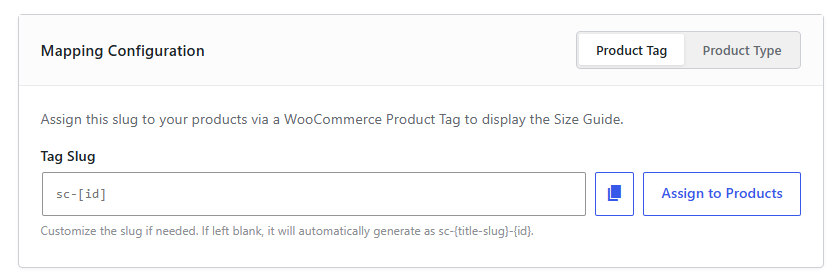

2. **Product Type**:
   * **Hoạt động**: Chọn giá trị phân loại sản phẩm (**Product Type term value**).
   * Bất kỳ sản phẩm nào thuộc Product Type đã chọn sẽ tự động hiển thị bảng size ngoài frontend.
   * **Luồng xử lý**: Sau khi lưu, quá trình hoàn tất (không cần qua bước Bulk Update).

    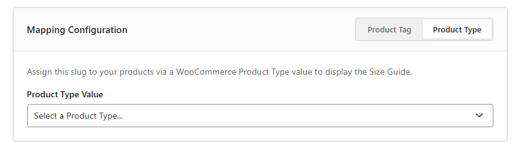

#### B. Chi tiết bảng size (Chart Details)
* **Title (Bắt buộc)**: Tiêu đề của bảng size hiển thị trên popup.
* **Name**: Tên hiển thị trong danh sách quản lý.
* **Chart Image (Bắt buộc)**: Ảnh bảng size lấy từ WordPress Media.
* **Description / Fit Notes**: Mô tả hoặc ghi chú thêm (hỗ trợ nhập text hoặc HTML).

    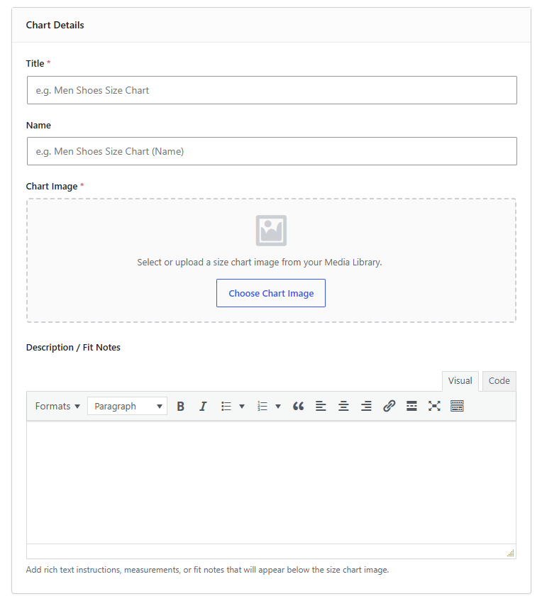

---

### 12.3. Cập nhật Bảng Size Hàng Loạt (Bulk Update Size Chart to Products)

Trang Bulk Update dùng để gán hoặc gỡ tag bảng size hàng loạt cho sản phẩm.

    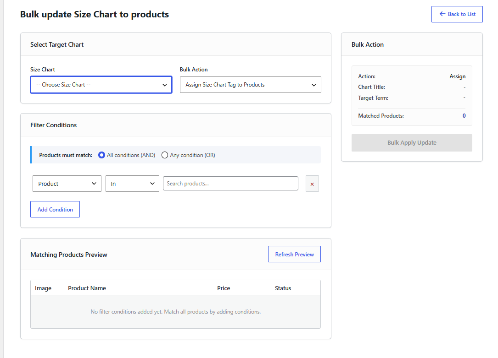

Giao diện Bulk Update bao gồm các thành phần:

#### 1. Chọn Bảng Size & Hành động (Select Target Chart & Action)
* **Select Target Chart**: Chọn bảng size mục tiêu.
  * > [!IMPORTANT]
  * > Chỉ những bảng size dùng cơ chế **Mapping Tag** mới hiển thị.
  * > Quy tắc hiển thị: Ưu tiên hiển thị **Name**, nếu Name trống sẽ hiển thị **Title**.
* **Action**: Có 2 loại hành động:
  * `Assign Tag`: Gán tag của bảng size đã chọn vào các sản phẩm thỏa mãn điều kiện.
  * `Remove Tag`: Gỡ tag của bảng size khỏi các sản phẩm thỏa mãn điều kiện.

    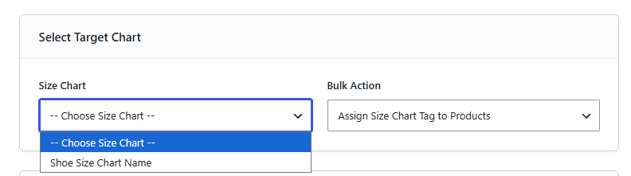

#### 2. Điều kiện Lọc (Filter Conditions)
Cấu hình logic tương tự module condition của **Collection** (Bộ sưu tập), bao gồm:
* Lọc theo **Category** (Danh mục sản phẩm).
* Lọc theo **Tags** (Nhãn sản phẩm hiện có).
* Lọc theo **Collection** (Bộ sưu tập sản phẩm).
* Lọc theo **Title** (Từ khóa trong tiêu đề sản phẩm).
  * > [!TIP]
  * > **Quy tắc OR cho tiêu đề (Title)**: Các từ khóa phân tách nhau bằng dấu phẩy `,` sẽ được hiểu theo logic HOẶC (Ví dụ: `T-shirt, Jacket` sẽ lọc các sản phẩm có tiêu đề chứa từ "T-shirt" **HOẶC** "Jacket").

    

#### 3. Xem trước sản phẩm khớp điều kiện (Matching Products Preview)
* Hiển thị danh sách sản phẩm thỏa mãn điều kiện lọc sẽ được gán/gỡ tag.
* Dùng để kiểm tra trước danh sách sản phẩm khớp điều kiện.

    

#### 4. Tiến trình xử lý (Bulk Action)
* Hiển thị thông tin tóm tắt tiến trình và thanh tiến trình.
* **Xử lý theo batch**: Mỗi batch xử lý **50 sản phẩm**.
* **ProgressBar**: Hiển thị phần trăm hoàn thành tiến trình của mỗi batch.

    

---

### 12.4. Cấu hình chung (Settings)

* **Truy cập**: Dashboard -> **Enhancement Kit** -> **Size Charts** -> chọn tab **Settings**.

Các tùy chọn cấu hình bao gồm:

* **Enable Size Charts**: Tích chọn để bật hoặc tắt hoạt động của module Size Charts.
* **Cấu hình nhãn & Kiểu dáng (Text & Styling)**:
  * `Size Guide Link Text`: Thay đổi nội dung hiển thị của liên kết mở bảng size (Ví dụ: "Size Guide" hoặc "Bảng size").
  * `Size Guide Text Color`: Chọn màu chữ cho liên kết.
  * `Size Guide Hover Text Color`: Chọn màu chữ khi di chuột qua liên kết.
  * `Underline Size Guide Text`: Tích chọn để hiển thị gạch chân liên kết mở bảng size.
* **Allowed Attributes (Product Type mapping)**:
  * Chọn các thuộc tính (attribute) được phép tải trước và hiển thị tại ô chọn attribute value trong phần mapping term khi cấu hình Product Type.
  * *Mặc định*: Nếu không chọn thuộc tính nào, hệ thống tự động tìm và kiểm tra danh sách mặc định gồm: `Product Type (pa_product-type)`, `Produkttyp (pa_produkttyp)`, `Type de produit (pa_type-de-produit)`, `Tipo de producto (pa_tipo-de-producto)`.
  * *Lưu ý*: Chỉ cấu hình hiển thị các giá trị cần thiết, tùy chỉnh để tương thích chính xác với thuộc tính của từng website.
* **Size Attributes (Vị trí hiển thị)**:
  * Chọn các thuộc tính đại diện cho kích thước. 
  * *Mặc định*: Nếu không chọn thuộc tính nào, danh sách mặc định sau sẽ được áp dụng: `Size (pa_size)`, `Sizes (pa_sizes)`, `Grosse (pa_grosse)`, `Taille (pa_taille)`, `Tamano (pa_tamano)`, `Tamanho (pa_tamanho)`.
  * *Lưu ý*: Nếu sản phẩm chứa nhiều hơn một thuộc tính nằm trong danh sách được chọn này, hệ thống sẽ ưu tiên hiển thị liên kết bảng size theo thuộc tính kích thước `Size (pa_size)`. Trường hợp sản phẩm không chứa thuộc tính `pa_size` thì sẽ hiển thị tại thuộc tính đầu tiên khớp trong danh sách mà sản phẩm có.
  * **Cơ chế hiển thị trên giao diện (Frontend Display)**:
    * **Cách 1 - Hiển thị phía trên Label của thuộc tính size**: Áp dụng khi sản phẩm có chứa thuộc tính nằm trong danh sách Size Attributes được cấu hình hoặc mặc định.
      

          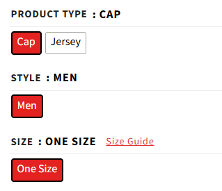
      

    * **Cách 2 - Hiển thị tại Hook trước khối giỏ hàng**: Áp dụng khi sản phẩm không có thuộc tính kích thước nào thuộc danh sách trên. Liên kết tự động hiển thị tại hook `woocommerce_before_add_to_cart_form` (phía trước khối chọn số lượng và nút Add to Cart).
      

          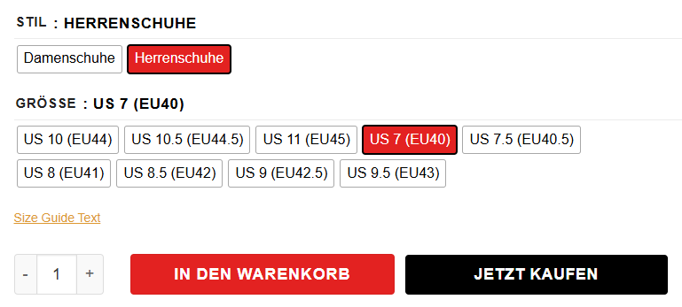
      

    

