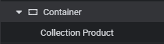
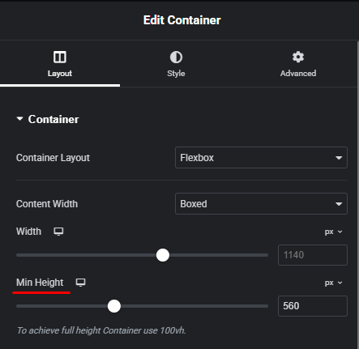
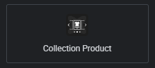
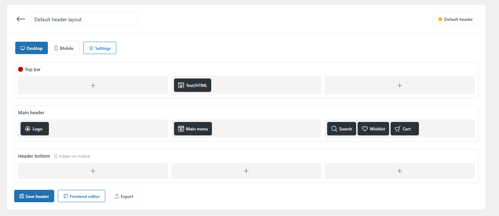
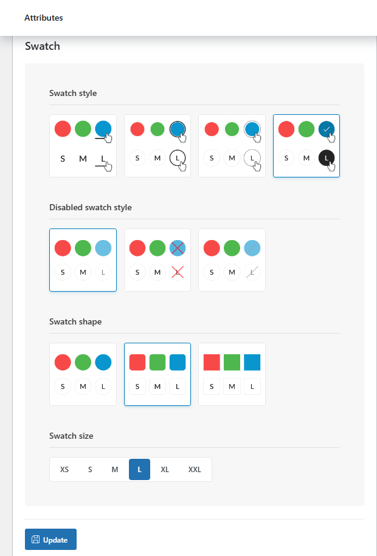
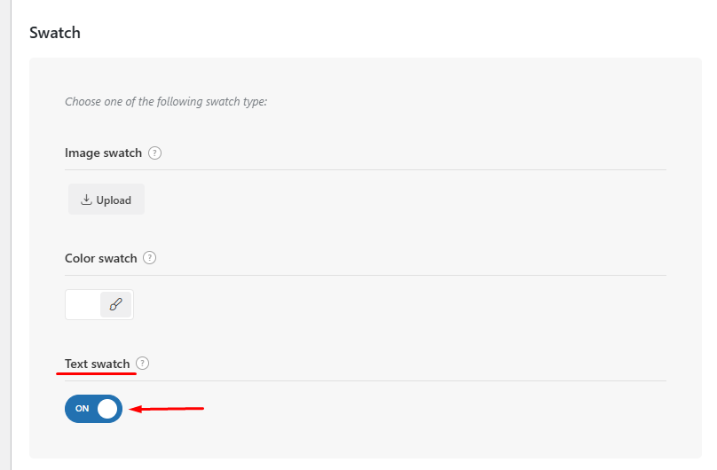

# Hướng dẫn Sử dụng Theme Woodmart

## 1. Cấu hình Hệ thống (Theme Settings)
Quản lý cấu hình tập trung thông qua bảng điều khiển Woodmart.

- **Truy cập**: Dashboard -> **Woodmart** -> **Theme Settings**.
- **Colors (Styles and Colors)**:
    - **Primary color**: Thiết lập mã màu chủ đạo của website.
- **Typography**:
    - Thiết lập Font Family chi tiết cho từng thành phần (Text, Headlines, Navigation).
    - Hỗ trợ tích hợp trực tiếp Google Fonts.
    - **Yêu cầu kỹ thuật**: Đảm bảo độ tương phản (Contrast) đạt tiêu chuẩn **WCAG AA** (tối thiểu 4.5:1) giữa màu chữ và nền để đảm bảo khả năng đọc.

---

## 2. Xây dựng Layout (Elementor & Woodmart Builder)
Sử dụng Elementor phối hợp với các Widget đặc thù của Woodmart để tối ưu hiệu suất và giao diện.

- **Kiến trúc Container**:
    - **Yêu cầu kỹ thuật**: Mọi khối nội dung phải được bao bọc trong một **Container**. Đây là quy tắc bắt buộc để đảm bảo tính đồng nhất về Grid hệ thống.
    </img> 
    - **Min Height**: Bắt buộc thiết lập chiều cao tối thiểu cho Container trên cả Desktop và Mobile. Điều này giúp trình duyệt xác định trước không gian hiển thị, ngăn chặn hiện tượng nhảy khung hình và tối ưu chỉ số LCP.
    </img>

- **Widget tiêu chuẩn**:
    - **Banner**: Sử dụng widget **Image** hoặc **Image or SVG** đặt trong Container để kiểm soát tỉ lệ hiển thị.
    - **Products**: Sử dụng widget **Product (grid/carousel)** để nhúng sản phẩm từ các Collection linh hoạt.
    </img>
- **Hệ thống Layouts**:
    - Truy cập **Woodmart -> Layouts** để xây dựng các Template động cho Single Product, Shop, Cart, Checkout, giúp quản lý giao diện tập trung.

---

## 3. Quản lý Header (Header Builder)
Woodmart cung cấp trình xây dựng Header mạnh mẽ với cơ chế kéo thả trực quan.

- **Truy cập**: Dashboard -> **Woodmart** -> **Header Builder**.
- **Tính năng chủ chốt**: 
    - **Cơ chế kéo thả**: Dễ dàng sắp xếp các Element như Logo, Search, Account, Cart vào các hàng (Rows) khác nhau.
    </img>
    - **Header linh hoạt**: Khả năng tạo nhiều Header khác nhau và gán theo điều kiện (Condition) cho từng trang (ví dụ: Header riêng cho trang chủ và trang cửa hàng).

---

## 4. Cấu hình hiển thị Attribute và Plugin Bổ trợ (WC Enhancement Kit)
Truy cập plugin thông qua **Settings -> WC Enhancement Kit**.

### Module Optimization
- **Theme Config**: Bật tùy chọn **Woodmart config** trong dashboard của plugin.
- **Module Optimization**: Khuyên dùng trạng thái **Disable** cho các module **Single Product** và **Pagination** và các module **Legacy** của plugin để tránh xung đột với tính năng gốc của Woodmart.

### Variation Display (Hiển thị Biến thể)
- **Enable URL Rewrite**: Tạo **Permalinks riêng** cho từng biến thể sản phẩm.
- **Force Form Data Loading**: Kích hoạt cơ chế **tải trước dữ liệu form thuộc tính**.
- **Smart Default Variant**: Tự động **kích hoạt biến thể đầu tiên** khi tải trang.
- **Swatch Styling**: Cấu hình **CSS** (Background/Text Color) cho trạng thái **Selected** tại phần Swatch Settings.
    </img>

### Cấu hình Swatches cho Thuộc tính (Attributes)
Để thay thế danh sách thả xuống mặc định bằng các ô chọn màu sắc hoặc kiểu dáng (Swatches) trực quan, hãy thực hiện theo quy trình sau:

1. **Cấu hình cấp Thuộc tính (Global settings)**:
    - **Truy cập**: Dashboard -> **Products** -> **Attributes**.
    - **Thao tác**: Chọn thuộc tính cần cấu hình (ví dụ: **Style**, **Color**) và nhấn **Edit**.
    - **Các thông số quan trọng**:
        - **Swatch style**: Thiết lập kiểu hiển thị khi chọn biến thể.
        - **Disabled swatch style**: Trạng thái hiển thị khi biến thể hết hàng.
        - **Swatch shape**: Hình dạng của ô chọn (Rounded hoặc Square).
        - **Swatch size**: Kích thước hiển thị (XS, S, M, L, XL).
    </img>

2. **Cấu hình giá trị hiển thị (Configure Terms)**:
    - **Thao tác**: Tại danh sách thuộc tính, chọn **Configure terms** cho thuộc tính tương ứng.
    - **Kích hoạt**: Chỉnh sửa từng giá trị (ví dụ: màu Đỏ, size L) và bật tùy chọn **Enable text swatch** hoặc thiết lập màu sắc/hình ảnh minh họa cụ thể.
    </img>

---

## 5. Tài liệu tham khảo
- [Woodmart Documentation](https://xtemos.com/documentation/woodmart/)
- [Công cụ kiểm tra độ tương phản](https://webaim.org/resources/contrastchecker/)
