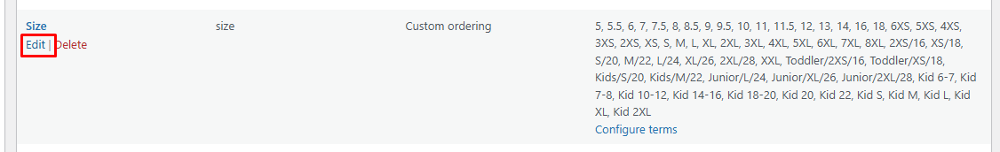
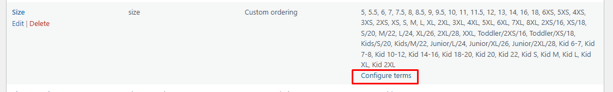
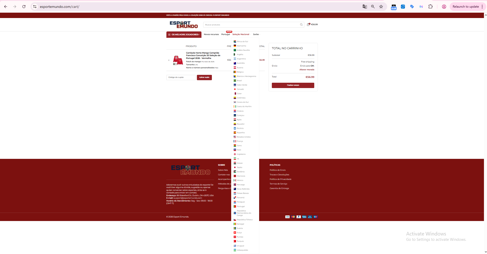
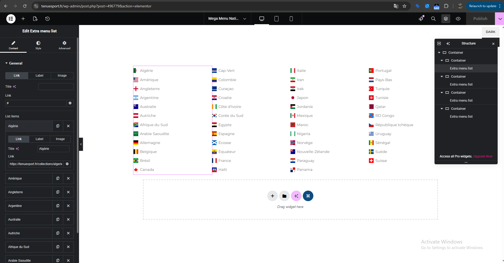
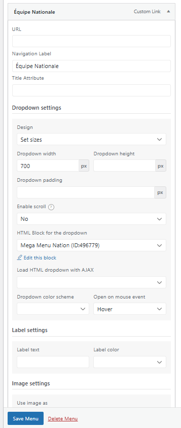
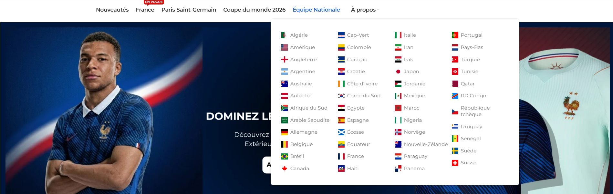

# Hướng dẫn Sử dụng Theme Woodmart

## 1. Cấu hình Hệ thống (Theme Settings)
Quản lý cấu hình tập trung thông qua bảng điều khiển Woodmart.

- **Truy cập**: Dashboard -> **Woodmart** -> **Theme Settings**.
- **Colors (Styles and Colors)**:
    - **Primary color**: Thiết lập mã màu chủ đạo của website.
- **Typography**:
    - Thiết lập Font Family chi tiết cho từng thành phần (Text, Headlines, Navigation).
    - Hỗ trợ tích hợp trực tiếp Google Fonts.
    - **Yêu cầu kỹ thuật**: Đảm bảo độ tương phản (Contrast) đạt tiêu chuẩn **WCAG AA** (tối thiểu 4.5:1) giữa màu chữ và nền để đảm bảo điểm số **Accessibility**.

---

## 2. Xây dựng Layout (Elementor & Woodmart Builder)
Sử dụng Elementor phối hợp với các Widget đặc thù của Woodmart để tối ưu hiệu suất và giao diện.

- **Kiến trúc Container**:
    - **Yêu cầu kỹ thuật**: Mọi khối nội dung phải được bao bọc trong một **Container**. Đây là quy tắc bắt buộc để đảm bảo tính đồng nhất và kiểm soát **Min Height**. 
    

        </img> 
    

    - **Min Height**: Bắt buộc thiết lập chiều cao tối thiểu cho Container trên cả Desktop và Mobile. Điều này giúp trình duyệt xác định trước không gian hiển thị, ngăn chặn hiện tượng nhảy khung hình và tối ưu chỉ số LCP.
    

        </img>
    

- **Widget tiêu chuẩn**:
    - **Banner**: Sử dụng widget **Image** hoặc **Image or SVG** đặt trong Container để kiểm soát tỉ lệ hiển thị.
    - **Products**: Sử dụng widget **Product (grid/carousel)** để nhúng sản phẩm từ các Collection linh hoạt. 
    

        </img>
    

    
- **Hệ thống Layouts**:
    - Truy cập **Woodmart -> Layouts** để xây dựng các Template động cho Single Product, Shop, Cart, Checkout, giúp quản lý giao diện tập trung.

---

## 3. Quản lý Header (Header Builder)
Woodmart cung cấp trình xây dựng Header với cơ chế kéo thả trực quan.

- **Truy cập**: Dashboard -> **Woodmart** -> **Header Builder**.
- **Tính năng chủ chốt**: 
    - **Cơ chế kéo thả**: Dễ dàng sắp xếp các Element như Logo, Search, Account, Cart vào các hàng (Rows) khác nhau.
    

        </img>
    

    
    - **Header linh hoạt**: Khả năng tạo nhiều Header khác nhau và gán theo điều kiện (Condition) cho từng trang (ví dụ: Header riêng cho trang chủ và trang cửa hàng).

---

## 4. Cấu hình Plugin Bổ trợ (WC Enhancement Kit)
Truy cập plugin thông qua **Settings -> WC Enhancement Kit**.

### 4.1. Tối ưu hóa Module (Module Optimization)
- **Theme Config**: Bật tùy chọn **Woodmart config** trong dashboard của plugin.
- **Module Optimization**: Khuyên dùng trạng thái **Disable** cho các module **Single Product** và **Pagination** và các module **Legacy** của plugin để tránh xung đột với tính năng gốc của Woodmart.

### 4.2. Hiển thị Biến thể (Variation Display)
- **Enable URL Rewrite**: Tạo **Permalinks riêng** cho từng biến thể sản phẩm.
- **Force Form Data Loading**: Kích hoạt cơ chế **tải trước dữ liệu form thuộc tính**.
- **Smart Default Variant**: Tự động **kích hoạt biến thể đầu tiên** khi tải trang.
- **Swatch Styling**: Cấu hình **CSS** (Background/Text Color) cho trạng thái **Selected** tại phần Swatch Settings.
    

        </img>
    

    
---

## 5. Cấu hình Swatches cho Thuộc tính (Attributes - Gốc của Woodmart)
Để thay thế danh sách thả xuống mặc định ở frontend bằng các ô chọn trực quan (Swatches) bằng tính năng mặc định của Woodmart, thực hiện theo quy trình sau:

### 5.1. Cấu hình cấp Thuộc tính (Global Settings)
- **Truy cập**: Dashboard -> **Products** -> **Attributes**.
- **Thao tác**: Chọn thuộc tính cần cấu hình (ví dụ: **Size**) và nhấn **Edit**.
    

        </img>
    

- **Các thông số quan trọng**:
    - **Swatch style**: Thiết lập kiểu hiển thị khi chọn biến thể.
    - **Disabled swatch style**: Trạng thái hiển thị khi biến thể hết hàng.
    - **Swatch shape**: Hình dạng của ô chọn (Rounded hoặc Square).
    - **Swatch size**: Kích thước hiển thị (XS, S, M, L, XL).
    

        </img>
    

- **Lưu cấu hình**: Sau khi thiết lập xong các thông số trên, cuộn xuống dưới cùng và nhấn nút **Update** để lưu lại cấu hình cấp thuộc tính.
    
### 5.2. Cấu hình giá trị hiển thị (Configure Terms)
- **Quay lại danh sách thuộc tính**: Sau khi nhấn *Update* ở bước 5.1, click vào liên kết **Attributes** ở menu bên trái (trong mục **Products -> Attributes**) để quay lại bảng danh sách thuộc tính tổng quát.
- **Thao tác**: Tìm thuộc tính **Size** trong bảng danh sách, di chuột đến cột ngoài cùng bên phải và click vào liên kết **Configure terms** của dòng Size đó.
    

        </img>
    

- **Kích hoạt giá trị cụ thể**: 
  - Tại bảng danh sách các giá trị thuộc tính Size hiện ra (ví dụ: *S, M, L, XL*), click nút **Edit** bên dưới giá trị muốn chỉnh sửa (ví dụ: **L**).
  
  - Tùy chỉnh bật tùy chọn **Enable text swatch** hoặc thiết lập mã màu/ảnh minh họa cụ thể cho giá trị này.
    

        </img>
    

- **Lưu cấu hình**: Sau khi cập nhật giá trị màu sắc, chữ hoặc hình ảnh minh họa cho term, cuộn xuống dưới cùng và nhấn nút **Update** (hoặc **Save Changes**) để áp dụng các thay đổi hiển thị ra ngoài frontend.

---

## 6. Giải pháp Tối ưu Menu quá dài bằng Mega Menu trong Woodmart

Khi cấu trúc điều hướng danh mục quá dài, việc hiển thị bằng menu dọc thả xuống thông thường (Standard Dropdown) trên Desktop sẽ gây ra lỗi khuất hoặc tràn giao diện theo chiều dọc trên các màn hình có chiều cao thấp:

    </img>

Để tối ưu, quy trình kỹ thuật chuẩn yêu cầu tách biệt hệ thống thành 2 menu riêng biệt:

### 6.1. Quy trình tách biệt hệ thống Menu
1. **Menu dành cho Mobile (Mobile Menu)**:
    - **Cách làm**: Khởi tạo một menu độc lập gán cho vị trí hiển thị di động.
    - **Cấu trúc**: Thiết lập cấu trúc phân cấp cây thư mục truyền thống dạng **Item -> Sub-item** (xếp dọc lồng nhau).
    - **Đặc tính kỹ thuật**: Tương thích tốt với thao tác cuộn dọc (Scroll) trên thiết bị di động.

2. **Menu dành cho Desktop (Desktop Menu)**:
    - **Cách làm**: Khởi tạo một menu riêng hiển thị trên Desktop và sử dụng giải pháp **HTML Blocks** kết hợp **Elementor** để làm Mega Menu.
    - **Đặc tính kỹ thuật**: Sử dụng bố cục dàn ngang để tận dụng chiều rộng màn hình, triệt tiêu lỗi hiển thị theo chiều dọc.

---

### 6.2. Các bước cấu hình Mega Menu trên Desktop bằng HTML Blocks

- **Bước 1 (Thiết kế nội dung bằng HTML Blocks & Elementor)**:
    - Truy cập **Dashboard -> HTML Blocks -> Add New** (Thêm Block mới) để tạo khối nội dung, đặt tên dễ nhận biết (ví dụ: *Mega Menu Shop*) và nhấn **Edit with Elementor** để bắt đầu thiết kế chi tiết:
        - **Dựng cấu trúc Container & phân cột**: Thêm một Container cha chính, bên trong tạo các Container con tương ứng với số cột mong muốn (ví dụ: chia thành 3, 4 hoặc 5 cột dọc để chứa các danh mục khác nhau).
        - **Sử dụng widget Extra Menu list**: Tìm và kéo thả element/widget **Extra Menu list** (widget gốc của Woodmart dùng để tạo danh sách menu tùy chỉnh) vào từng Container cột vừa tạo.
        - **Cấu hình chi tiết cho từng Menu Item**: Trong bảng cài đặt của widget **Extra Menu list**, tiến hành điền đầy đủ các thông tin **Label** (tên hiển thị), **Link** (đường dẫn đích), và **Icon** (icon hoặc ảnh SVG đại diện).
    

        </img>
    

- **Bước 2 (Gán vào Menu hệ thống)**:
    - Truy cập **Dashboard -> Appearance -> Menus**, chọn Menu chính hiển thị trên Desktop.
    - Tìm và nhấp vào mục cha (Parent item) muốn gán Mega Menu để mở bảng cấu hình:
        - Thiết lập tùy chọn **Design** thành **Set sizes** (hoặc Full Width/Custom size).
        - Tại mục chọn block dropdown, tìm và chọn đúng **HTML Block** đã thiết kế ở Bước 1 để hiển thị thay thế cho menu thả xuống mặc định.
    

        </img>
    

- **Kết quả hiển thị ngoài Frontend**:
    Sau khi cấu hình thành công, giao diện Mega Menu sẽ hiển thị trên Desktop theo đúng bố cục được thiết kế:
    

        </img>
    

---

## 7. Tài liệu tham khảo
- [Woodmart Documentation](https://xtemos.com/documentation/woodmart/)
- [Công cụ kiểm tra độ tương phản](https://webaim.org/resources/contrastchecker/)
