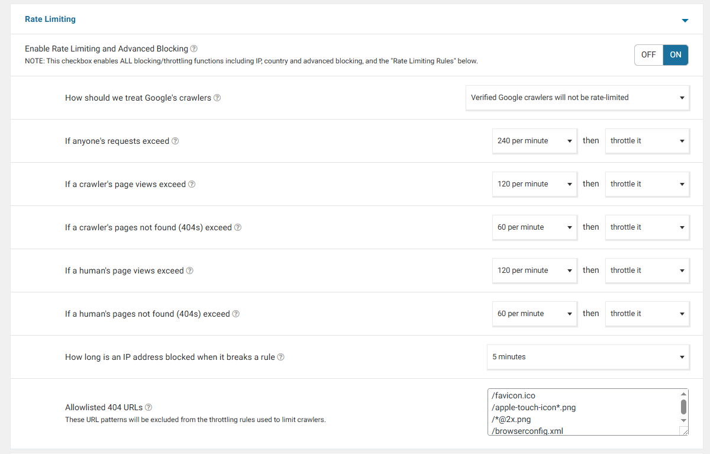
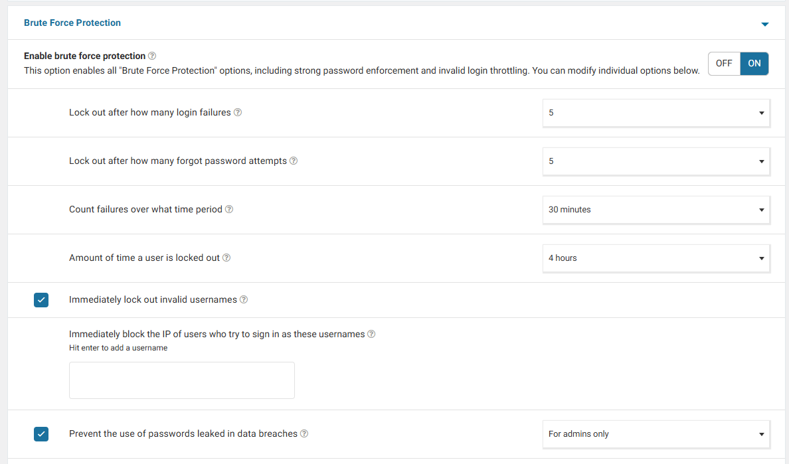
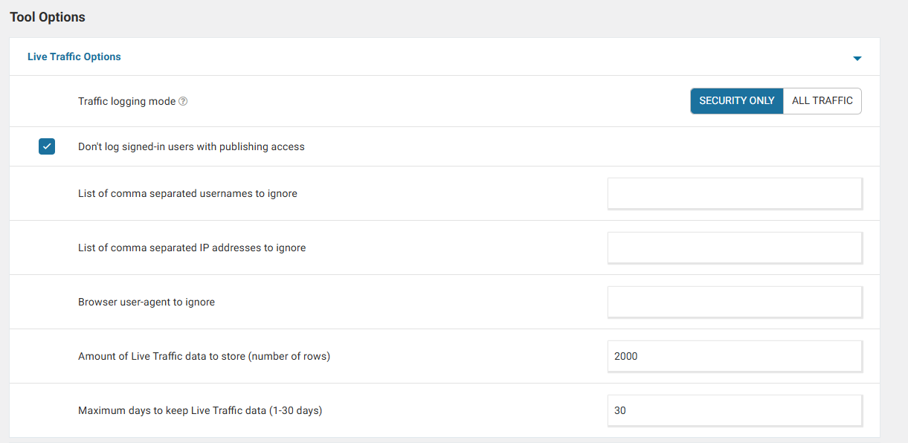

# Hướng Dẫn Cấu Hình Bảo Mật Với Plugin Wordfence Security

> [!IMPORTANT]
> **Wordfence Security** là plugin hỗ trợ bảo mật cho WordPress, cung cấp hệ thống tường lửa (Firewall), trình quét mã độc (Malware Scanner), cơ chế chống đăng nhập brute force và tính năng giám sát lưu lượng thời gian thực. Đối với website WooCommerce, việc thiết lập Wordfence đúng cách giúp bảo vệ thông tin khách hàng và ngăn chặn các cuộc tấn công mà không ảnh hưởng đến tốc độ tải trang.

---

## Danh Mục Hướng Dẫn (Quick Navigation)

1. [**Giới thiệu & Cài đặt ban đầu**](#1-giới-thiệu--cài-đặt-ban-đầu) - Đăng ký key miễn phí và tối ưu hóa file cấu hình.
2. [**Cấu hình Tường lửa (Web Application Firewall - WAF)**](#2-cấu-hình-tường-lửa-web-application-firewall---waf) - Kích hoạt chế độ bảo vệ tối đa và thiết lập chống spam.
3. [**Trình quét mã độc (Malware Scanner)**](#3-trình-quét-mã-độc-malware-scanner) - Thiết lập lịch quét tự động và xử lý file bị nhiễm độc.
4. [**Cấu hình Chống dò mật khẩu (Brute Force Protection)**](#4-cấu-hình-chống-dò-mật-khẩu-brute-force-protection) - Khóa IP khi đăng nhập sai mật khẩu, sử dụng tên username không tồn tại, hoặc mật khẩu bị rò rỉ.
5. [**Tối ưu hóa Wordfence cho WooCommerce**](#5-tối-ưu-hóa-wordfence-cho-website-woocommerce) - Tránh chặn nhầm khách mua hàng và tối ưu dung lượng database.

---

## 1. Giới thiệu & Cài đặt ban đầu
- **Cài đặt**: Vào **Plugins -> Add New**, tìm kiếm từ khóa `Wordfence Security` và tiến hành cài đặt, kích hoạt.
- **Kích hoạt Giấy phép (License Key)**: 
  1. Sau khi kích hoạt, hệ thống yêu cầu đăng ký một License Key (Có thể chọn gói **Free** - miễn phí).
  2. Điền email quản trị để nhận các thông báo cảnh báo bảo mật khẩn cấp từ hệ thống.
  3. Hoàn tất kích hoạt key được gửi qua email.

---

## 2. Cấu hình Tường lửa (Web Application Firewall - WAF)
Tường lửa của Wordfence ngăn chặn các truy cập độc hại trước khi chúng tiếp cận được nhân WordPress.

### 2.1. Tối ưu hóa Tường lửa (Optimize Wordfence Firewall)
> [!IMPORTANT]
> Ngay sau khi cài đặt, hệ thống sẽ hiển thị yêu cầu **Optimize the Wordfence Firewall**. Đây là bước quan trọng để tường lửa chạy ở mức độ hệ thống (`Extended Protection`), hỗ trợ bảo vệ website trước khi PHP của WordPress được tải.
- **Thực hiện**:
  1. Nhấp vào nút **Click here to configure** trên bảng thông báo.
  2. Tải xuống file sao lưu cấu hình hệ thống `.htaccess` (hoặc `nginx.conf`) theo hướng dẫn.
  3. Nhấn **Continue** để Wordfence tự động chèn mã bảo vệ vào file cấu hình máy chủ.

### 2.2. Chế độ Hoạt động (Firewall Status)
Vào **Wordfence -> Firewall**:
- **Learning Mode (Chế độ học học)**: Khi mới cài đặt, Wordfence mặc định chạy ở chế độ này trong vòng 1 tuần. Hệ thống sẽ theo dõi các hành vi bình thường của khách hàng và admin để tránh chặn nhầm (False Positives).
- **Enabled and Protecting (Bật bảo vệ)**: Sau 1 tuần, tường lửa sẽ tự động chuyển sang chế độ này. Có thể chủ động chuyển thủ công sang trạng thái này nếu hệ thống không sử dụng các API tùy biến khác.

### 2.3. Cấu hình Giới hạn Tần suất & Chặn Nâng cao (Rate Limiting and Advanced Blocking)
Giúp bảo vệ website WooCommerce khỏi các cuộc tấn công DDoS, spam, bots rác quét lỗ hổng bảo mật (Vulnerability Scanning) nhưng vẫn đảm bảo các công cụ tìm kiếm lớn (như Googlebot) và khách hàng thực tế không bị chặn nhầm.

- **Đường dẫn**: Vào **Wordfence -> Firewall -> All Firewall Options** -> cuộn xuống mục **Rate Limiting**.

    

Dưới đây là chi tiết ý nghĩa kỹ thuật và thông số cấu hình khuyến nghị cho cửa hàng WooCommerce:

| Tên cấu hình (Option) | Ý nghĩa kỹ thuật & Lưu ý thực tế | Khuyến nghị cấu hình tối ưu |
| :--- | :--- | :--- |
| **How should we treat Google's crawlers** | Cách Wordfence xử lý bot thu thập dữ liệu của Google. | Chọn **Verified Google crawlers have unlimited access** (Tránh tuyệt đối việc giới hạn hay bóp băng thông bot Google đã xác thực để đảm bảo chỉ số SEO ổn định). |
| **If anyone's requests exceed** | Tổng số yêu cầu (bao gồm cả HTML, CSS, JS, AJAX, hình ảnh, web fonts...) của bất kỳ ai trong 1 phút. | Chọn **240 per minute -> throttle it** (hoặc **300 per minute** đối với site lưu lượng lớn).  *Lưu ý*: Một lượt load trang WooCommerce thường kéo hàng chục tài nguyên tĩnh cùng AJAX fragments, nếu đặt 120/phút thì khách chỉ cần tải trang và f5 vài lần là bị bóp băng thông nhầm. |
| **If a crawler's page views exceed** | Số lượt xem trang trong 1 phút của một robot cào dữ liệu thông thường (ngoài Google). | Chọn **120 per minute -> throttle it** (hoặc **block it**). *Lưu ý*: Đẩy ngưỡng lên cao để tránh tối đa việc chặn nhầm các crawler hợp lệ ngoài Google (như Bingbot, Facebook, Pinterest, Ahrefs, Semrush, hay uptime monitors) khi chúng thực hiện thu thập thông tin tốc độ cao. |
| **If a crawler's pages not found (404s) exceed** | Số yêu cầu lỗi 404 của một Crawler trong 1 phút. Dấu hiệu của việc bots quét dò lỗi bảo mật. | Chọn **60 per minute -> block it**. *Lưu ý*: Tạo khoảng đệm an toàn lớn lên đến 60 lỗi 404/phút để bù trừ cho trường hợp website có nhiều tệp tin assets cũ bị thiếu hụt mà crawler vẫn liên tục quét qua. |
| **If a human's page views exceed** | Số lượt xem trang trong 1 phút của khách hàng thực tế. | Chọn **120 per minute -> throttle it**. *Lưu ý*: Khách mua hàng bằng điện thoại click nhanh để lọc sản phẩm, chuyển đổi chọn biến thể, hoặc thao tác AJAX giỏ hàng có thể dễ dàng chạm mốc 60/phút. Ngưỡng 120/phút an toàn hơn rất nhiều. |
| **If a human's pages not found (404s) exceed** | Số yêu cầu lỗi 404 của khách hàng thực tế trong 1 phút. | Chọn **60 per minute -> block it**. *Lưu ý*: Đẩy ngưỡng lên 60/phút giúp tránh tuyệt đối việc khách mua hàng thật bị block oan ngoài frontend do trình duyệt tự động gửi liên tục các yêu cầu tải assets bị lỗi (ảnh hỏng, font lỗi, scripts thiếu) ẩn trên web. |
| **How long is an IP address blocked when it breaks a rule** | Khoảng thời gian khóa hoàn toàn địa chỉ IP vi phạm quy tắc. | Chọn **5 minutes** (5 phút). *Lưu ý*: Thiết lập thời gian khóa ngắn chỉ 5 phút để bảo vệ trải nghiệm khách hàng tối đa. Nếu một người dùng thực tế vô tình bị hệ thống khóa nhầm, họ có thể nhanh chóng quay lại tiếp tục mua sắm ngay sau đó mà không bị gián đoạn quá lâu. |
| **Allowlisted 404 URLs** | Danh sách trắng các đường dẫn lỗi 404 được bỏ qua để tránh tính điểm phạt. | Điền các URL tĩnh hay gặp lỗi nhưng vô hại (mỗi dòng một link). Ví dụ: `/favicon.ico` `/apple-touch-icon*.png` `/robots.txt` |

---

## 3. Trình quét mã độc (Malware Scanner)
Giúp quét toàn bộ mã nguồn của website để phát hiện các tệp tin bị thay đổi, mã độc (backdoor, shell), mã script chuyển hướng trang độc hại hoặc link spam SEO đen.

* **Truy cập**: **Wordfence -> Scan**.
* **Khuyến nghị thiết lập quét (Scan Options)**:
  * Vào **Scan -> Scan Options and Scheduling**.
  * Chọn chế độ quét: **Standard Scan** (Khuyến nghị cho gói Free vì cân bằng rất tốt giữa hiệu suất server và độ sâu quét dữ liệu).
  * Bật tùy chọn: `Scan theme files against repository versions for changes` và `Scan plugin files against repository versions for changes`. Tính năng này sẽ so sánh trực tiếp file code theme/plugin trên website với bản gốc trên kho lưu trữ WordPress để phát hiện các chỉnh sửa bất thường.
* **Xử lý tệp bị nhiễm**:
  * Khi phát hiện file lõi của WordPress bị thay đổi, Wordfence cung cấp nút **View Differences** để so sánh dòng code bị sửa và nút **Restore Original** để khôi phục nhanh file sạch gốc từ WordPress.org.
  * Đối với mã độc không xác định trong thư mục upload, sử dụng tùy chọn **Delete** để xóa bỏ sau khi đã sao lưu (Backup) kỹ hệ thống.

---

## 4. Cấu hình Chống dò mật khẩu (Brute Force Protection)
Tự động phát hiện và khóa hoàn toàn các IP/tài khoản cố tình thực hiện hành vi dò quét mật khẩu liên tục qua form đăng nhập, form lấy lại mật khẩu, hoặc qua các cổng API.

- **Đường dẫn**: Vào **Wordfence -> Firewall -> All Firewall Options** -> cuộn xuống phần **Brute Force Protection**.

    

Cấu hình khuyến nghị bắt buộc đối với website WooCommerce bảo mật cao:

| Tên cấu hình trong Wordfence | Giá trị tối ưu | Ý nghĩa & Tác động kỹ thuật |
| :--- | :--- | :--- |
| **Lock out after how many login failures** | **5** (lần) | Tự động khóa IP đăng nhập sai mật khẩu quá **5 lần** liên tiếp. |
| **Lock out after how many forgot password attempts** | **5** (lần) | Tự động khóa IP thực hiện yêu cầu "Quên mật khẩu" liên tiếp quá **5 lần**. |
| **Count failures over what time period** | **30 minutes** (30 phút) | Cộng dồn và theo dõi số lần đăng nhập lỗi trong chu kỳ **30 phút** trước khi đưa ra quyết định khóa IP. |
| **Amount of time a user is locked out** | **4 hours** (4 tiếng) | Thời gian IP bị khóa hoàn toàn khi vi phạm quy tắc Brute Force. Thiết lập **4 tiếng** là tối ưu để ngăn cản các cuộc tấn công dò mật khẩu tự động quy mô lớn. |
| **Immediately lock out invalid usernames** | **ON** (Bật) | Khóa IP **ngay lập tức** từ lần thử đầu tiên nếu đăng nhập bằng tên username không tồn tại trên hệ thống. |
| **Immediately block the IP of users who try to sign in as these usernames** | Thêm các tên rác phổ biến (Gõ tên -> nhấn *Enter* để thêm): `admin` `administrator` `root` `user` `test` | Khóa IP ngay lập tức nếu kẻ tấn công cố gắng đăng nhập bằng các tên nhạy cảm này. Đây là hành vi quét tự động điển hình của tin tặc. |
| **Prevent the use of passwords leaked in data breaches** | **ON** (Bật) | Ngăn chặn không cho phép quản trị viên hoặc người dùng thiết lập mật khẩu đã từng bị rò rỉ trong các vụ lộ dữ liệu lớn trên thế giới (bảo vệ tài khoản tuyệt đối). |

---

## 5. Tối ưu hóa Wordfence cho Website WooCommerce
Do Wordfence giám sát liên tục lưu lượng truy cập nên nếu không tối ưu hóa, nó có thể làm chậm cơ sở dữ liệu hoặc vô tình chặn nhầm khách mua hàng tại các bước thanh toán nhạy cảm.

### 5.1. Bỏ qua quét các thư mục ảnh tải lên
Mã độc thường không thể tự thực thi trong thư mục hình ảnh của WooCommerce. Để giảm tải CPU khi quét web:
- Vào mục **Scan Options and Scheduling**.
- Bật tùy chọn: `Exclude files from scan that match these wildcards`.
- Nhập đường dẫn loại trừ: `wp-content/uploads/*` để bỏ qua việc quét tệp ảnh thông thường.

### 5.2. Tối ưu dung lượng lưu trữ cơ sở dữ liệu (Database Size)
Tính năng **Live Traffic** lưu nhật ký mọi lượt truy cập của bots và người dùng vào cơ sở dữ liệu, điều này khiến dung lượng cơ sở dữ liệu tăng nhanh trên các website WooCommerce có lưu lượng truy cập lớn.
* **Tối ưu hóa**:
  * Vào **Wordfence -> Firewall -> All Firewall Options**.
  * Cuộn xuống mục **Live Traffic Options**.
  * Tại phần **Live Traffic Mode**, chọn **Security Only** (Chỉ ghi nhận lại các lượt truy cập bị tường lửa chặn hoặc có hành vi phá hoại bảo mật) thay vì chọn *All Traffic* (Lưu tất cả lượt truy cập). Thiết lập này giúp cơ sở dữ liệu nhẹ hơn đến 80%.

    

### 5.3. Tránh chặn nhầm hành động của Khách hàng (Whitelisting)
Nếu trong quá trình khách hàng thanh toán qua API bên thứ ba (Ví dụ: Paypal, Stripe...) mà bị Wordfence chặn nhầm:
1. Truy cập **Wordfence -> Tools -> Live Traffic** để xem danh sách các truy cập gần nhất bị block.
2. Tìm kiếm IP hoặc request bị chặn ứng với thời điểm khách hàng gặp lỗi.
3. Click vào request bị chặn đó và chọn **Whitelist this action from Firewall** để đưa hành động này vào danh sách an toàn, đảm bảo khách hàng sau này không bị chặn lại.
